# Roadmap — Computer Science

> [!abstract] Les fondations informatiques — algorithmique, structures de données, systèmes, réseau, bases de données, sécurité — relues pour quelqu'un qui fait déjà de la data science et veut cesser de traiter la machine comme une boîte noire.

**Source** : roadmap.sh/computer-science, capturée le 15 mars 2026 · **Enrichie** le 3 août 2026
Les éléments en vert dans les schémas et les encadrés « Ajout 2026 » ne figurent pas dans la roadmap d'origine.

---

## En un coup d'œil

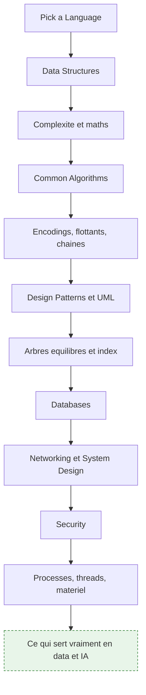

---

## 1. Choisir un langage

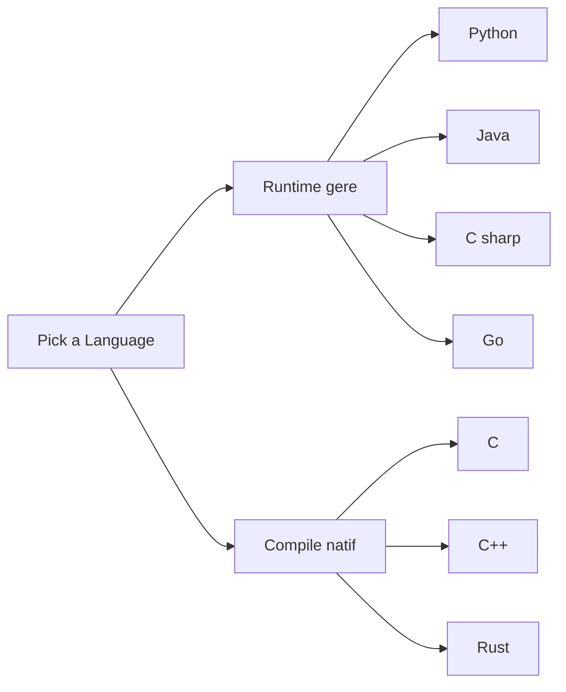

**À quoi ça sert.** Le langage n'est pas le sujet : ce qui compte est d'en pratiquer un où la mémoire, les types et le modèle de concurrence sont visibles, en plus de Python. Python cache tout — allocation, GIL, copies implicites — et c'est précisément ce que la roadmap veut faire regarder en face. Un second langage sert d'appareil de mesure.

**Ce qu'il faut savoir**

- Python — l'écosystème data ; connaître le comptage de références, les vues NumPy et le comportement du GIL évite l'essentiel des surprises de performance.
- C et C++ — les couches réelles sous CPython, NumPy, BLAS, PyTorch, ONNX Runtime, FAISS, llama.cpp ; les lire suffit, les écrire est un bonus.
- Rust — sûreté mémoire sans GC ; devient la norme de l'outillage data (Polars, tokenizers, uv, ruff) et s'expose en Python via PyO3.
- Go, Java et C# — Go pour les sidecars, exporters et services d'orchestration ; JVM et .NET pour la réalité des SI d'entreprise et l'écosystème big data historique, Spark, Kafka et Flink.

> [!tip] Ajout 2026
> Le duo réellement rentable pour un profil data est Python plus Rust : écrire une extension Rust de cinquante lignes pour une boucle chaude est devenu plus simple qu'écrire du Cython, et la moitié de l'outillage moderne est déjà du Rust exposé en Python.

> [!warning] Piège
> Apprendre un langage bas niveau « pour la performance » puis réécrire du code déjà vectorisé. Le gain vient du profilage — py-spy, cProfile, perf — et ne concerne que la boucle chaude effectivement mesurée.

---

## 2. Structures de données

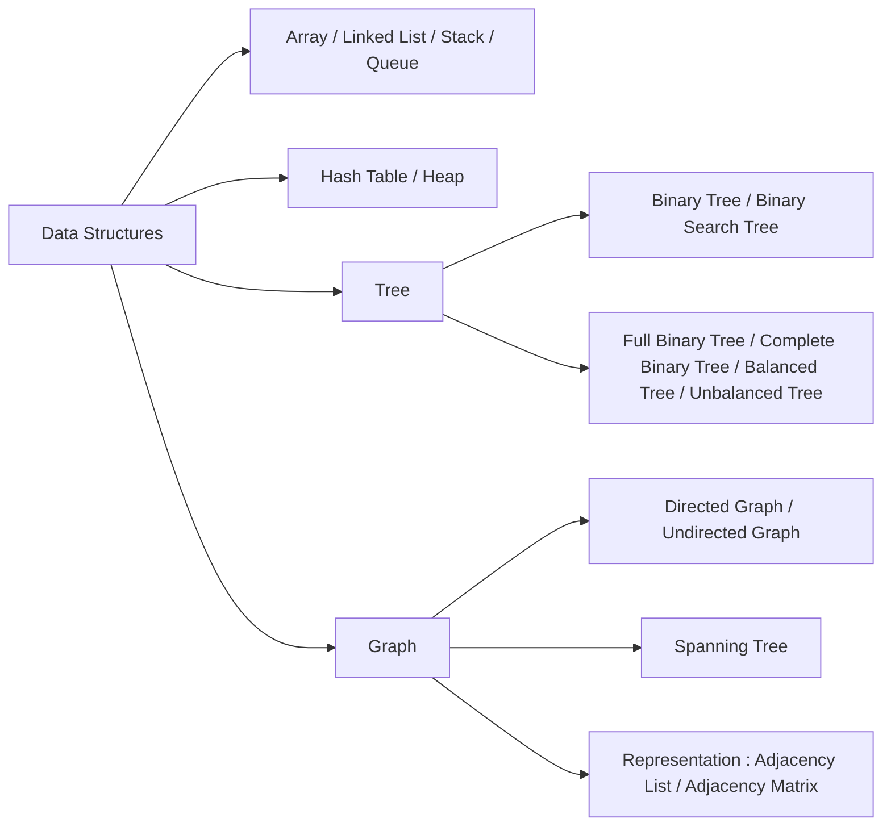

**À quoi ça sert.** Une structure de données est un contrat de coûts : ce qu'elle rend gratuit et ce qu'elle rend cher. En data, la structure est souvent imposée par la bibliothèque, mais le choix ressurgit dès qu'on écrit une boucle de préparation, un cache ou un déduplicateur.

**Ce qu'il faut savoir**

- Array contre Linked List — accès indexé constant et mémoire contiguë donc cache-friendly, ce qui explique que NumPy écrase une liste Python ; en face, insertion constante si on tient le nœud mais parcours par sauts de pointeurs qui détruit le cache, donc rarement le bon choix.
- Stack et Queue — LIFO et FIFO ; de la pile d'un parseur aux files de tâches d'un pipeline.
- Hash Table et Heap — dictionnaire à coût amorti constant d'un côté, extraction du minimum en temps logarithmique de l'autre ; le heap fait tourner tout top-k et l'ordonnancement de Dijkstra.
- Tree, Binary Tree, Binary Search Tree — hiérarchie et recherche ordonnée ; une BST n'est efficace que si elle reste équilibrée, d'où le vocabulaire full, complete, balanced et unbalanced (complete est ce qui permet de stocker un heap dans un tableau).
- Directed et Undirected Graph, Spanning Tree et leur Representation — le modèle de toute relation, l'arbre couvrant minimisant le coût de connexion ; l'Adjacency List sert aux graphes creux, l'Adjacency Matrix aux graphes denses et à tout ce qui se calcule en algèbre linéaire.

> [!tip] Ajout 2026
> La matrice d'adjacence creuse au format CSR est le pont direct vers les GNN et GraphRAG : un message passing n'est qu'un produit matrice creuse par matrice dense. Voir [[06 - Graphes de connaissances et GraphRAG]].

> [!warning] Piège
> Utiliser une liste Python comme file et faire pop(0) : linéaire à chaque retrait, donc quadratique sur la boucle. collections.deque règle le problème en une ligne, et le même réflexe vaut pour la concaténation de chaînes.

---

## 3. Complexité, coûts et maths de base

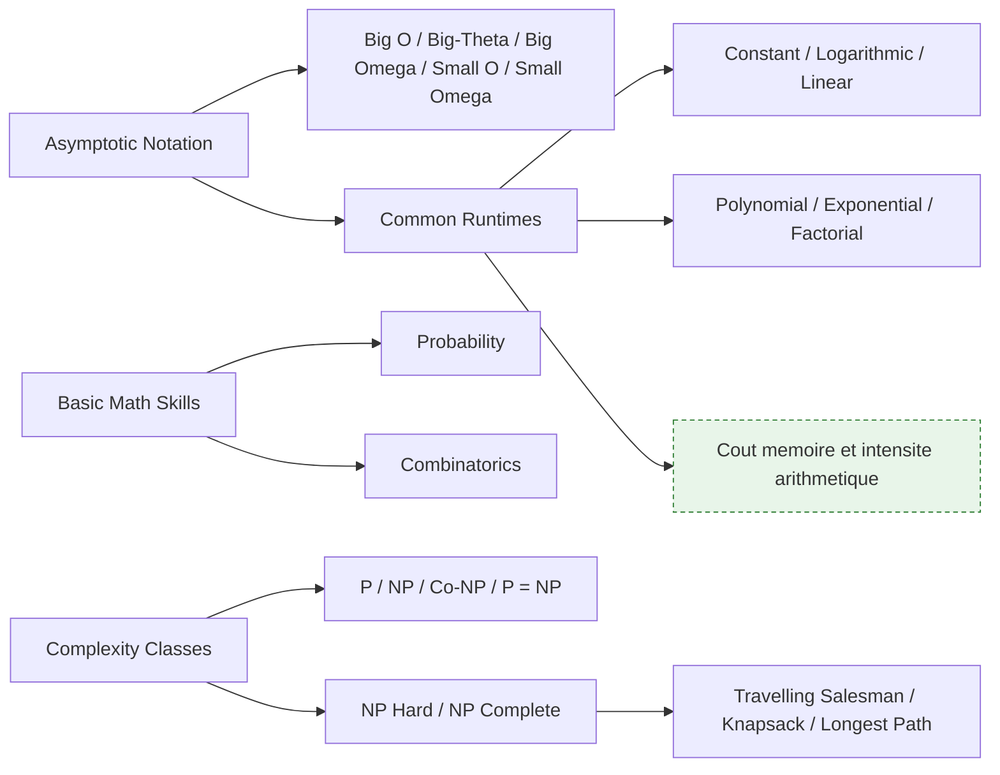

**À quoi ça sert.** L'analyse asymptotique répond à une question : quand la taille des données est multipliée par dix, que devient le temps de calcul. Les classes de complexité, elles, disent quand arrêter de chercher un algorithme exact. Reconnaître qu'un problème métier est un sac à dos déguisé fait basculer immédiatement vers une heuristique ou un solveur.

**Ce qu'il faut savoir**

- Big O, Big Omega, Big-Theta — borne supérieure, borne inférieure, encadrement exact ; Theta est ce qu'on veut souvent dire en écrivant O. Small O et Small Omega sont des dominations strictes, quasi absentes de la pratique.
- Constant, Logarithmic, Linear, Polynomial, Exponential, Factorial — indexation, dichotomie et scan simple, puis l'endroit où meurent silencieusement les pipelines (jointure imbriquée, matrice de similarité tous contre tous), puis la recherche exhaustive, acceptable seulement sur entrées minuscules ou avec élagage.
- Complexité mémoire — l'axe oublié : une matrice de similarité sur cent mille documents fait dix milliards de flottants, l'algorithme est correct mais la machine tombe.
- Probability et Combinatorics — conditionnement, Bayes, dénombrement ; le langage de la vraisemblance, de la calibration, du sampling par température et des collisions de hachage.
- P, NP, Co-NP, P = NP, NP Hard, NP Complete — résoluble contre vérifiable en temps polynomial ; on suppose P différent de NP et on passe aux heuristiques, prouver l'absence de solution étant plus dur que d'en exhiber une. Les NP-complets sont équivalents par réduction : Travelling Salesman pour les tournées, Knapsack pour la sélection sous budget, Longest Path facile sur un DAG mais NP-complet dès qu'un cycle apparaît.

> [!tip] Ajout 2026
> Le facteur constant écrase souvent l'exposant : un algorithme linéaire faisant un aller-retour disque par élément perd contre un quadratique tenant en cache L2. Le raisonnement moderne complète la complexité par l'intensité arithmétique, rapport FLOPs sur octets déplacés — c'est l'argument de FlashAttention, même complexité, ordre de grandeur gagné sur les accès mémoire. Le knapsack, lui, est le bon modèle mental du remplissage d'une fenêtre de contexte sous budget de tokens.

> [!warning] Piège
> Comparer deux implémentations sur mille lignes. À cette taille tout est instantané et le classement s'inverse souvent à l'échelle réelle : mesurer sur deux ordres de grandeur et regarder la pente, pas la valeur.

---

## 4. Algorithmes classiques

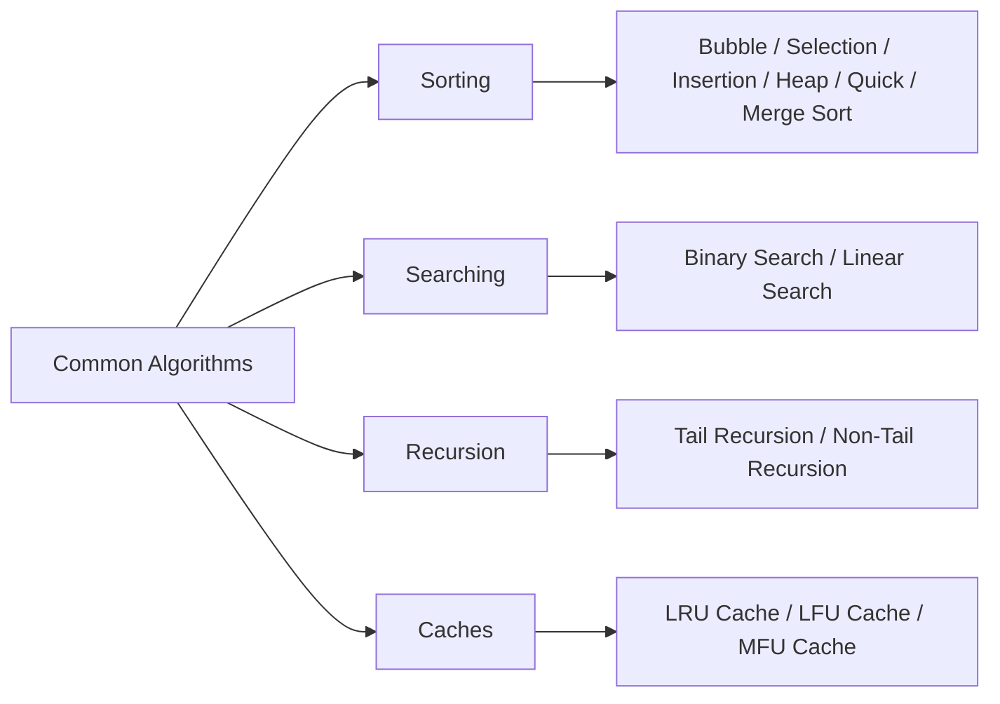

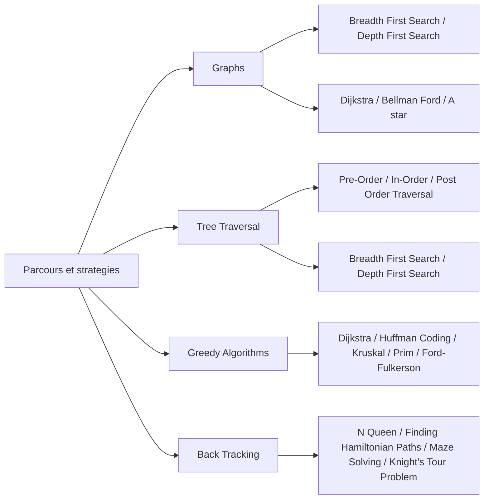

**À quoi ça sert.** Personne ne réimplémente un tri en production. L'intérêt est le catalogue de schémas de raisonnement : diviser pour régner, parcourir en largeur ou en profondeur, avancer par choix localement optimal, explorer puis revenir en arrière. Ces quatre schémas couvrent la quasi-totalité des problèmes non triviaux d'un pipeline, d'un planificateur d'agent ou d'un moteur de retrieval.

**Ce qu'il faut savoir**

- Bubble, Selection, Insertion, Merge, Quick, Heap Sort — les trois premiers sont quadratiques, Insertion restant le meilleur choix sur de très petits segments d'où sa présence dans les tris hybrides ; Merge Sort est stable, linéarithmique garanti et externalisable, donc le tri des moteurs de bases de données quand les données ne tiennent pas en mémoire ; Quick Sort est le plus rapide en moyenne grâce à la localité mémoire mais quadratique si le pivot est mal choisi ; Heap Sort est garanti et en place mais mauvais pour le cache.
- Binary Search, Linear Search, Tail et Non-Tail Recursion — la dichotomie sur données triées sert aussi à calibrer un seuil de classifieur, la recherche linéaire reste imbattable sur petites collections non triées, et CPython n'optimisant pas la récursion terminale, une pile explicite s'impose pour parcourir un arbre de documents profond.
- Breadth First Search, Depth First Search, Dijkstra, Bellman Ford, A star — BFS pour le plus court chemin en nombre d'arêtes et l'expansion par voisinage, DFS pour la détection de cycles et le tri topologique donc l'ordonnancement d'un DAG ; puis poids positifs, poids négatifs avec détection de cycle négatif, et Dijkstra guidé par une heuristique admissible.
- Pre-Order, In-Order, Post Order Traversal — In-Order sur une BST donne l'ordre trié ; Post-Order est le parcours des agrégations bottom-up et des arbres d'expression.
- Huffman Coding — codage entropique, grand-parent conceptuel de BPE ; Kruskal et Prim pour l'arbre couvrant minimal, Kruskal reposant sur union-find, structure très utile pour dédupliquer par composantes connexes ; Ford-Fulkerson pour le flot maximal et les problèmes d'affectation.
- Back Tracking — N Queens, chemins hamiltoniens, labyrinthe, cavalier : explorer, élaguer, revenir. C'est la forme brute de ce que fait un agent qui teste plusieurs plans, et la parenté avec MCTS est directe.
- LRU, LFU, MFU Cache — LRU par défaut, LFU quand la popularité est stable, MFU quand la donnée très récemment utilisée ne resservira plus.

> [!tip] Ajout 2026
> Le tri externe par fusion est exactement ce que fait un shuffle Spark ou un ORDER BY sur table volumineuse : le coût se paie en passes disque, d'où l'intérêt de partitionner avant de trier. Côté agents, la boucle plan-exécution-retour arrière est du backtracking déguisé, et lui imposer une profondeur maximale plus un critère d'élagage est ce qui empêche une boucle infinie de tool calls.

> [!warning] Piège
> Croire que la recherche vectorielle approchée est un k-NN simplement accéléré. Un index HNSW est un graphe parcouru en largeur guidée : il hérite des pathologies des graphes et le rappel n'est jamais total. Le mesurer contre une recherche exhaustive sur un échantillon est le seul moyen de savoir ce qu'on perd.

---

## 5. Représentation des données en machine

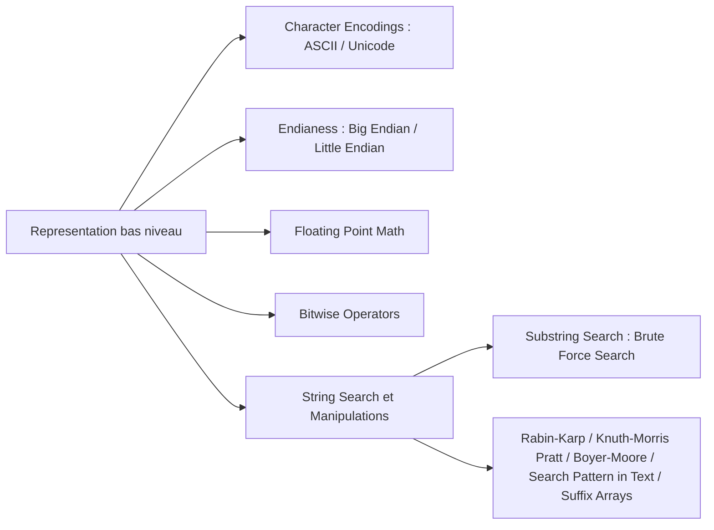

**À quoi ça sert.** C'est le chapitre qui explique les bugs qu'on ne comprend pas : le caractère devenu point d'interrogation, la somme de flottants qui ne tombe pas juste, le fichier binaire illisible ailleurs. Pour un profil data, encodage et arithmétique flottante sont des sources d'erreurs quotidiennes, pas de la trivia.

**Ce qu'il faut savoir**

- ASCII, Unicode, Big Endian et Little Endian — un code point n'est ni un caractère affiché ni un octet, UTF-8 est à longueur variable donc len() ne donne ni le nombre d'octets ni le nombre de graphèmes, et la normalisation NFC contre NFD fait diverger deux chaînes visuellement identiques, cause classique de doublons non détectés dans un corpus ; l'ordre des octets, lui, devient visible dès qu'on lit un format binaire brut, un memmap produit sur une autre architecture ou un dump réseau.
- Floating Point Math — IEEE 754 : l'addition n'est pas associative, la comparaison stricte à zéro est un bug, l'accumulation sur des millions de valeurs dérive. En pratique, accumuler en float64 même quand on calcule en float32.
- Bitwise Operators — masques, décalages, popcount : la base des bitmaps de filtrage, des filtres de Bloom et de la distance de Hamming sur hachage binaire.
- Brute Force Search, Rabin-Karp, Knuth-Morris Pratt, Boyer-Moore — force brute suffisante sur textes courts ; hachage glissant qui se généralise à la détection de quasi-doublons ; préfixe-suffixe précalculé et linéaire garanti ; saut en avant par mauvais caractère, le plus rapide en pratique et ce qui est derrière grep. Search Pattern in Text et Suffix Arrays complètent l'ensemble : indexer tous les suffixes permet la recherche de sous-chaîne en temps logarithmique et le calcul de répétitions dans un corpus.

> [!tip] Ajout 2026
> Le sujet flottant est redevenu central avec la quantification : bfloat16 sacrifie la mantisse pour garder l'exposant de float32, ce qui le rend stable à l'entraînement là où float16 sature, et les formats 8 et 4 bits ajoutent des échelles par bloc pour compenser la dynamique perdue. Savoir lire « exposant, mantisse, échelle par groupe » suffit à comprendre pourquoi un modèle quantifié dégrade sur certaines couches.

> [!warning] Piège
> Lire un CSV sans spécifier l'encodage. Sur un fichier Windows en cp1252, la lecture passe silencieusement et corrompt les accents ; l'erreur ne se manifeste que trois étapes plus loin, dans les embeddings.

---

## 6. Design patterns et modélisation

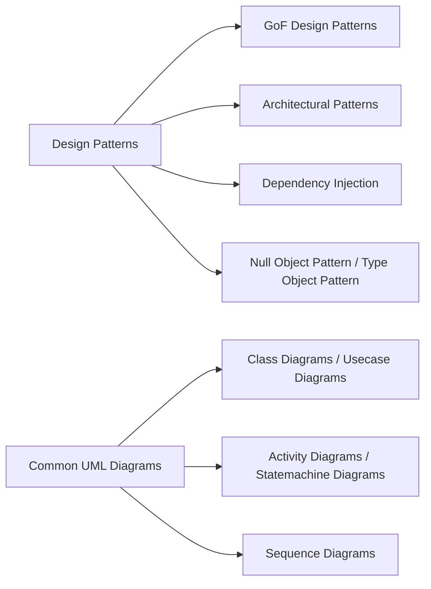

**À quoi ça sert.** Les patterns sont un vocabulaire partagé. Leur valeur réelle n'est pas de les appliquer mais de les reconnaître : comprendre qu'un framework impose une Factory ou une Strategy fait gagner des heures de lecture. UML sert surtout à deux choses, le diagramme de séquence pour raconter un flux, celui d'états pour rendre explicite une machine à états d'agent.

**Ce qu'il faut savoir**

- GoF Design Patterns et Architectural Patterns — création, structure, comportement, avec cinq patterns qui reviennent vraiment (Factory, Strategy, Adapter, Observer, Decorator) ; côté architecture, couches, hexagonal, event-driven ou microservices, le choix se jouant sur les frontières de déploiement et de données, pas sur l'élégance.
- Dependency Injection — passer les dépendances au lieu de les construire, ce qui rend un pipeline testable sans réseau en injectant un faux client LLM.
- Null Object Pattern et Type Object Pattern — un objet inerte plutôt qu'un None supprime les tests de nullité éparpillés (tracer désactivé, cache no-op) ; décrire les variantes en données plutôt qu'en classes est exactement le mécanisme d'un registre de modèles ou d'outils chargé depuis un YAML.
- Class, Usecase, Activity, Statemachine, Sequence Diagrams — structure et relations pour cartographier un schéma de données ; périmètre fonctionnel et enchaînement pour des interlocuteurs non techniques ; états et transitions pour un agent avec reprise sur erreur ; séquence pour documenter une chaîne RAG avec reranking et fallback.

> [!tip] Ajout 2026
> Un diagramme de séquence Mermaid dans le README d'un projet d'agent économise plus de temps qu'une page de prose et se relit dans le diff. Côté patterns, l'architecture d'agents est majoritairement du Strategy plus Registry — outils déclarés en données, sélectionnés à l'exécution — soit précisément ce que standardise MCP.

> [!warning] Piège
> Introduire une hiérarchie de classes abstraites pour un pipeline qui a un seul cas d'usage. La sur-abstraction préventive coûte plus cher que la duplication assumée : attendre le troisième cas concret avant de factoriser.

---

## 7. Arbres équilibrés, tries et index

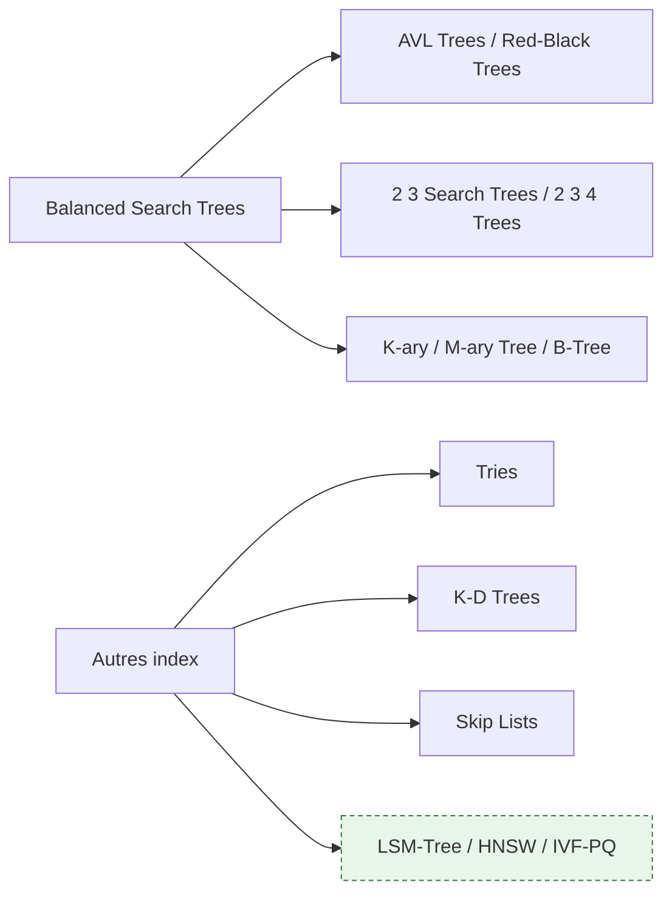

**À quoi ça sert.** Tout ce chapitre répond à une question : retrouver une donnée sans tout lire. C'est le plus directement rentable pour un profil data, parce qu'il explique le comportement des index de bases de données, des moteurs de recherche et des bases vectorielles. Un index est toujours un compromis entre coût d'écriture, coût de lecture et espace.

**Ce qu'il faut savoir**

- AVL Trees et Red-Black Trees — rééquilibrage strict et lectures très rapides d'un côté, équilibre plus lâche et meilleur compromis en écriture de l'autre ; le red-black est l'implémentation des map et set ordonnés des bibliothèques standard.
- 2 3 Search Trees, 2 3 4 Trees, K-ary / M-ary Tree — arbres multi-clés par nœud, base conceptuelle des red-black trees et des B-trees ; plus le nœud est large, moins l'arbre est profond, donc moins d'accès disque.
- B-Tree et sa variante B+ — l'index de PostgreSQL, MySQL, SQLite ; chaque nœud tient dans une page disque, ce qui permet une recherche en trois ou quatre lectures sur des millions de lignes.
- Tries — arbre préfixe : autocomplétion, routage d'URL, et le mécanisme qui rend efficace la tokenisation par plus long préfixe.
- K-D Trees et Skip Lists — partitionnement de l'espace pour le plus proche voisin, qui s'effondre en grande dimension d'où les méthodes approchées ; alternative probabiliste aux arbres équilibrés, simple à rendre concurrente, utilisée dans les sorted sets Redis et les memtables des moteurs LSM.

> [!tip] Ajout 2026
> Deux structures absentes de la roadmap dominent la pratique data. Le LSM-Tree (RocksDB, Cassandra, ClickHouse) optimise l'écriture en accumulant en mémoire puis en fusionnant sur disque, à l'inverse du B-tree qui privilégie la lecture. Et les index vectoriels — HNSW, graphe navigable multicouche, ou IVF-PQ, partitionnement plus quantification — remplacent le K-D tree au-delà de quelques dizaines de dimensions. Voir [[05 - Stores et index]].

> [!warning] Piège
> Multiplier les index en pensant accélérer. Chaque index ralentit les écritures et consomme de l'espace ; vérifier avec EXPLAIN ANALYZE qu'il est réellement emprunté par le planificateur avant de le garder.

---

## 8. Bases de données

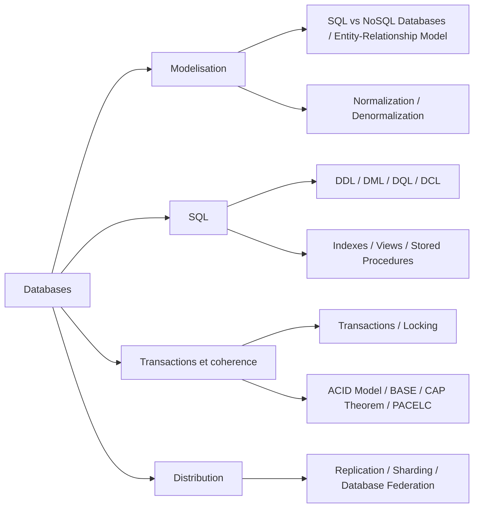

**À quoi ça sert.** La base de données est là où vivent réellement les données d'entreprise, et c'est le composant qu'un data scientist maltraite le plus. Le modèle transactionnel évite les extractions incohérentes, l'indexation évite les requêtes qui tournent des heures, la modélisation permet de discuter d'égal à égal avec l'équipe qui possède le schéma.

**Ce qu'il faut savoir**

- SQL contre NoSQL, Normalization et Denormalization — le vrai critère est le schéma d'accès, pas le volume : requêtes ad hoc et jointures pour le relationnel, accès par clé connue et schéma mouvant pour le document ou le clé-valeur ; on normalise pour la cohérence en écriture et on dénormalise pour la vitesse en lecture, un entrepôt analytique assumant l'étoile.
- Entity-Relationship Model — entités, cardinalités, clés : le schéma à demander avant d'écrire la moindre requête, et le document que consomme un Text-to-SQL.
- DDL, DML, DQL, DCL — définition, manipulation, interrogation, droits ; la catégorie d'une commande dit si elle est transactionnelle et si elle verrouille. Indexes, Views, Stored Procedures — B-tree par défaut, GIN et GiST pour le JSON et le texte intégral, pgvector pour les embeddings ; la vue matérialisée est un cache à rafraîchir ; la procédure stockée est performante mais difficile à versionner et tester.
- Transactions et Locking — connaître read committed, repeatable read et serializable, et savoir qu'une transaction longue bloque le nettoyage des versions.
- ACID contre BASE, CAP Theorem, PACELC — garantie forte contre disponibilité et cohérence à terme ; CAP arbitre en cas de partition, PACELC ajoute l'arbitrage latence contre cohérence en fonctionnement normal, celui qu'on rencontre au quotidien.
- Replication, Sharding, Database Federation — décalage du réplica comme cause classique d'un job qui lit des données périmées ; la clé de partition détermine tout et une jointure inter-shards coûte très cher ; la fédération évite la duplication au prix de la latence.

> [!tip] Ajout 2026
> Le contact avec l'IA est double. Text-to-SQL : la qualité dépend bien plus de la description du schéma injectée dans le prompt que du modèle, et une vue métier propre vaut mieux qu'un schéma normalisé au maximum. Stockage vectoriel : pgvector avec index HNSW suffit jusqu'à quelques millions de vecteurs et évite d'introduire une base dédiée. Voir [[08 - Données structurées et Text-to-SQL]].

> [!warning] Piège
> Extraire un dataset avec un SELECT sans transaction pendant que le système écrit. Les lignes lues au début et à la fin ne reflètent pas le même état, et l'incohérence reste invisible jusqu'à ce qu'un total ne tombe pas juste. Utiliser un snapshot explicite ou une colonne de date de coupure.

---

## 9. Réseau et system design

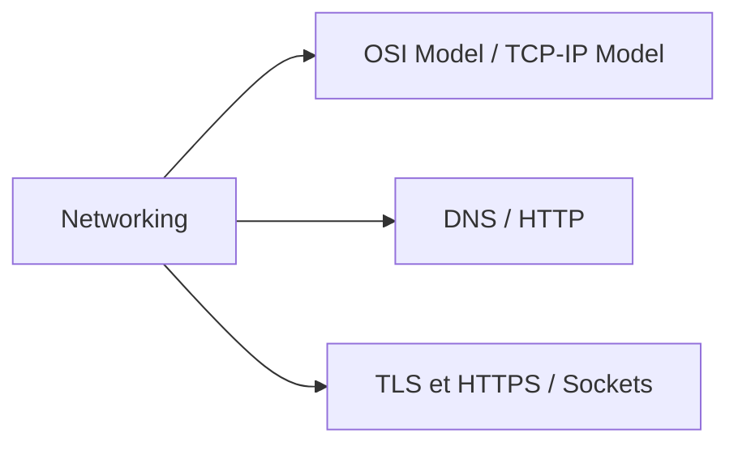

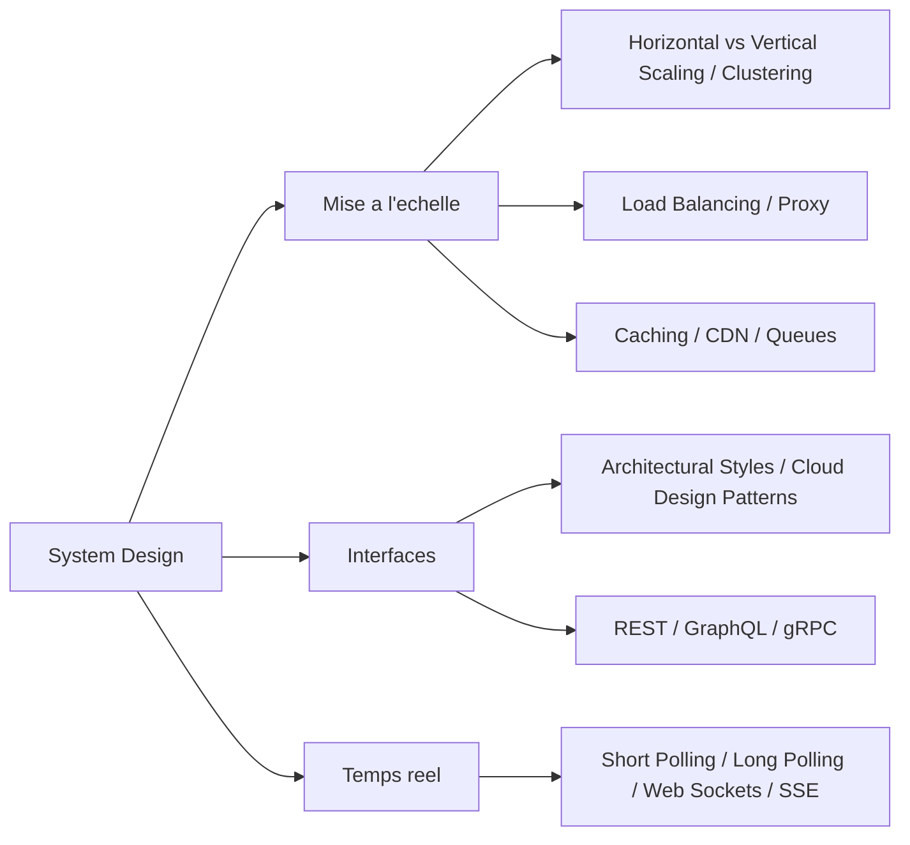

**À quoi ça sert.** Le réseau est ce qui casse quand le modèle fonctionne : timeouts sur un endpoint d'inférence, certificat refusé derrière un proxy d'entreprise, DNS qui échoue dans un conteneur. Et mettre un modèle en production est du system design — une file devant l'inférence, un cache devant les embeddings, un load balancer devant les répliques, une API devant le tout.

**Ce qu'il faut savoir**

- OSI Model et TCP/IP Model — sept couches de référence pour situer un problème, quatre couches réelles pour le résoudre ; TCP garantit l'ordre et la livraison, UDP ne garantit rien mais ne bloque pas. DNS, HTTP, TLS et HTTPS, Sockets — le DNS est le premier suspect quand un service marche par IP et pas par nom ; distinguer 401 de 403 et 429 de 503 change la stratégie de retry ; en entreprise le proxy inspectant le trafic impose d'ajouter son autorité de certification ; le socket explique les connexions réinitialisées et l'intérêt du pooling.
- Horizontal vs Vertical Scaling, Clustering, Load Balancing, Proxy — en inférence LLM le vertical est souvent forcé par la VRAM nécessaire, router selon la charge réelle bat le round-robin car les requêtes ont des durées très inégales, et le reverse proxy porte TLS, authentification, rate limiting et quotas. Caching, CDN, Queues — le cache est le levier le plus rentable (embeddings, réponses, préfixe KV) ; le CDN concerne les assets, pas l'inférence ; la file découple production et consommation et permet le retry, patron naturel de tout traitement par lot.
- Architectural Styles et Cloud Design Patterns — monolithe modulaire d'abord, découpage sur preuve de besoin ; circuit breaker, retry avec backoff, bulkhead, sidecar et saga sont les recettes de résilience à connaître par leur nom.
- REST, GraphQL, gRPC — REST comme défaut raisonnable pour exposer un modèle, GraphQL quand les clients varient au prix de requêtes coûteuses non anticipées, gRPC sur HTTP/2 pour l'interne à faible latence.
- Short Polling, Long Polling, Web Sockets, SSE — du plus gaspilleur au plus adapté ; SSE est le standard de fait pour le streaming de tokens, WebSocket le choix quand la bidirectionnalité est réelle.

> [!tip] Ajout 2026
> Le dimensionnement d'un service d'inférence ne se raisonne pas comme une API classique : le batching continu fait légèrement monter la latence individuelle pendant que le débit global triple, et la file d'attente devient le vrai levier. Trois métriques à suivre en permanence — temps jusqu'au premier token, tokens par seconde par requête, occupation du cache KV. Attention aussi à désactiver la bufferisation du proxy, sinon le flux SSE arrive d'un bloc. Voir [[13 - Serving et infra locale]].

> [!warning] Piège
> Cacher les réponses avec une clé égale au prompt exact : le taux de succès est proche de zéro dès qu'un identifiant ou un horodatage entre dans le prompt. Normaliser la clé, ou cacher au niveau du retrieval, bien plus répétitif que les prompts complets.

---

## 10. Sécurité

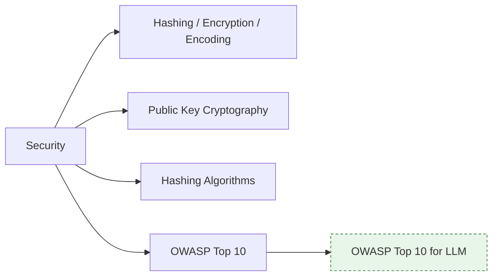

**À quoi ça sert.** Trois notions confondues en permanence — encoder, hacher, chiffrer — expliquent la majorité des erreurs de sécurité amateur. Pour un profil data, le sujet se concentre sur la protection des données personnelles, la gestion des clés d'API, et depuis peu une surface d'attaque entièrement nouvelle du côté des applications LLM.

**Ce qu'il faut savoir**

- Encoding et Hashing — base64 ou URL-encoding sont des représentations réversibles sans secret, donc jamais de la sécurité ; le hachage est à sens unique et, pour les mots de passe, seuls des algorithmes lents et salés conviennent (bcrypt, scrypt, Argon2), jamais SHA-256 nu.
- Encryption et Public Key Cryptography — symétrique pour le volume, asymétrique pour l'échange de clés et la signature ; socle de TLS, SSH et de la signature de commits.
- Hashing Algorithms — SHA-2 et SHA-3 pour l'intégrité, HMAC pour l'authentification de message, xxHash ou MurmurHash pour la déduplication rapide ; MD5 et SHA-1 sont cassés pour tout usage de sécurité.
- OWASP Top 10 — injection, authentification défaillante, mauvaise configuration, désérialisation non sûre : la liste de contrôle minimale avant d'exposer quoi que ce soit.

> [!tip] Ajout 2026
> L'OWASP Top 10 dédié aux applications LLM est devenu la référence de revue pour toute chaîne RAG ou agent. Ce qui mord en pratique : prompt injection indirecte via un document ingéré, fuite d'information sensible dans la réponse, permissions excessives accordées à un outil d'agent, empoisonnement de la base vectorielle. La contre-mesure structurante n'est pas un filtre de prompt mais le moindre privilège sur les outils plus une validation des sorties côté application. Voir [[16 - Sécurité et gouvernance]].

> [!warning] Piège
> Traiter le contenu récupéré par un RAG comme des données inertes. Un document du corpus peut contenir des instructions que le modèle exécutera : toute donnée retrouvée est une entrée non fiable, au même titre qu'un champ de formulaire.

---

## 11. Processus, threads et fonctionnement de la machine

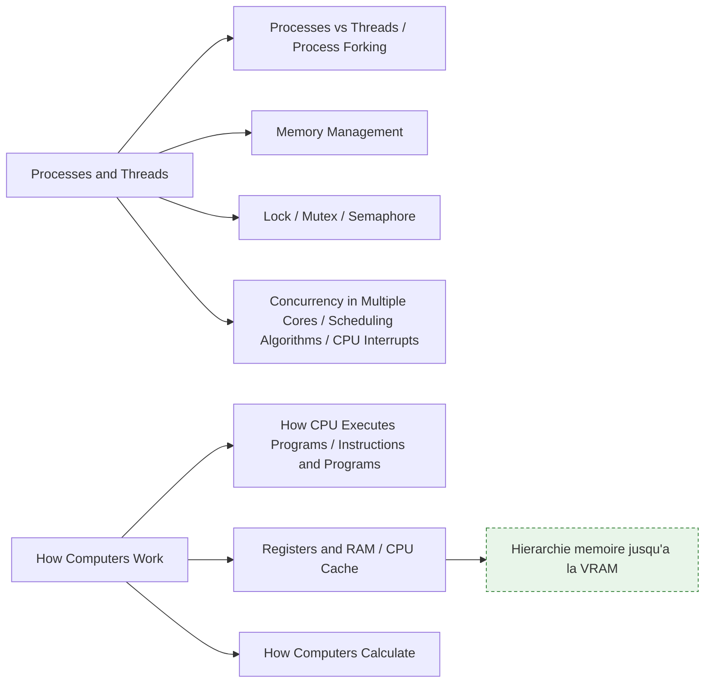

**À quoi ça sert.** C'est le chapitre qui transforme les incidents mystérieux en diagnostics : un DataLoader qui bloque, une mémoire qui explose au fork, un job qui n'utilise que quinze pour cent des cœurs, un OOM à la seconde epoch. La hiérarchie mémoire explique en prime pourquoi les mêmes FLOPs coûtent dix fois plus cher selon l'organisation des données.

**Ce qu'il faut savoir**

- Processes vs Threads et Process Forking — mémoire isolée contre mémoire partagée ; le GIL rend les threads Python utiles pour l'attente entrée-sortie et inutiles pour le calcul pur, et le fork en copie sur écriture paraît gratuit jusqu'à ce que chaque enfant touche les pages partagées.
- Memory Management — pile, tas, mémoire virtuelle, pagination ; le swap qui s'active est la cause typique d'un job qui devient cent fois plus lent sans lever d'erreur.
- Lock, Mutex, Semaphore — exclusion mutuelle et limitation de concurrence ; le sémaphore est l'outil naturel pour plafonner le nombre d'appels simultanés à une API.
- Concurrency in Multiple Cores et Scheduling Algorithms — parallélisme réel, mais attention à la sur-souscription quand BLAS lance déjà autant de threads que de cœurs et qu'on empile du multiprocessing par-dessus ; l'ordonnancement explique la variabilité de latence sur machine partagée.
- CPU Interrupts, How CPU Executes Programs et Instructions and Programs — le mécanisme matériel sous-jacent des entrées-sorties asynchrones, puis — cycle fetch-decode-execute, pipeline, prédiction de branchement : c'est pourquoi le code sans branche est plus rapide.
- Registers and RAM, CPU Cache, How Computers Calculate — la latence croît de plusieurs ordres de grandeur du registre à la RAM et parcourir une matrice dans le mauvais ordre multiplie le temps par cinq à FLOPs identiques, ce qui justifie tout le calcul vectorisé ; binaire, complément à deux et unités flottantes font le lien direct avec le chapitre 5.

> [!tip] Ajout 2026
> La même hiérarchie se retrouve sur GPU et c'est le cœur de l'optimisation d'inférence : registres, mémoire partagée par bloc, puis HBM. Les noyaux fusionnés ne changent pas la complexité, ils évitent des allers-retours vers la HBM. Concrètement, la VRAM se partage entre poids du modèle et cache KV, et ce partage fixe le nombre de requêtes concurrentes possibles.

> [!warning] Piège
> Lancer un DataLoader avec beaucoup de workers sur un dataset qui référence un gros objet Python : le comptage de références touche les pages et déclenche la copie sur écriture, multipliant la mémoire par le nombre de workers. Stocker en tableaux NumPy ou en memmap règle le problème.

---

## Parcours conseillé

| Ordre | Étape | Effort | À viser |
|---|---|---|---|
| 1 | Complexité, coûts et maths | ~1 semaine | Estimer le coût d'un traitement avant de le lancer, en temps et en mémoire |
| 2 | Structures de données | ~1 semaine | Choisir la bonne structure et justifier le choix par les coûts d'opération |
| 3 | Bases de données | ~2 semaines | Lire un plan d'exécution, poser un index utile, extraire de façon cohérente |
| 4 | Arbres équilibrés, tries et index | ~1 semaine | Expliquer B-tree contre LSM-tree et le compromis rappel-latence d'un index vectoriel |
| 5 | Processus, threads et machine | ~1 semaine | Diagnostiquer une fuite mémoire, une sur-souscription de threads, un OOM |
| 6 | Réseau et system design | ~3 semaines | Débuguer TLS, DNS et timeouts ; concevoir une chaîne d'inférence avec file, cache et load balancer |
| 7 | Algorithmes classiques | ~2 semaines | Reconnaître les quatre schémas et les appliquer au bon problème |
| 8 | Sécurité | ~4 jours | Distinguer encoder, hacher, chiffrer ; passer une revue OWASP LLM |
| 9 | Représentation en machine | ~4 jours | Ne plus perdre de temps sur un encodage ou une dérive flottante |
| 10 | Design patterns et UML | ~1 semaine | Reconnaître les patterns d'un framework, documenter par diagramme de séquence |
| 11 | Second langage | ~1 mois | Écrire une extension Rust ou C++ pour une boucle chaude profilée |

---

## Liens dans le coffre

- [[05 - Stores et index]] — la suite directe du chapitre 7 : B-tree, LSM-tree et index vectoriels appliqués au RAG.
- [[08 - Données structurées et Text-to-SQL]] — prolonge le chapitre bases de données côté génération de requêtes par modèle.
- [[13 - Serving et infra locale]] — traduit réseau, system design et hiérarchie mémoire en dimensionnement d'inférence réel.
- [[16 - Sécurité et gouvernance]] — reprend l'OWASP Top 10 et son extension LLM en pratiques applicables.
- [[Pipeline Data]] — le contexte d'application des structures de données, de la complexité et des transactions.
- [[02 - Roadmap — AI and Data Scientist]] — la roadmap complémentaire côté statistiques et modélisation.

## Pour aller plus loin

- Cormen, Leiserson, Rivest, Stein — *Introduction to Algorithms* : la référence exhaustive, à consulter par chapitre plutôt qu'à lire.
- Martin Kleppmann — *Designing Data-Intensive Applications* : bases de données, réplication, partitionnement et cohérence.
- Bryant et O'Hallaron — *Computer Systems: A Programmer's Perspective* : représentation binaire, cache, processus, mémoire virtuelle.
- Kurose et Ross — *Computer Networking: A Top-Down Approach* : le réseau abordé depuis HTTP en descendant vers les sockets.
- Documentation officielle PostgreSQL, chapitres *Indexes* et *Concurrency Control* : la meilleure source pratique sur indexation et isolation.
- OWASP — *Top 10* et *Top 10 for Large Language Model Applications* : listes de contrôle de revue de sécurité.
