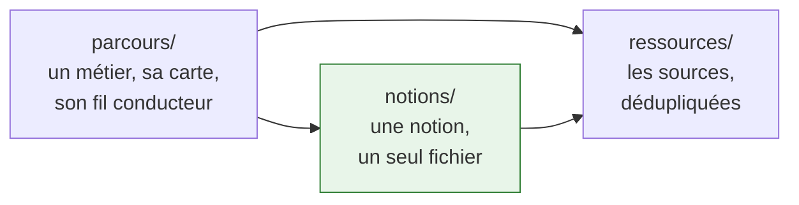

> [!abstract] Un atlas des métiers de l'IA et de la data science, en français. Treize parcours d'apprentissage transposés depuis roadmap.sh, expliqués plutôt que traduits, et complétés par ce que la source ne dit pas. Au centre : le **Forward Deployed Engineer**, le métier que l'amont documente le moins et qui en demande le plus.

**Sources** : roadmap.sh, extraites par `tools/roadmap_extract.py` · **Dernière capture** : 16 septembre 2026

---

## Ce que c'est, et ce que ce n'est pas

Ce n'est pas une traduction de roadmap.sh. Une roadmap amont est une carte de mots :
elle dit qu'il faut connaître le RAG, pas ce qu'est un mauvais découpage ni pourquoi
votre récupération sort trois passages hors sujet. Ici, chaque nœud est expliqué, situé
dans le métier, et assorti de l'erreur qu'on voit en vrai.

Ce n'est pas non plus un cours. Il n'y a ni exercice, ni vidéo, ni suivi de progression.
C'est un corpus de notes qu'on lit dans l'ordre qu'on veut, relié par ses liens.

## Comment lire

| Signal | Ce que ça veut dire |
|---|---|
| Nœud **en vert pointillé** dans un schéma | Absent de la roadmap d'origine — ajouté d'après l'état 2026 |
| `> [!tip] Ajout 2026` | Ce que la source ne dit pas et qui compte aujourd'hui |
| `> [!warning] Piège` | Erreur classique, constatée sur le terrain |
| Lien **grisé, souligné en pointillé** | La page visée n'est pas encore écrite. C'est un signal de travail, pas une erreur |
| Nœud **en pointillé** dans une carte | Idem, dans une carte de roadmap |

Les cartes de roadmap reprennent la disposition exacte de roadmap.sh et chaque nœud y
est cliquable. Au téléphone, elles défilent horizontalement, et chacune porte la même
carte en liste, repliée sous le schéma.

---

## Les métiers

### La pièce maîtresse

- [[parcours/forward-deployed-engineer|Forward Deployed Engineer]] — l'ingénieur qui va
  livrer de l'IA chez le client, dans son système d'information et avec ses contraintes.
  La roadmap amont est la plus maigre du catalogue : vingt nœuds, dont le socle technique
  n'est qu'un renvoi vers sept autres parcours. C'est donc le dossier où l'apport propre
  est le plus grand — réingénierie de processus, arbitrage déterministe / probabiliste,
  interfaçage avec l'existant, jeu des parties prenantes, sortie de mission.

### Les quatre rôles ajoutés

- [[parcours/ai-red-teaming|AI Red Teaming]] — attaquer un système à base de LLM pour le
  durcir : injection de prompt, exfiltration, contournement des garde-fous.
- [[parcours/ai-product-builder|AI Product Builder]] — construire un produit sur des
  modèles existants, du prototype à la mise en service.
- [[parcours/data-analyst|Data Analyst]] — de la question métier à la réponse chiffrée :
  SQL, statistiques, visualisation, et la part de méthode qui évite de se tromper.
- [[parcours/bi-analyst|BI Analyst]] — modélisation dimensionnelle, entrepôt, tableaux de
  bord qui servent vraiment à décider.

### Le socle historique

Huit notes transposées en août 2026, qui couvrent les fondations et la chaîne complète
du modèle à la production.

- [[01 - Roadmap — Computer Science]] — algorithmique, systèmes, réseau, bases de
  données, sécurité. Ce qui ne se périme pas.
- [[02 - Roadmap — AI and Data Scientist]] — le parcours généraliste maths → stats → code
  → ML → deep learning. **La note pivot** : commencer ici pour situer les autres.
- [[03 - Roadmap — Data Engineer]] — ingestion, stockage, transformation, orchestration.
  La plomberie sans laquelle rien ne tourne.
- [[04 - Roadmap — Machine Learning]] — le ML classique et sa méthodologie : validation,
  fuite de données, métriques.
- [[05 - Roadmap — AI Engineer]] — construire sur des modèles pré-entraînés : API,
  embeddings, RAG, coût, déploiement.
- [[06 - Roadmap — Prompt Engineering]] — ce qui marche encore, ce qui est devenu du
  folklore, et le context engineering qui a absorbé le métier.
- [[07 - Roadmap — AI Agents]] — boucle agentique, outils, MCP, mémoire, évaluation.
- [[08 - Roadmap — MLOps]] — versionnement, CI/CD, supervision, dérive, coûts.

L'index détaillé de ces huit notes, avec leurs dépendances : [[00 - Index — Roadmaps]].

---

## Les trois niveaux, et la règle qui les tient

**Une notion transverse est expliquée une seule fois.** Le RAG, l'évaluation, les
garde-fous, SQL, Docker : chacun a un fichier et un seul, sous `notions/`. Un parcours
métier n'en redonne jamais l'explication — il y renvoie, et ajoute en une phrase ce que
la notion veut dire pour ce métier-là.

C'est la règle la moins spectaculaire du corpus et la plus structurante : sans elle, cinq
rédactions parallèles produisent cinq explications divergentes du RAG, et le lecteur ne
sait plus laquelle croire. Les slugs sont fixés dans le
[[notions/_registre|registre des notions]].

---

## Trois trajectoires

### Vous venez du développement et visez le terrain client

[[parcours/forward-deployed-engineer|Forward Deployed Engineer]] d'abord, puis
[[05 - Roadmap — AI Engineer]] pour la profondeur technique et
[[08 - Roadmap — MLOps]] pour la mise en service. Le vrai saut n'est pas technique : il
est dans le cadrage et la conduite d'une mission chez quelqu'un d'autre.

### Vous venez de la data science et visez les LLM

[[02 - Roadmap — AI and Data Scientist]] pour situer l'existant →
[[05 - Roadmap — AI Engineer]] → [[07 - Roadmap — AI Agents]]. Le choc culturel est réel :
on passe d'un monde où l'on entraîne et où l'on optimise une métrique unique à un monde
où l'on assemble et où l'on évalue des comportements.

### Vous venez du métier et visez la décision

[[parcours/data-analyst|Data Analyst]] puis [[parcours/bi-analyst|BI Analyst]], avec
[[03 - Roadmap — Data Engineer]] en appui dès que les données cessent de tenir dans un
tableur.

---

## Où en est le chantier

Le corpus s'écrit par chantiers parallèles. À ce jour : les huit notes historiques sont
en ligne, le socle d'extraction et le site sont construits, les cinq parcours du premier
lot sont en cours de rédaction.

Beaucoup de liens de cette page mènent donc à des pages qui n'existent pas encore. Ils
apparaissent grisés et soulignés en pointillé. C'est voulu : un lien orphelin est une
tâche identifiée, pas un oubli.
