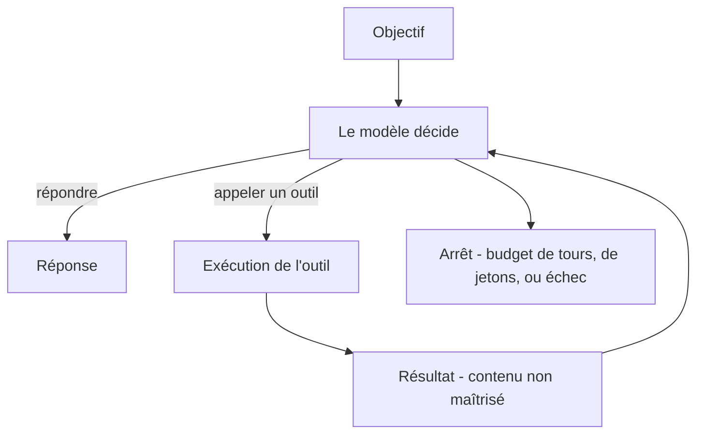

Systèmes où un modèle de langage décide lui-même, à chaque tour, s'il répond ou s'il appelle un outil, et boucle sur le résultat obtenu jusqu'à ce qu'une condition d'arrêt soit atteinte.

## À quoi ça sert

Un agent sert quand le nombre d'étapes n'est pas connu à l'avance. Si l'enchaînement est fixe — extraire, vérifier, écrire — un programme classique qui appelle le modèle à des points précis est plus simple, plus rapide, moins cher et testable. L'agent ne devient utile que lorsqu'il faut décider en cours de route quoi faire ensuite, à partir de ce qu'on vient d'apprendre.

Ce qui est difficile n'est presque jamais la boucle : on l'écrit en une page. C'est de **faire accepter qu'un système agisse**, et d'être en mesure de dire, après coup, pourquoi il a agi ainsi. La conception d'un agent est pour l'essentiel une conception de garde-fous, de journalisation et de réversibilité.

## Ce qu'il faut savoir

- **La boucle** : objectif, choix d'action, exécution, observation, itération. Tout le reste est de l'outillage autour.
- **Les outils sont l'agent.** La qualité dépend davantage du nom, de la description et du schéma d'arguments que du modèle. Peu d'outils, bien nommés, avec des erreurs explicites que le modèle peut lire et corriger.
- **Commencer par la plus petite unité d'autonomie qui apporte de la valeur**, et n'ajouter une capacité qu'une fois la précédente prouvée. C'est le meilleur conseil du domaine, et le plus ignoré.
- **La mémoire** : le contexte de la session, un état externe persistant, une mémoire longue durée. Chacune ajoute une surface de défaillance et une surface d'attaque — une mémoire empoisonnée se rejoue à chaque session.
- **Multi-agents** : pertinent quand les rôles sont réellement distincts et que les périmètres d'outils diffèrent. Le plus souvent, c'est une architecture qui multiplie le coût et la latence pour résoudre un défaut de prompt.
- **Plafonner dans le code** le nombre de tours, le budget de jetons et le temps. Une boucle non bornée est le mode de défaillance le plus coûteux du domaine.
- **Tout résultat d'outil est du contenu non maîtrisé** qui revient dans le contexte. C'est le vecteur d'injection indirecte principal. Voir [[notions/injection-de-prompt]].
- **L'évaluation porte sur la trajectoire**, pas seulement sur la réponse finale : quels outils, dans quel ordre, avec quels arguments. Deux réponses identiques obtenues par deux chemins ne se valent pas.

## Selon le métier

### Forward Deployed Engineer

Un agent en environnement client doit avoir un périmètre d'action explicitement borné, journalisé et réversible. Ce qui bloque n'est pas la technique mais l'acceptation : un service de contrôle interne n'autorise pas un système qui décide **et** agit sans trace. L'architecture qui passe est presque toujours hybride — le modèle interprète, le code déterministe applique les règles et écrit.

### AI Product Builder

L'usage rentable d'un agent dans ce métier est souvent dans l'atelier plutôt que dans le produit : assistants de codage branchés sur le dépôt, la base et le suivi de tickets. Dans le produit, la fonction « assistant conversationnel » est la plus demandée, la plus chère à évaluer, la moins utilisée après le premier mois et la plus exposée en cas de dérapage.

> [!warning] Piège
> Confondre agent et enchaînement. Beaucoup de systèmes appelés agents sont des séquences fixes d'appels de modèle, et s'en portent très bien. Déguiser un enchaînement en agent ajoute le non-déterminisme, la difficulté de test et le coût variable, sans rien gagner. Si l'on sait dessiner l'organigramme complet, ce n'est pas un agent.

## Pour aller plus loin

- [What are Tools in AI Agents? — Hugging Face](https://huggingface.co/learn/agents-course/en/unit1/tools) — la partie qui détermine la qualité du résultat.
- [Building an AI Agent Tutorial — LangChain](https://python.langchain.com/docs/tutorials/agents/) — une implémentation complète, à lire pour la structure plus que pour la bibliothèque.
- [How to Design My First AI Agent](https://towardsdatascience.com/how-to-design-my-first-ai-agent/) — le versant conception, avec les arbitrages.
- [[parcours/ai-agents/index|AI Agents]] — la note de fond du corpus sur le sujet.

## Appelée par

- [[parcours/forward-deployed-engineer/index|Forward Deployed Engineer]]
- [[parcours/ai-product-builder|AI Product Builder]]

Voisines : [[notions/mcp]], [[notions/garde-fous]], [[notions/evaluation-llm]], [[notions/cout-et-latence-inference]].
