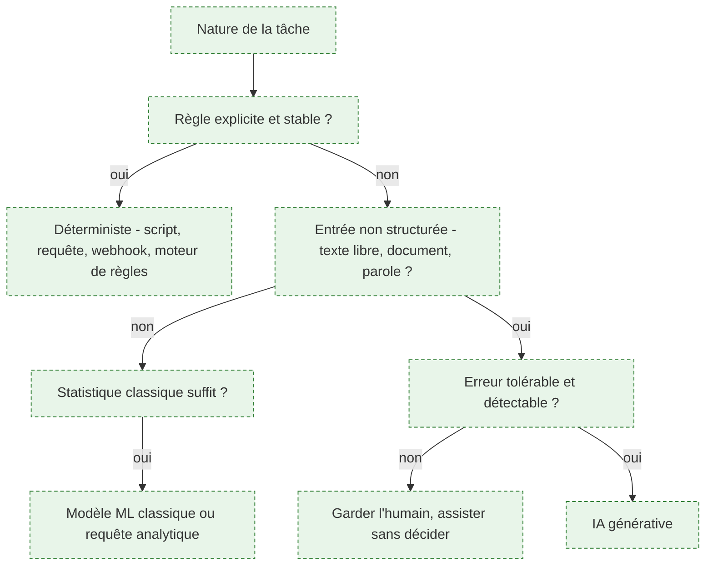

# Arbitrage déterministe / probabiliste

Décision, prise étape par étape sur un processus, de traiter chaque étape par un mécanisme dont le résultat est vérifiable par construction — script, requête, webhook, moteur de règles, RPA — ou par un modèle dont le résultat est probable.

## À quoi ça sert

C'est l'erreur de cadrage la plus coûteuse du domaine, et elle se commet **dans les deux sens**. Un système génératif placé sur une tâche déterministe coûte plus cher, répond plus lentement, se trompe parfois, et remplace un comportement vérifiable par un comportement à surveiller. Un moteur de règles placé sur une tâche qui demande de l'interprétation produit un arbre de conditions ingérable que personne ne maintiendra.

Le sens de l'erreur dépend du métier, et c'est le constat le plus utile du lot : **le FDE sous-utilise l'IA** sur des processus parfaitement automatisables par un connecteur et une suppression d'étape, parce que le sujet est cadré comme un « projet IA » ; **le product builder met un modèle là où une règle suffisait**, parce que le générateur l'a proposé et que c'était plus rapide à écrire.

L'arbitrage se rend par étape de processus, pas une fois pour le projet entier : un même processus mélange presque toujours les deux natures.

## La grille de décision

Cinq étapes, dans cet ordre : qualifier la nature de la tâche, puis vérifier s'il existe une règle explicite et stable, puis si l'entrée est non structurée, puis si une méthode statistique classique suffit, et enfin si l'erreur est tolérable et détectable.

## Ce qu'il faut savoir

- **Règle explicite, entrée structurée, résultat vérifiable : c'est du déterministe.** Moins cher, testable, explicable à un auditeur. Aucune de ces trois propriétés n'est récupérable ensuite.
- **Entrée non structurée et jugement nécessaire** — texte libre, courriel, document scanné, transcription : l'IA générative devient pertinente.
- **Entre les deux, tout un espace** couvert par le ML classique ou l'analyse : classer, prédire, détecter une anomalie sur des données tabulaires ne demande pas un modèle de langage.
- **La question qui tranche vraiment n'est pas la difficulté de la tâche, c'est le coût d'une erreur et sa détectabilité.** Une erreur rare et invisible dans un processus comptable coûte plus qu'une erreur fréquente et visible dans une aide à la rédaction.
- **L'architecture hybride gagne le plus souvent** : le modèle fait la traduction, le déterministe fait le travail. Un modèle extrait des informations structurées d'un document, du code classique applique les règles métier, vérifie la cohérence et écrit dans le système. Souplesse sur l'entrée, vérifiabilité sur la décision.
- **La RPA — pilotage de l'interface — est une solution de dernier recours** quand aucune interface programmatique n'existe. Elle casse à chaque changement d'écran : l'assumer comme dette explicite ou ne pas la retenir.
- **L'arbitrage est un livrable écrit**, pas une intuition d'ingénieur. Il sera relu quand le système se comportera mal.

## Selon le métier

### Forward Deployed Engineer

L'arbitrage se rend **par étape du processus**, par écrit, et se présente au client. Le piège propre à ce métier est le sens de la commande : quand le budget est intitulé « projet IA », toute réponse qui n'utilise pas d'IA paraît hors sujet, y compris aux yeux du FDE. C'est précisément le moment de dire que la moitié du gain vient d'un connecteur et d'une suppression d'étape.

### AI Product Builder

L'erreur est inversée : on ne met pas trop peu d'IA, on met un LLM dans une fonction qui était une règle métier de quinze lignes, parce que le générateur l'a proposé. Une classification à sept catégories stables, un calcul, un routage : ce sont des règles. On n'y met un modèle que si l'entrée est du langage libre ou si les cas sont ouverts.

> [!warning] Piège
> Laisser l'arbitrage se faire par la commande plutôt que par la tâche. Dans un sens, le budget s'appelle « IA » et interdit la réponse simple ; dans l'autre, l'outil propose un appel de modèle et personne ne se demande si une condition suffisait. Dans les deux cas, la décision a été prise par le contexte et non par l'analyse de l'étape.

## Pour aller plus loin

- [Prompt Engineering vs Fine Tuning: When to Use Each](https://www.codecademy.com/article/prompt-engineering-vs-fine-tuning) — un arbitrage voisin, utile pour la méthode de comparaison.
- [[roadmaps/04 - Roadmap — Machine Learning]] — l'espace intermédiaire entre la règle et le génératif, souvent la bonne réponse.
- [[parcours/forward-deployed-engineer/arbitrage-technologique]] — la grille appliquée à un processus réel, avec ses conséquences de mission.

## Appelée par

- [[parcours/forward-deployed-engineer/index|Forward Deployed Engineer]]
- [[parcours/ai-product-builder|AI Product Builder]]

Voisines : [[notions/reingenierie-de-processus]], [[notions/roi-des-projets-ia]], [[notions/choix-de-modele]], [[notions/bpmn]].
