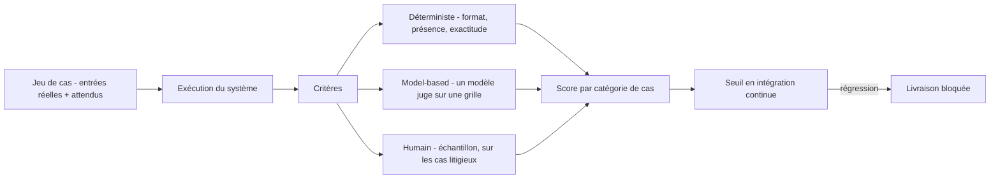

Pratique consistant à mesurer le comportement d'un système génératif sur un jeu de cas fixé, avec des critères décidés à l'avance, de façon rejouable à chaque changement de prompt, de modèle, d'outil ou de corpus.

## À quoi ça sert

Un système à base de modèle n'a pas d'état binaire. Il n'est ni « marche » ni « ne marche pas » : il a un taux de réussite sur une population de cas, et ce taux bouge sans qu'on y touche, parce que le fournisseur met à jour le modèle, parce qu'un document est entré dans l'index, parce qu'une phrase du prompt système a été reformulée. Sans mesure rejouable, chaque changement remet la qualité à zéro sans que personne s'en aperçoive.

L'évaluation résout trois problèmes distincts, et c'est pour cela qu'elle revient dans trois métiers. Elle **remplace l'opinion par un chiffre** — ce qui est autant un acte technique qu'un acte de négociation. Elle **détecte la régression**, c'est-à-dire l'amélioration d'un cas qui en casse trois autres, invisible autrement. Et elle **rend la sécurité mesurable** : un corpus d'attaques rejoué à chaque livraison transforme un audit ponctuel en posture suivie.

Le jeu d'évaluation est aussi l'artefact le plus durable d'un projet. Il survit au modèle, au prestataire et à l'équipe qui l'a écrit.

## Ce qu'il faut savoir

- **Le jeu de cas vient du réel.** Des entrées inventées produisent un score flatteur et inutile. La bonne source est la production, les tickets, les demandes que le métier a réellement formulées — y compris les mal formulées.
- **Classer les cas par catégorie** (cas nominal, cas limite, cas hors périmètre, cas piégé) et publier un score par catégorie. Un score global masque exactement ce qu'on cherche à voir.
- **Trois familles de critères.** Déterministe : le format est-il valide, la valeur extraite est-elle exacte, la réponse cite-t-elle une source existante. Model-based : un modèle note sur une grille écrite. Humain : coûteux, réservé à un échantillon et aux arbitrages. Commencer par le déterministe, toujours — c'est le moins cher et le plus stable.
- **Le juge modèle a ses biais** : préférence pour les réponses longues, pour son propre style, sensibilité à l'ordre des options. Il se calibre contre un échantillon annoté par un humain avant d'être cru.
- **Toute correction entre dans le jeu.** Un défaut signalé par un utilisateur devient un cas d'évaluation le jour même. C'est le mécanisme qui fait croître la couverture sans effort de conception.
- **Épingler la version du modèle** quand le fournisseur le permet, et rejouer l'évaluation à chaque changement de version. Une mise à jour silencieuse est un changement non testé.
- **Le seuil bloquant en intégration continue** est ce qui distingue une évaluation d'un tableau de bord décoratif. Sans conséquence, la mesure est ignorée dès la première urgence.
- **Mesurer aussi le coût et la latence** sur le même jeu : une amélioration de qualité obtenue en triplant la facture est une décision, pas un progrès.

## Selon le métier

### Forward Deployed Engineer

Le jeu d'évaluation est autant un instrument de négociation qu'un outil technique. Il déplace la recette d'une impression vers un chiffre, et il protège du cas unique montré en réunion comme preuve que « ça ne marche pas ». Il se construit en phase d'arbitrage, il est versionné dans le dépôt du client, et il fait partie du transfert de fin de mission : comment l'exécuter, comment y ajouter un cas, comment lire le résultat.

### AI Product Builder

C'est le point où un product builder échoue le plus souvent, parce qu'il vient d'une culture du binaire — ça marche ou ça ne marche pas. Sans jeu de cas attendus rejoué à chaque changement, chaque amélioration est un pari. Le format minimal viable est modeste : trente cas dans un fichier, un script, un score affiché en intégration continue.

### AI Red Teaming

L'évaluation est ce qui transforme un audit en capacité durable. Le corpus est adverse — injections directes et indirectes, tentatives d'exfiltration, contournements de filtre — et les critères sont vérifiables par programme : le marqueur secret est-il sorti, l'outil interdit a-t-il été appelé, la donnée d'un autre locataire est-elle apparue. Le corpus tourne à chaque changement de prompt, de modèle, de version d'outil ou de politique de filtrage, avec un seuil bloquant. Sans cela, on sait qu'une attaque a marché un jour donné et rien de la posture du système.

> [!warning] Piège
> Construire le jeu d'évaluation à partir des cas qu'on sait traiter. Le score monte, la couverture n'avance pas, et les défaillances réelles restent hors champ. Le jeu se construit à partir des cas qui ont échoué, pas de ceux qui ont réussi. Corollaire : un score de 97 % obtenu au premier essai n'est pas un bon résultat, c'est le signe que le jeu est trop facile.

## Pour aller plus loin

- [Demystifying evals for AI agents — Anthropic](https://www.anthropic.com/engineering/demystifying-evals-for-ai-agents) — pourquoi commencer par le déterministe et comment construire un jeu qui sert.
- [DeepEval — framework d'évaluation open source](https://www.deepeval.com/) — l'outillage, si l'on ne veut pas écrire le harnais soi-même.
- [Why Evals Matter — LangSmith Evaluations](https://www.youtube.com/watch?v=vygFgCNR7WA) — la série vidéo, orientée mise en pratique.
- [HackAPrompt Dataset](https://huggingface.co/datasets/hackaprompt/hackaprompt-dataset) — corpus d'attaques réelles, point de départ d'une évaluation adverse.

## Appelée par

- [[parcours/forward-deployed-engineer/index|Forward Deployed Engineer]]
- [[parcours/ai-product-builder|AI Product Builder]]
- [[parcours/ai-red-teaming/index|AI Red Teaming]]

Voisines : [[notions/observabilite]], [[notions/tests-logiciels]], [[notions/integration-continue]], [[notions/metriques-evaluation-ml]].
