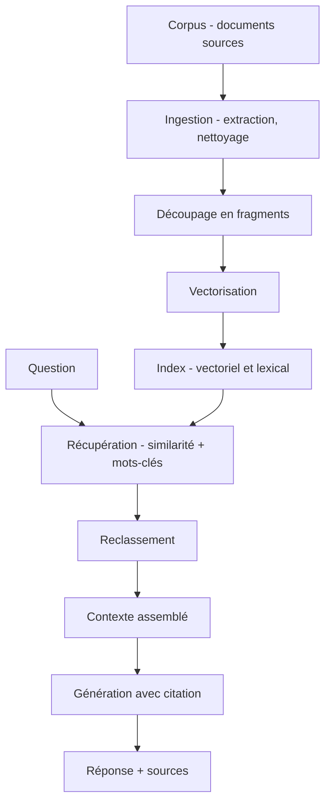

Architecture qui va chercher, au moment de la requête, les extraits de documents pertinents dans un corpus, puis les place dans le contexte du modèle pour qu'il réponde à partir de ce qu'on lui a fourni plutôt que de ce qu'il a mémorisé.

## À quoi ça sert

Le RAG répond à un problème précis : un modèle ne connaît pas les documents de l'organisation, et l'affinage n'est pas la bonne façon de les lui apprendre. Il change aussi la nature de l'erreur — au lieu d'une affirmation plausible et invérifiable, on obtient une réponse rattachée à des extraits qu'on peut afficher. La citation de source n'est pas un ornement, c'est ce qui rend le système utilisable dans un contexte où quelqu'un devra assumer la réponse.

Son second intérêt est opérationnel : le corpus se met à jour sans toucher au modèle. Un document nouveau est indexé et devient répondable dans la minute, ce qui est hors de portée de toute méthode d'entraînement.

Le coût réel n'est presque jamais là où on l'attend. La génération est la partie facile ; l'ingestion — extraction du texte, découpage, gestion des versions, des droits, des documents scannés — concentre l'essentiel de l'effort.

## Ce qu'il faut savoir

- **Le découpage décide de tout.** Un fragment trop petit perd son contexte, trop grand il noie le signal. Les découpages qui suivent la structure du document — titres, sections, tableaux conservés entiers — battent presque toujours le découpage à taille fixe.
- **Récupération hybride.** La similarité vectorielle rate les identifiants, les références réglementaires et les noms propres rares ; la recherche lexicale les trouve. Combiner les deux et reclasser est le réglage qui rapporte le plus pour le moins d'effort. Voir [[notions/embeddings-et-bases-vectorielles]].
- **Le reclassement** par un modèle dédié, appliqué à une vingtaine de candidats pour n'en garder que quatre ou cinq, corrige une grande partie des récupérations médiocres.
- **Les métadonnées valent autant que le texte** : date, version, service émetteur, niveau de confidentialité. Elles permettent de filtrer avant de chercher, ce qui est plus efficace et plus sûr que de filtrer après.
- **Les droits d'accès se filtrent à la requête**, pas après coup. Un index interrogé par un compte de service unique qui voit tout fait fuiter par construction ; l'identité de l'utilisateur doit descendre jusqu'à la couche de récupération.
- **Les modes d'échec sont identifiables** : rien de pertinent n'a été récupéré, le pertinent a été récupéré mais noyé, le modèle a ignoré le contexte, le modèle a mélangé deux fragments contradictoires. Les distinguer demande de journaliser le contexte réellement envoyé — sans quoi le diagnostic est impossible.
- **Évaluer séparément la récupération et la génération.** Un taux de rappel sur les fragments attendus, puis une évaluation de la réponse. Confondre les deux fait corriger le prompt quand le problème est l'index.
- **Tout le monde n'a pas besoin de RAG.** Si le corpus tient dans la fenêtre de contexte, l'y mettre directement est plus simple, plus fiable et souvent moins cher.

## Selon le métier

### Forward Deployed Engineer

Le corpus client conditionne tout, et il est toujours plus sale que prévu : documents scannés, versions multiples du même contrat, droits d'accès par document, tableaux en images. L'effort réel est dans l'ingestion, pas dans la génération — l'annoncer au cadrage évite de vendre trois semaines ce qui en prend huit.

### AI Product Builder

Le RAG n'est nécessaire que si le produit a un corpus propre à interroger. Beaucoup de produits n'en ont pas et s'en passent très bien ; le monter par réflexe est un des surcoûts les plus fréquents du métier — une base vectorielle de plus à héberger, à sauvegarder et à resynchroniser pour un gain nul.

### AI Red Teaming

L'index est une surface d'attaque à part entière. Faire indexer un document suffit à installer une charge persistante — à la fois injection indirecte et empoisonnement — sans toucher aux poids du modèle, et elle survit à tout changement de modèle. Deux tests systématiques dès qu'il y a du RAG : peut-on faire entrer un document dans l'index, et la récupération respecte-t-elle les droits de l'utilisateur courant.

> [!warning] Piège
> Régler le prompt pour compenser une mauvaise récupération. Tant que le bon fragment n'est pas dans le contexte, aucune formulation ne produira la bonne réponse — le modèle inventera simplement avec plus d'assurance. Le premier diagnostic consiste toujours à afficher ce qui a été récupéré et à vérifier à la main si la réponse s'y trouvait.

## Pour aller plus loin

- [Retrieval-Augmented Generation for Knowledge-Intensive NLP Tasks](https://arxiv.org/abs/2005.11401) — l'article fondateur, utile pour savoir ce que le terme désignait à l'origine.
- [A Guide to Chunking Strategies for RAG](https://zilliz.com/learn/guide-to-chunking-strategies-for-rag) — le découpage, comparé stratégie par stratégie.
- [RAG Failure Patterns, Explained](https://www.youtube.com/watch?v=1nI0hX9dvD4) — les modes d'échec, ce qui est le meilleur angle d'entrée en pratique.

## Appelée par

- [[parcours/forward-deployed-engineer/index|Forward Deployed Engineer]]
- [[parcours/ai-product-builder/index|AI Product Builder]]
- [[parcours/ai-red-teaming/index|AI Red Teaming]]

Voisines : [[notions/embeddings-et-bases-vectorielles]], [[notions/agents-llm]], [[notions/injection-de-prompt]], [[notions/evaluation-llm]].
