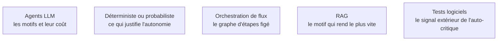

Choisir une architecture, c'est choisir combien de liberté on laisse au modèle : prendre le motif le plus contraint qui résout le problème, et ne monter en autonomie que sur preuve d'insuffisance.

## Six motifs, du plus contraint au plus libre

Le **graphe d'étapes figé** place un modèle dans certains nœuds seulement : déterministe, testable, observable. Il est largement sous-estimé — la majorité des « agents » livrés en production sont, et doivent être, des graphes de ce type. Le **planificateur-exécuteur** produit un plan en amont puis l'exécute : bon pour la lisibilité et le contrôle du budget, fragile quand la réalité contredit le plan, donc à doter d'une replanification explicite. La boucle **raisonner-agir** alterne pensée, action et observation ; elle est aujourd'hui native aux API d'appel d'outils, et le prompt textuel des débuts n'est plus nécessaire.

L'**agent de récupération** — le modèle reformule, cherche plusieurs fois, croise les sources — est le motif qui rend le plus vite en entreprise. L'**auto-critique** n'est efficace que si la critique s'appuie sur un signal extérieur : tests, analyseur statique, validation de schéma ; purement textuelle, elle produit surtout de la complaisance. Le **multi-agents**, enfin, apporte un gain réel sur l'exploration parallèle et un gain douteux sur les tâches séquentielles, où le coût de coordination dépasse le bénéfice.

## Ce qu'il faut savoir faire

- **Justifier par écrit pourquoi ce n'est pas un simple graphe d'étapes.** Si la justification ne tient pas en trois lignes, c'est un graphe d'étapes.
- **Découper le multi-agents sur des frontières de contexte et de permissions**, jamais sur des titres de poste. Le motif qui tient est l'orchestrateur avec sous-agents à contexte isolé : le sous-agent reçoit une tâche fermée, travaille dans son propre contexte et ne renvoie qu'un résumé.
- **Reconnaître que le bénéfice de l'isolation n'est pas la spécialisation.** Le vrai gain est que le bruit de la recherche ne pollue pas le contexte du décideur.
- **Éviter les conversations libres entre agents pairs.** C'est une source régulière d'incidents et de boucles infinies, sans gain mesuré.
- **Outiller toute auto-critique.** Brancher la critique sur ce qui échoue objectivement — un test rouge, un schéma invalide — plutôt que sur une relecture du texte produit.
- **Prévoir la replanification dès le premier plan.** Un planificateur sans issue de secours produit une exécution qui continue à appliquer un plan invalidé au deuxième pas.

> [!warning] Piège
> Le multi-agents comme organigramme. Copier une structure d'entreprise — un « chef de projet », un « développeur », un « testeur » — produit des tours de table verbeux et une facture multipliée sans gain mesurable.

## Les notions mobilisées

- [[notions/agents-llm]] — angle agents : le choix du motif se réévalue après les premières mesures, il ne se décide pas sur une architecture de diapositive.
- [[notions/arbitrage-deterministe-probabiliste]] — la question préalable à tout choix de motif : ce chemin dépend-il réellement de l'observation ?
- [[notions/orchestration-de-flux]] — le vocabulaire et l'outillage des graphes d'étapes, ordonnancement et reprise compris, largement transposables ici.
- [[notions/rag]] — l'agent de récupération est le motif le plus rentable en entreprise, et celui dont les modes d'échec sont les mieux documentés.
- [[notions/tests-logiciels]] — sans signal de test, l'auto-critique n'est qu'une seconde génération de texte plus assurée que la première.

## Pour apprendre

- [Plan and Execute: AI Agents Architecture](https://medium.com/@shubham.ksingh.cer14/plan-and-execute-ai-agents-architecture-f6c60b5b9598) — le motif planificateur-exécuteur, avec ses limites.
- [Airflow — Directed Acyclic Graphs](https://airflow.apache.org/docs/apache-airflow/stable/concepts/dags.html) — la documentation de référence sur les graphes d'étapes, hors contexte LLM et d'autant plus claire.
- [Guide to multi-agent systems](https://cloud.google.com/discover/what-is-a-multi-agent-system) — un panorama des topologies multi-agents et de ce qu'elles coûtent.
- [What is multi-agent collaboration?](https://www.ibm.com/think/topics/multi-agent-collaboration) — le même terrain vu par un autre éditeur ; les écarts sont instructifs.
- [Multi-Agent-based Code Generation](https://arxiv.org/abs/2312.13010) — un cas d'étude chiffré, sur le domaine où le motif a le plus été mesuré.
