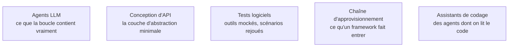

Niveau attendu : **autonomie**. Écrire la boucle à la main, puis nommer le besoin qui justifie un framework et assumer les dépendances qu'il fait entrer : un confirmé décide seul et sait revenir en arrière. Pas au-delà, parce que l'outillage change tous les six mois et qu'aucune autorité durable ne se construit dessus.

Trois niveaux d'abstraction, trois compromis : écrire la boucle à la main est formateur et souvent suffisant, et les frameworks se paient sur la persistance d'état et la reprise sur incident, pas sur la boucle elle-même.

## Ce que chaque niveau apporte

**À la main**, c'est une centaine de lignes : appeler, tester s'il y a des appels d'outils, exécuter, réinjecter, recommencer, avec un compteur de tours maximum. Tout le reste est votre code, et c'est précisément ce qui rend le débogage possible. L'analyse de la sortie n'est plus un problème : les sorties structurées et les appels d'outils typés l'ont réglée — écrire un analyseur à l'expression régulière est aujourd'hui un signal d'alerte.

**L'appel de fonction natif** est le même concept dans trois formats de messages selon le fournisseur. Une couche d'abstraction minimale suffit à les couvrir, et c'est l'unique service que rend vraiment un framework généraliste.

**Les frameworks** se justifient sur un besoin nommé. Machine à états explicite, points de reprise, interruption humaine et streaming pour les plus sérieux ; intégrations et catalogue de motifs pour les plus larges ; orientation données et indexation pour ceux issus du RAG ; orientation multi-agents pour ceux qui démontrent vite mais se contraignent mal quand le nombre de tours augmente.

## Ce qu'il faut savoir faire

- **Écrire la boucle avant de choisir un framework.** Sinon on finit par déboguer les abstractions d'un tiers au lieu de son propre problème, et les traces deviennent illisibles.
- **Gérer les erreurs comme un service, pas comme un script** : retry avec backoff et jitter, distinction entre erreur récupérable et erreur métier, plafond de dépense par session.
- **Nommer le besoin avant d'adopter.** Typiquement la persistance d'état et la reprise après incident : si ce n'est pas ça, le framework ajoute surtout de la surface.
- **Ne pas démarrer un projet sur une API d'agent hébergée en fin de vie.** Les services d'agents managés bougent vite ; vérifier le statut de dépréciation avant d'y investir une architecture.
- **Valider les entrées et les sorties d'agent par un schéma typé.** C'est le compromis le plus propre en Python, et il supprime une classe entière d'erreurs avant qu'elles atteignent un outil.
- **Lire ce qu'un framework fait entrer dans le projet.** Un cadre d'agents tire des dizaines de dépendances transitives et, souvent, des serveurs d'outils tiers : c'est une décision de chaîne d'approvisionnement.

> [!tip] Un vocabulaire à corriger
> Le nœud « Smol Depot » de la roadmap amont est une erreur d'extraction : il s'agit de **smolagents**, le framework minimaliste de Hugging Face, qui pousse le motif « code comme action ». Excellent pour comprendre la boucle, précisément parce qu'il en cache très peu.

> [!warning] Piège
> Choisir le framework avant d'avoir mesuré. Écrire la boucle, mesurer, puis n'adopter un cadre que pour un besoin nommé — c'est l'ordre qui évite la réécriture au troisième mois.

## Les notions mobilisées

- [[notions/agents-llm]] — angle agents : ce que le framework masque est exactement ce qu'il faudra comprendre le jour de l'incident.
- [[notions/conception-d-api]] — la couche minimale devant trois formats de messages fournisseurs est la seule abstraction rentable à écrire soi-même.
- [[notions/tests-logiciels]] — rejouer des scénarios de bout en bout avec des outils simulés isole la variabilité du modèle du reste des pannes.
- [[notions/chaine-d-approvisionnement-logicielle]] — SDK, cadres et serveurs d'outils tiers entrent dans le périmètre de sécurité du projet au même titre qu'une bibliothèque.
- [[notions/assistants-de-codage]] — les agents de code libres sont le corpus le plus accessible pour lire une boucle de production réelle.

## Pour apprendre

- [LangGraph](https://docs.langchain.com/oss/python/langgraph/overview) — machine à états, points de reprise, interruption humaine : ce qui compte réellement en production.
- [langgraph](https://github.com/langchain-ai/langgraph) — le dépôt, pour lire comment la persistance est implémentée.
- [Hugging Face — smolagents et multi-agents](https://huggingface.co/learn/agents-course/en/unit2/smolagents/multi_agent_systems) — le framework minimaliste et le motif « code comme action », avec exercices.
- [Agno](https://docs.agno.com/) — une approche orientée performance et faible surcoût d'instanciation, avec mémoire et outils intégrés.
- [A practical guide to building agents](https://cdn.openai.com/business-guides-and-resources/a-practical-guide-to-building-agents.pdf) — un guide d'éditeur, mais le plus sobre sur le découpage d'une boucle.
- [Instructor](https://github.com/567-labs/instructor) — validation et réessai des sorties structurées, à brancher avant l'exécution de l'outil.
