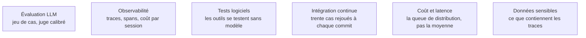

Niveau attendu : **autonomie**. Évaluer la trajectoire et pas seulement la réponse, calibrer un juge, instrumenter en OpenTelemetry : des gestes de conception qu'un confirmé pose seul ; la référence reviendrait à l'équipe qui opère la plateforme de traces, pas à celui qui l'instrumente.

Le vrai goulot d'étranglement des projets d'agents : sans jeu d'évaluation, aucune modification de prompt, de modèle ou d'outil n'est décidable — et sans trace complète, un incident non déterministe est irreproductible, donc non corrigeable.

## Évaluer la trajectoire, pas seulement la réponse

A-t-il appelé les bons outils, dans un ordre plausible, sans tours inutiles ? Un bon résultat obtenu par hasard en vingt tours est une régression que rien d'autre ne détecte. Les métriques qui comptent sont celles de l'agent — taux de réussite de la tâche, nombre de tours, taux d'erreur d'appel d'outil, coût par session, latence au 95ᵉ centile — et la qualité textuelle seule ne dit rien.

Privilégier les tâches **vérifiables par programme** : le test passe, le chiffre est exact, le fichier est produit. Le juge à base de modèle se réserve aux dimensions subjectives, calibré contre des annotations humaines. Trente cas bien choisis rejoués en intégration continue valent mieux qu'un test de référence académique.

## Ce qu'il faut savoir faire

- **Tester les outils comme du code normal, sans modèle.** Un outil qui échoue en silence fait boucler l'agent, et c'est la moitié des pannes.
- **Rejouer des scénarios de bout en bout avec des outils simulés**, pour isoler la variabilité du modèle de celle de l'environnement.
- **Construire le référentiel avec des humains au démarrage**, puis échantillonner en continu pour recalibrer les juges automatiques. Un juge non recalibré dérive avec le modèle qu'il note.
- **Propager un identifiant de session sur tous les tours**, avec une span par appel de modèle et par appel d'outil, et la relation parent-enfant préservée pour les sous-agents.
- **Faire contenir à la trace le prompt exact, les outils exposés, chaque appel avec ses arguments, chaque résultat, les tokens et le coût.** Une trace partielle ne permet pas de rejouer.
- **Instrumenter en OpenTelemetry natif** plutôt que se lier au SDK d'un éditeur : les traces partent alors dans le backend d'observabilité déjà en place, pas dans un silo de plus.
- **Monter deux tableaux de bord dès le premier jour** : coût par session, et distribution du nombre de tours.
- **Rejouer les traces de production échouées** — c'est la meilleure source de cas de test, et la seule qui ressemble aux utilisateurs réels.

> [!warning] Piège
> Juger un agent sur une moyenne. Ce qui compte est la queue de distribution : les quelques pour cent de sessions qui partent à quarante tours, coûtent dix fois le prix moyen et finissent en échec. Second piège, plus grave : journaliser les prompts complets sans filtrage — rédaction à l'émission, rétention courte, accès restreint.

## Les notions mobilisées

- [[notions/evaluation-llm]] — angle agents : on évalue une trajectoire et un coût, pas seulement une réponse ; c'est ce qui distingue l'évaluation d'agent de l'évaluation de modèle.
- [[notions/observabilite]] — la trace hiérarchique avec sous-agents est la seule structure qui permette de reconstituer ce qui s'est passé un mardi à 3 heures.
- [[notions/tests-logiciels]] — outils testés en unitaire, flux testés en intégration avec simulacres : la partie non probabiliste se teste normalement.
- [[notions/integration-continue]] — un jeu d'évaluation lancé à la main n'est jamais lancé ; il n'a de valeur qu'automatisé.
- [[notions/cout-et-latence-inference]] — le coût par session et sa dispersion sont des métriques de qualité, pas seulement de facturation.
- [[notions/donnees-sensibles]] — les traces contiennent des données clients, des secrets collés par l'utilisateur, parfois des jetons d'API.

## Pour apprendre

- [Langfuse](https://langfuse.com/docs) — traces, coûts et jeux d'évaluation, libre et auto-hébergeable : le choix par défaut quand les données ne sortent pas.
- [DeepEval](https://www.deepeval.com/) — l'évaluation écrite comme des tests, intégrable dans pytest et donc en intégration continue.
- [Ragas](https://docs.ragas.io/en/stable/) — les métriques de récupération, à brancher sur la partie RAG d'un agent.
- [LangSmith Documentation](https://docs.smith.langchain.com/) — jeux de données, exécutions et traces liés dans un même outil.
- [openllmetry](https://www.traceloop.com/blog/openllmetry) — l'instrumentation OpenTelemetry des appels LLM, pour éviter le silo d'observabilité.
- [deepeval](https://github.com/confident-ai/deepeval) — le dépôt, pour lire comment les métriques sont réellement calculées.
