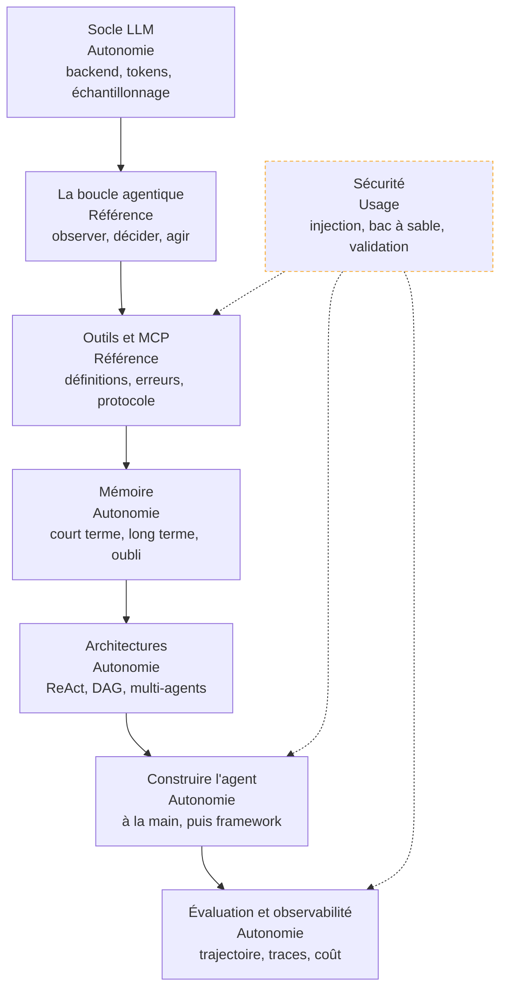

Mettre un agent en production plutôt qu'une démonstration : une boucle bornée, des outils dont les erreurs se corrigent, une mémoire qui oublie, et une trace qui permet de rejouer l'incident.

## La roadmap

Chaque case mène à sa page, et porte en deuxième ligne le niveau attendu chez un profil confirmé — **notion** (reconnaître le sujet, savoir qui appeler), **usage** (s'en servir sur un chemin balisé), **autonomie** (concevoir, déboguer sous pression, arbitrer et défendre), **référence** (faire autorité dans la salle). Cochez les étapes acquises en bas de page pour suivre votre progression.

## Ma progression

- [ ] [[parcours/ai-agents/socle-llm|Socle LLM et backend]] — un agent est d'abord un service asynchrone qui appelle une API payante
- [ ] [[parcours/ai-agents/la-boucle-agentique|La boucle agentique]] — ce qui sépare un agent d'un appel de modèle, et le prompt qui la spécifie
- [ ] [[parcours/ai-agents/outils-et-mcp|Outils, actions et MCP]] — écrire des définitions que le modèle lit, et les exposer une seule fois
- [ ] [[parcours/ai-agents/memoire|Mémoire de l'agent]] — court terme, long terme, profil utilisateur, stratégies d'oubli
- [ ] [[parcours/ai-agents/architectures|Architectures d'agents]] — du graphe déterministe au multi-agents, et ce qui justifie de monter
- [ ] [[parcours/ai-agents/construire-l-agent|Construire l'agent]] — la boucle à la main, l'appel de fonction natif, puis le framework
- [ ] [[parcours/ai-agents/evaluation-et-observabilite|Évaluation et observabilité]] — évaluer la trajectoire, tracer, mesurer la queue de distribution
- [ ] [[parcours/ai-agents/securite|Sécurité de l'agent]] — triade létale, bac à sable, permissions, validation humaine
