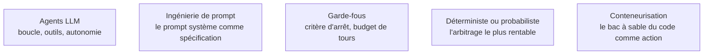

Niveau attendu : **référence**. Premier des deux domaines où un ingénieur d'agents confirmé doit faire autorité : le critère d'arrêt, la validation des arguments côté application et l'arbitrage entre autonomie et graphe déterministe sont exactement ce que personne d'autre dans la salle ne tranchera à sa place.

Ce qui distingue un agent d'un appel de modèle, c'est la boucle : il choisit une action, observe le résultat réel, et décide de la suite. Cette rétroaction produit toute la valeur — et toute la difficulté opérationnelle.

## Les quatre temps, et le cinquième qu'on oublie

L'entrée est normalisée — texte, fichier, événement — puis donnée au modèle, qui décide s'il répond, appelle un outil ou pose une question. L'exécution se fait **côté application**, avec validation systématique des arguments générés : le modèle ne lance jamais rien lui-même, c'est votre code qui exécute et donc votre code qui porte la responsabilité. Le résultat retourne dans le contexte, et c'est là que la qualité se joue : un message d'erreur explicite permet à l'agent de se corriger, un `null` silencieux le fait boucler.

Le cinquième temps est le critère d'arrêt. Retirez-le et vous avez un générateur de facture. Nombre maximal de tours, budget de tokens, délai d'expiration : les trois se câblent, aucun ne se négocie.

## Le prompt système est la spécification

Sur un agent, ce n'est pas un texte d'ambiance : il fixe le comportement autorisé, les outils disponibles, les cas de refus et le format de sortie. Ces quelques centaines de mots ont plus d'effet sur la fiabilité que le choix du framework. Ce qui compte le plus dedans, ce sont les **règles d'usage des outils** : quand appeler quoi, quoi faire en cas d'échec, quand s'arrêter et rendre la main.

## Ce qu'il faut savoir faire

- **Trancher avant de coder : autonomie ou enchaînement déterministe.** Si les étapes sont connues à l'avance, un graphe classique est plus rapide, moins cher, testable et débogable. L'autonomie ne se justifie que quand le chemin dépend réellement de l'observation.
- **Choisir des tâches vérifiables ou réversibles.** Les cas qui tiennent aujourd'hui sont ceux où l'action se vérifie — le code compile, la requête renvoie des lignes — ou s'annule. Irréversible et non vérifiable reste en validation humaine.
- **Ne pas imposer de plan explicite à un modèle de raisonnement.** La décomposition avant réponse reste efficace sur les modèles standards ; sur les modèles à raisonnement natif, elle est redondante et peut nuire.
- **Réserver l'exploration de plusieurs branches à l'hors-ligne.** Coûteuse, rarement rentable en production, utile pour générer des plans ou des jeux de tests.
- **Considérer le motif « code comme action ».** Plutôt que dix outils en dix tours, l'agent écrit un script qui les orchestre et ne renvoie que le résultat : moins de tours, moins de tokens, et une composition que l'appel d'outil tour par tour ne permet pas. Contrepartie non négociable : un vrai bac à sable.
- **Figer un jeu de cas et le rejouer à chaque modification du prompt.** Sans cela, on optimise à l'aveugle et on régresse en silence.

> [!warning] Piège
> Empiler les interdictions au fil des incidents. Un prompt système de plusieurs milliers de tokens de « ne fais jamais… » devient contradictoire et coûte cher à chaque tour. Les contraintes dures se codent dans l'application — validation, permissions — pas dans le prompt.

## Les notions mobilisées

- [[notions/agents-llm]] — angle agents : commencer par la plus petite unité d'autonomie qui apporte de la valeur, et n'ajouter une capacité qu'une fois la précédente prouvée.
- [[notions/ingenierie-de-prompt]] — sur un agent, la partie qui rend vraiment est celle des règles d'usage des outils, pas les formules d'invocation.
- [[notions/garde-fous]] — le critère d'arrêt est le premier garde-fou, et le seul qui protège du coût autant que du comportement.
- [[notions/arbitrage-deterministe-probabiliste]] — la décision d'architecture la plus rentable du projet se prend avant la première ligne de code.
- [[notions/conteneurisation]] — le bac à sable jetable, sans réseau ni secret, est ce qui rend le motif « code comme action » utilisable.

## Pour apprendre

- [Hugging Face — La boucle de l'agent](https://huggingface.co/learn/agents-course/en/unit1/agent-steps-and-structure) — les étapes décomposées, gratuitement et avec des exercices.
- [ReAct: Synergizing Reasoning and Acting](https://react-lm.github.io/) — l'article et la page du motif fondateur.
- [ReAct Systems](https://learnprompting.org/docs/agents/react) — la même mécanique expliquée côté mise en œuvre.
- [Claude — Prompt engineering](https://platform.claude.com/docs/en/build-with-claude/prompt-engineering/overview) — les techniques par ordre d'effet réel, utile pour écrire le prompt système.
- [Tree of Thoughts](https://www.promptingguide.ai/techniques/tot) — l'exploration de branches, avec ce qu'elle coûte.
