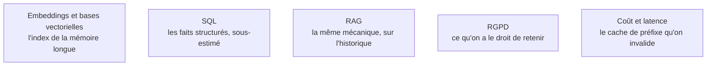

**Autonomie.** Trancher entre table de faits et index vectoriel, écrire une stratégie d'oubli explicite et la défendre en revue est attendu d'un confirmé ; pas la référence, parce que la mémoire reste un sous-système emprunté à la récupération documentaire, dont l'état de l'art se suit plus qu'il ne se maîtrise.

Sans mémoire, l'agent redemande à chaque session ce qu'on lui a déjà dit ; avec une mauvaise mémoire, il rappelle avec assurance une information périmée — ce qui est pire. C'est le sous-système où les erreurs se cumulent au lieu de s'annuler.

## Deux durées de vie, deux bacs

La mémoire **épisodique** retient ce qui s'est passé — « le 12 mars, l'utilisateur a demandé un export ». La mémoire **sémantique** retient ce qui est vrai — « l'utilisateur travaille en Python 3.12 ». Elles n'ont ni la même durée de vie, ni la même stratégie d'écriture, ni la même valeur, et les mettre dans le même magasin est la source d'erreur la plus fréquente.

À court terme, il n'y a que l'historique de la conversation courante, borné par la fenêtre et à compacter avant saturation. À long terme, la persistance entre sessions reprend la mécanique de la récupération documentaire appliquée à l'historique — sauf que le SQL y est largement sous-estimé : pour des faits utilisateur structurés, une table clé-valeur bat un index vectoriel en précision comme en débogabilité.

## Ce qu'il faut savoir faire

- **Préférer l'écriture explicite à l'extraction automatique.** Un outil `remember` que l'agent appelle avec un fait structuré produit une mémoire nettement moins bruitée qu'une extraction en fin de session.
- **Tenir un profil utilisateur structuré, lisible et éditable par l'utilisateur.** C'est le mécanisme de mémoire le plus efficace et le moins risqué, et il ne demande aucun index.
- **Résumer par tranches en conservant les décisions et les contraintes**, pas la conversation. Un résumé qui garde le ton et perd les engagements ne sert à rien.
- **Écrire une stratégie d'oubli explicite** : durée de vie, décroissance par ancienneté, invalidation quand un fait est contredit. C'est la partie que tout le monde saute, et elle explique la majorité des comportements aberrants au bout de quelques semaines.
- **Tenir une mémoire procédurale versionnée** — un fichier de règles que l'agent amende après un échec (« sur ce projet, lancer les tests avec X ») et relit au démarrage. Simple, auditable, et il se relit à froid.
- **Permettre au modèle de contredire sa mémoire** quand l'utilisateur dit l'inverse dans la conversation courante. Une mémoire qui gagne toujours est un bug.

> [!warning] Piège
> Injecter la mémoire long terme systématiquement dans le prompt système. Elle grossit, invalide le cache de préfixe — donc multiplie le coût de chaque tour — et finit par contredire la demande courante. La mémoire se récupère à la demande, via un outil.

## Les notions mobilisées

- [[notions/embeddings-et-bases-vectorielles]] — l'index de la mémoire longue, avec les mêmes contraintes de réindexation et de purge qu'un corpus documentaire.
- [[notions/sql]] — angle agents : pour un profil ou un fait daté, une table ordinaire est plus précise et plus facile à corriger qu'une recherche par similarité.
- [[notions/rag]] — la mémoire longue **est** un RAG sur l'historique : mêmes réglages, mêmes modes d'échec, même besoin d'évaluation.
- [[notions/rgpd]] — ce qu'un agent retient d'un utilisateur est une donnée personnelle : durée de conservation, droit de rectification et effacement s'appliquent au magasin de mémoire.
- [[notions/cout-et-latence-inference]] — toute mémoire écrite en tête de prompt invalide le cache de préfixe, et le surcoût se paie à chaque tour de la boucle.

## Pour apprendre

- [Agentic Memory for LLM Agents](https://arxiv.org/abs/2502.12110) — l'état de l'art académique sur l'organisation de la mémoire d'un agent.
- [Memory Management in AI Agents](https://python.langchain.com/docs/how_to/chatbots_memory/) — la mise en œuvre concrète, court terme et long terme, avec du code.
- [Short-Term vs Long-Term Memory in AI Agents](https://adasci.org/short-term-vs-long-term-memory-in-ai-agents/) — la distinction posée proprement, sans jargon cognitif inutile.
- [What Is AI Agent Memory?](https://www.ibm.com/think/topics/ai-agent-memory) — un panorama sobre des types de mémoire et de leurs usages.
- [Evaluating LLMs for Text Summarization](https://insights.sei.cmu.edu/blog/evaluating-llms-for-text-summarization-introduction/) — comment juger un résumé, donc comment juger une compaction.
