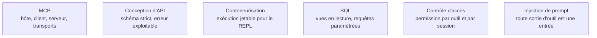

Niveau attendu : **référence**. Second domaine d'autorité : la fiabilité d'un agent tient davantage au soin porté à quinze définitions d'outils qu'au choix du modèle, et c'est la seule partie du système dont l'ingénieur d'agents est pleinement propriétaire, de la description jusqu'au schéma d'erreur.

Les outils sont l'interface entre le modèle et le réel, et leur description est un prompt à part entière : la qualité d'un agent dépend davantage du soin apporté à quinze définitions d'outils qu'au choix du modèle.

## Écrire pour le modèle, pas pour un développeur

Une bonne définition dit **quand utiliser l'outil et quand ne pas l'utiliser**, avec un ou deux appels d'exemple. C'est ce qui réduit le plus les erreurs d'arguments — plus que n'importe quel ajustement du prompt système. Le schéma d'entrée est strict : champs obligatoires explicites, énumérations plutôt que texte libre, chaque degré de liberté étant une occasion d'erreur. Et l'erreur retournée est en langage naturel exploitable — « la table X n'existe pas, tables disponibles : … » — plutôt qu'une trace de pile : c'est ce qui transforme un échec en auto-correction.

MCP standardise cette exposition, ce qui évite de réécrire un connecteur par framework. L'hôte est l'application, le client gère une connexion, le serveur expose outils, ressources et prompts. En local, transport en sous-processus et confiance implicite ; en distant, HTTP en flux, autorisation déléguée et multi-tenance — deux modèles de menace différents, à ne pas traiter avec le même code.

## Ce qu'il faut savoir faire

- **Exposer peu d'outils, à gros grain, alignés sur des intentions métier** plutôt qu'un calque mécanique d'une API REST existante. Un serveur qui expose quarante points d'entrée est inutilisable par un modèle.
- **Rester sous une quinzaine d'outils par agent.** Au-delà, la sélection se dégrade, le contexte se remplit de descriptions et la latence monte. Charger les outils par tâche, ou déléguer à un sous-agent qui dispose du bon sous-ensemble.
- **Traiter recherche web et appels d'API tiers comme des sources de contenu hostile.** Ce qu'ils renvoient entre dans le contexte et peut contenir des instructions.
- **Isoler l'exécution de code.** C'est l'outil le plus puissant et le plus dangereux : conteneur jetable, pas de réseau par défaut, quotas processeur et mémoire.
- **Préférer des requêtes paramétrées ou des vues en lecture seule au SQL libre.** La génération de requête arbitraire transforme un agent de consultation en outil d'exfiltration.
- **Exiger une validation humaine sur les actions visibles de l'extérieur** — courriel, messagerie, écriture de fichier — tant que le taux d'erreur n'est pas mesuré. Pour l'accès fichier : racine restreinte, résolution des liens symboliques, refus des chemins remontants.

> [!warning] Piège
> Brancher trente serveurs MCP « au cas où », et les installer sans lire leur code. La description d'un outil est du texte injecté dans le prompt : un serveur tiers malveillant n'a pas besoin d'être appelé pour agir.

## Les notions mobilisées

- [[notions/mcp]] — angle agents : le protocole n'est pas la partie difficile ; le découpage des outils exposés et le modèle de confiance entre serveurs le sont.
- [[notions/conception-d-api]] — une définition d'outil est un contrat dont le consommateur génère ses arguments : mêmes exigences qu'une API publique, lecteur moins indulgent.
- [[notions/conteneurisation]] — le conteneur jetable sans réseau ni secret est la seule parade solide à l'exécution de code généré.
- [[notions/sql]] — vues en lecture seule et requêtes paramétrées, plutôt qu'un accès libre à la base derrière un outil « requête ».
- [[notions/controle-d-acces]] — permissions par outil et par session, propagation de l'identité de l'utilisateur jusqu'au système appelé, moindre privilège par défaut.
- [[notions/injection-de-prompt]] — le canal d'entrée le plus négligé est la sortie d'un outil, et le second est la description d'un outil tiers.

## Pour apprendre

- [Model Context Protocol](https://modelcontextprotocol.io/introduction) — la spécification et son introduction : la source, pas un commentaire.
- [MCP — Construire un serveur](https://modelcontextprotocol.io/docs/develop/build-server) — le tutoriel officiel, court et suffisant pour un premier serveur.
- [MCP — Spécification d'autorisation](https://modelcontextprotocol.io/specification/2025-11-25/basic/authorization) — la partie qui décide si votre agent devient une porte d'entrée. À lire avant d'exposer quoi que ce soit.
- [Hugging Face — MCP Course](https://huggingface.co/learn/mcp-course/en/unit0/introduction) — parcours gratuit avec exercices, sur le protocole et ses clients.
- [Hugging Face — Les outils](https://huggingface.co/learn/agents-course/en/unit1/tools) — la notion d'outil expliquée sans cadre propriétaire.
- [modelcontextprotocol](https://github.com/modelcontextprotocol/modelcontextprotocol) — les SDK et la spécification en version suivie.
