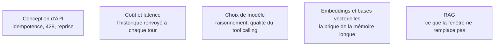

Un agent n'est pas un objet d'IA : c'est un service backend qui appelle une API payante, gère des délais d'expiration, de la concurrence et de l'état — et les projets échouent presque toujours sur ces fondations, pas sur le modèle.

La mécanique du modèle lui-même — tokenisation, fenêtre, échantillonnage, facturation — est traitée une fois dans [[parcours/ai-engineer/fondamentaux-llm|Fondamentaux LLM]]. Cette page ne retient que ce qu'une boucle change.

## Ce que la boucle amplifie

Un tour d'agent renvoie tout l'historique au modèle. Le coût croît donc de façon quadratique avec le nombre de tours si on ne compacte pas — et le prix d'entrée et celui de sortie diffèrent d'un ordre de grandeur, ce qui rend l'intuition trompeuse dans les deux sens. Tout ce qui dégrade un appel isolé — contexte saturé, échantillonnage trop chaud, tokenisation imprévue — est répété à chaque tour.

Un tour peut aussi durer plusieurs minutes. Il ne tient pas dans une requête HTTP synchrone : file d'attente, tâche asynchrone, état persistant, et un identifiant de session propagé partout.

## Ce qu'il faut savoir faire

- **Concevoir le service comme un backend asynchrone** : jobs, reprise, idempotence, codes 429 et 5xx, retry avec backoff et jitter. C'est la moitié du travail, et elle n'a rien de spécifique à l'IA.
- **Fixer un `max_tokens` et un délai d'expiration par tâche.** Une boucle sans plafond est une facture ouverte, et sans délai l'agent se fait tuer par le proxy après avoir consommé les appels d'outils coûteux.
- **Baisser la température dès qu'il y a des appels d'outils**, et ne jouer que sur un seul des paramètres d'échantillonnage. Les pénalités de répétition sont contre-productives sur du JSON, où la répétition de clés est légitime.
- **Savoir ce que le streaming apporte et ce qu'il coûte.** Il affiche au fil de l'eau et permet de couper tôt une génération qui part en vrille ; il complique la validation, parce qu'on ne valide pas un JSON qu'on n'a pas fini de recevoir.
- **Versionner prompts et définitions d'outils comme du code.** Ce sont eux qui changent le comportement en production, pas le numéro de version de la bibliothèque.
- **Arbitrer poids ouverts contre poids fermés sur la qualité du tool calling**, pas sur un classement généraliste : c'est là que l'écart se voit sur un agent.

> [!warning] Piège
> Croire qu'une fenêtre d'un million de tokens supprime le besoin de récupération. Elle déplace le problème : latence, coût, et chute de l'attention sur les longs contextes — la performance se dégrade bien avant la limite annoncée, surtout au milieu.

## Les notions mobilisées

- [[notions/conception-d-api]] — angle agents : l'appel d'outil est un appel d'API dont le client est imprévisible, donc idempotence et validation serveur ne sont plus optionnelles.
- [[notions/cout-et-latence-inference]] — la croissance quadratique du coût avec le nombre de tours est le calcul que personne ne fait avant la première facture.
- [[notions/choix-de-modele]] — pour un agent, la qualité de l'appel d'outil et la stabilité des versions pèsent plus que la qualité rédactionnelle.
- [[notions/embeddings-et-bases-vectorielles]] — la brique commune à la récupération documentaire et à la mémoire long terme de l'agent.
- [[notions/rag]] — la récupération reste nécessaire même avec une très grande fenêtre, pour des raisons de coût autant que de qualité.

## Pour apprendre

- [Hugging Face — LLM Course](https://huggingface.co/learn/llm-course/chapter1/1) — ce qu'il y a sous l'API, gratuitement et sans cadre propriétaire.
- [LLM Parameters Explained](https://learnprompting.org/blog/llm-parameters) — température, top-p et pénalités expliqués avec des exemples, plutôt que par analogie.
- [Claude — Comptage de jetons](https://platform.claude.com/docs/en/build-with-claude/token-counting) — compter avant d'appeler : la base de tout budget d'agent.
- [OpenAI — API Reference](https://developers.openai.com/api/reference/overview) — la référence de l'API la plus répandue, paramètre par paramètre.
- [OpenAI Pricing](https://openai.com/api/pricing/) — les ordres de grandeur d'entrée et de sortie, à avoir en tête avant de concevoir une boucle longue.
