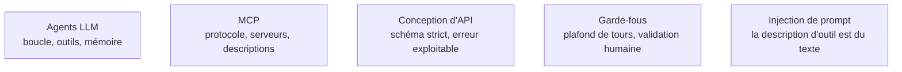

Niveau attendu : **autonomie**. Câbler une boucle bornée, des outils bien décrits et un serveur MCP fait partie du travail courant d'un confirmé ; le niveau s'arrête là parce que l'autorité sur les trajectoires, la mémoire et le multi-agents appartient au parcours [[parcours/ai-agents/index|AI Agents]], pas à cette page.

Un agent est une boucle — observer, choisir un outil, lire le résultat, recommencer jusqu'à une condition d'arrêt — et l'écart entre une démonstration et un système fiable tient presque entièrement à la qualité des outils exposés.

Ce que cette page couvre en une fois, le parcours [[parcours/ai-agents/index|AI Agents]] le traite section par section : architectures, mémoire, frameworks, évaluation de trajectoire, sécurité.

## Ce qu'il faut savoir faire

- **Écrire la boucle à la main au moins une fois** — une soixantaine de lignes : appeler, détecter les appels d'outils, exécuter, réinjecter, recommencer avec un compteur de tours. On comprend ensuite ce que masquent les SDK d'agents, dont le prix est le couplage au fournisseur.
- **Soigner la description d'outil plus que le prompt système.** C'est elle que le modèle lit pour décider. Dire quand utiliser l'outil et quand ne pas l'utiliser, avec un ou deux appels d'exemple.
- **Tenir un schéma de paramètres strict et une sortie compacte.** Champs obligatoires explicites, énumérations plutôt que texte libre : chaque degré de liberté est une occasion d'erreur.
- **Renvoyer des erreurs exploitables.** « La table X n'existe pas, tables disponibles : … » permet au modèle de se corriger seul ; une trace de pile le fait boucler.
- **Rester sous une dizaine d'outils par agent.** Au-delà, le taux de sélection correcte s'effondre et le contexte se remplit de descriptions inutiles — charger les outils par tâche, ou déléguer à un sous-agent.
- **Câbler une condition d'arrêt non négociable** : nombre maximal de tours, budget de tokens, délai d'expiration. Un agent sans plafond consomme un budget entier sur une requête.
- **Exposer un système interne par un serveur MCP** plutôt que par un adaptateur maison par fournisseur : le serveur est écrit une fois et consommable par n'importe quel hôte compatible. Transport en sous-processus pour un serveur local, HTTP en flux pour un serveur distant — qui exige, lui, authentification et contrôle d'accès par utilisateur.

> [!tip] La question qui tranche en revue de conception
> Cet agent a-t-il besoin d'un état durable, ou est-ce un enchaînement déterministe déguisé ? Beaucoup de projets « agents » sont trois appels en série, mieux servis par du code classique : plus rapide, moins cher, testable.

> [!warning] Piège
> Donner des outils d'écriture — courriel, suppression, paiement — sans validation humaine ni idempotence, et installer des serveurs MCP tiers sans lire leur code. Une hallucination sur un argument devient une action irréversible, et la description d'un outil est du texte injecté dans le prompt.

## Les notions mobilisées

- [[notions/agents-llm]] — angle AI Engineer : commencer par la plus petite unité d'autonomie qui apporte de la valeur, et n'ajouter une capacité qu'une fois la précédente prouvée.
- [[notions/mcp]] — le moyen le plus rapide d'exposer proprement un système interne à un agent, et un point d'entrée de sécurité à traiter comme tel.
- [[notions/conception-d-api]] — une définition d'outil est un contrat d'API dont le consommateur est un modèle : mêmes exigences, lecteur moins indulgent.
- [[notions/garde-fous]] — plafond de tours, budget, validation humaine sur action irréversible : les trois barrières qui ne se négocient pas.
- [[notions/injection-de-prompt]] — tout ce qu'un outil renvoie entre dans le contexte, descriptions d'outils tierces comprises.

## Pour apprendre

- [Model Context Protocol](https://modelcontextprotocol.io/) — la spécification du protocole d'accès aux outils. La source, pas un commentaire.
- [MCP — Construire un serveur](https://modelcontextprotocol.io/docs/develop/build-server) — le tutoriel officiel, court et suffisant pour un premier serveur.
- [Claude — Usage d'outils](https://platform.claude.com/docs/en/agents-and-tools/tool-use/overview) — comment un modèle décide d'appeler un outil, et ce que la description change.
- [ReAct: Synergizing Reasoning and Acting](https://react-lm.github.io/) — le motif raisonner-agir dont presque toutes les boucles actuelles dérivent.
- [A practical guide to building agents](https://cdn.openai.com/business-guides-and-resources/a-practical-guide-to-building-agents.pdf) — un guide d'éditeur, mais le plus sobre sur le découpage d'une boucle.
