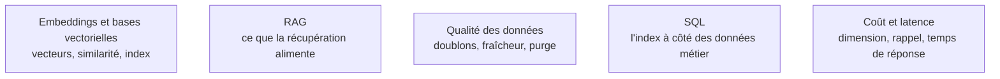

**Autonomie.** Mesurer un rappel, passer à l'hybride et régler les paramètres d'un index sont des gestes qu'un confirmé pose seul et justifie ; la recherche d'information comme discipline — apprentissage de classement, index distribués à grande échelle — appelle encore un spécialiste.

Un embedding projette un texte dans un espace où la proximité géométrique approxime la proximité de sens : c'est ce qui permet de chercher « comment annuler mon abonnement » et de trouver un document qui parle de « résiliation ».

## Quatre usages, une seule opération

Recherche sémantique, classification, recommandation, détection d'anomalie : dans les quatre cas on produit un vecteur puis on compare par cosinus. Un classifieur linéaire entraîné sur des embeddings est souvent plus rapide, moins cher et plus stable qu'un appel de modèle par ligne — c'est l'arbitrage que la plupart des équipes ne font pas.

Le « choisissez-en une » de la roadmap amont est le bon conseil sur les bases vectorielles : les interfaces se ressemblent, la migration est peu coûteuse, l'important est de commencer. FAISS est une bibliothèque et non une base — ni persistance ni filtrage transactionnel, imbattable en local. Chroma et LanceDB sont embarqués, Qdrant et Weaviate sont des serveurs complets, Pinecone est managé. Avec pgvector ou un index intégré à la base documentaire déjà en place, une seule base à sauvegarder et des jointures possibles : souvent le choix le plus raisonnable.

## Ce qu'il faut savoir faire

- **Choisir un modèle réellement multilingue** plutôt qu'un modèle anglophone en tête de classement, dès que le corpus est en français.
- **Faire correspondre la métrique à l'entraînement du modèle** — cosinus dans la grande majorité des cas — et connaître ce que la dimension coûte en stockage comme en recherche.
- **Mesurer le rappel contre une recherche exhaustive sur un échantillon** avant de régler les paramètres d'index : ils arbitrent rappel contre latence, et personne ne peut le faire à l'aveugle.
- **Passer à l'hybride quand les références exactes échouent.** BM25 plus dense, fusionnés par Reciprocal Rank Fusion, corrigent les échecs sur acronymes, codes produits et numéros de version.
- **Ajouter un reclassement croisé sur le top 50.** Il apporte plus de gain que n'importe quel changement d'embedder, pour un coût de latence borné et prévisible.
- **Stocker la version du modèle à côté de chaque vecteur** et fixer une clé stable par document, pour pouvoir réindexer et purger sans deviner.

> [!warning] Piège
> Changer de modèle d'embedding sans tout réindexer, et ne pas prévoir la suppression. Les vecteurs ne sont pas comparables entre familles, et un document réindexé sans purge laisse des fragments fantômes qui remontent des informations périmées — la panne la plus difficile à diagnostiquer de tout le pipeline.

## Les notions mobilisées

- [[notions/embeddings-et-bases-vectorielles]] — angle AI Engineer : le choix de la base compte moins que la discipline d'indexation et de purge qu'on met autour.
- [[notions/rag]] — la recherche n'est presque jamais une fin en soi ici : elle sert à remplir une fenêtre de contexte.
- [[notions/qualite-des-donnees]] — doublons, versions concurrentes et documents périmés produisent des réponses contradictoires que le modèle présentera avec le même aplomb.
- [[notions/sql]] — garder l'index vectoriel dans la base métier simplifie la sauvegarde, les droits et les jointures ; c'est le défaut raisonnable quand la pile existe déjà.
- [[notions/cout-et-latence-inference]] — vectoriser un corpus entier est un coût ponctuel ; le réindexer à chaque changement d'embedder ne l'est plus.

## Pour apprendre

- [OpenAI — Embeddings](https://developers.openai.com/api/docs/guides/embeddings) — ce qu'est un vecteur d'embedding et comment il se calcule, côté pratique.
- [FAISS](https://ai.meta.com/tools/faiss/) — la bibliothèque d'index de similarité de référence ; ce que les autres enveloppent.
- [Qdrant](https://qdrant.tech/) — base vectorielle libre, documentation honnête sur les compromis d'index.
- [Weaviate](https://weaviate.io/) — recherche hybride vecteur et mot-clé : la combinaison qui rattrape le plus d'échecs de récupération.
- [Chroma](https://www.trychroma.com/) — la plus simple pour un prototype local, sans infrastructure.
