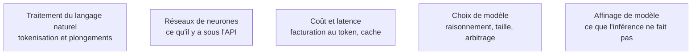

Un modèle de langage prédit le token suivant, et tout le reste en découle : pas besoin de dériver la rétropropagation, mais il faut savoir expliquer pourquoi un appel coûte ce qu'il coûte et pourquoi il répond ce qu'il répond.

## La frontière avec le ML Engineer

Elle structure tout le parcours. Le ML Engineer **produit** un modèle : données, entraînement, métriques, déploiement des poids. L'AI Engineer **consomme** un modèle déjà entraîné et construit le système autour — récupération du contexte, orchestration, garde-fous, coût, latence, interface. Le cycle de travail change de nature : on ne collecte plus un jeu de données, on écrit un prompt, on mesure, on itère en heures.

Le titre recouvre aujourd'hui deux métiers que les offres mélangent : celui qui câble des APIs et des pipelines de récupération, et celui qui opère de l'inférence — vLLM, quantification, traitement par lots, GPU. Lire la fiche de poste, pas l'intitulé.

## Ce qu'il faut savoir faire

- **Compter les tokens avec le tokenizer du fournisseur**, jamais en mots divisés par 0,75. Les identifiants, le code et le français accentué coûtent plus que prévu, et c'est l'unité de facturation comme de fenêtre.
- **Expliquer la dégradation sur long contexte.** Une fenêtre large ne veut pas dire une attention uniforme : la performance chute sur l'information placée au milieu, bien avant la limite annoncée.
- **Régler l'échantillonnage sans superstition.** Température à 0 pour l'extraction, le classement et le JSON ; 0,7 et plus pour de la rédaction. Top-K et Top-P tronquent la distribution — ne bouger qu'un seul des trois leviers à la fois.
- **Savoir quand une pénalité de répétition nuit.** Utile sur les petits modèles ouverts qui bouclent, nuisible sur du code ou du texte structuré où la répétition de clés est légitime.
- **Traiter le budget de raisonnement comme un hyperparamètre à mesurer.** Les modèles de raisonnement facturent leur chaîne de pensée en tokens de sortie : sur de l'extraction, l'activer multiplie le coût sans rien améliorer ; sur de la planification multi-étapes ou du débogage, l'écart est net.
- **Situer le cache de préfixe.** Le KV cache explique pourquoi le premier token est lent et les suivants rapides ; le prompt caching côté fournisseur explique la règle « stable d'abord, variable ensuite ».

> [!warning] Piège
> Croire que la température à 0 rend l'appel reproductible. Le traitement par lots côté fournisseur, le routage entre GPU et les mises à jour silencieuses introduisent de la variance. Épingler une version de modèle quand c'est possible, et écrire des tests tolérants.

## Les notions mobilisées

- [[notions/traitement-langage-naturel]] — tokenisation et plongements : les deux briques qui expliquent le prix d'un appel et la recherche par similarité.
- [[notions/reseaux-de-neurones]] — l'attention et le décodage autorégressif, à connaître juste assez pour raisonner sur la latence.
- [[notions/cout-et-latence-inference]] — angle AI Engineer : le coût unitaire est une contrainte de conception dès la première maquette, pas une optimisation de fin de projet.
- [[notions/choix-de-modele]] — raisonnement ou non, petit ou grand modèle : la décision se prend sur des cas mesurés, jamais sur un classement public.
- [[notions/affinage-de-modele]] — ce que l'inférence seule ne fait pas, et pourquoi ce n'est presque jamais le bon premier réflexe.

## Pour apprendre

- [Hugging Face — LLM Course](https://huggingface.co/learn/llm-course/chapter1/1) — le parcours gratuit le plus complet pour comprendre ce qu'il y a sous l'API.
- [Claude — Fenêtres de contexte](https://platform.claude.com/docs/en/build-with-claude/context-windows) — ce qui occupe réellement le contexte, et pourquoi il se remplit plus vite que prévu.
- [Claude — Comptage de jetons](https://platform.claude.com/docs/en/build-with-claude/token-counting) — compter avant d'appeler : la base de tout budget d'inférence.
- [Attention Is All You Need](https://arxiv.org/abs/1706.03762) — Vaswani et al., 2017 : l'architecture dont tout le reste descend, à avoir lue une fois.
