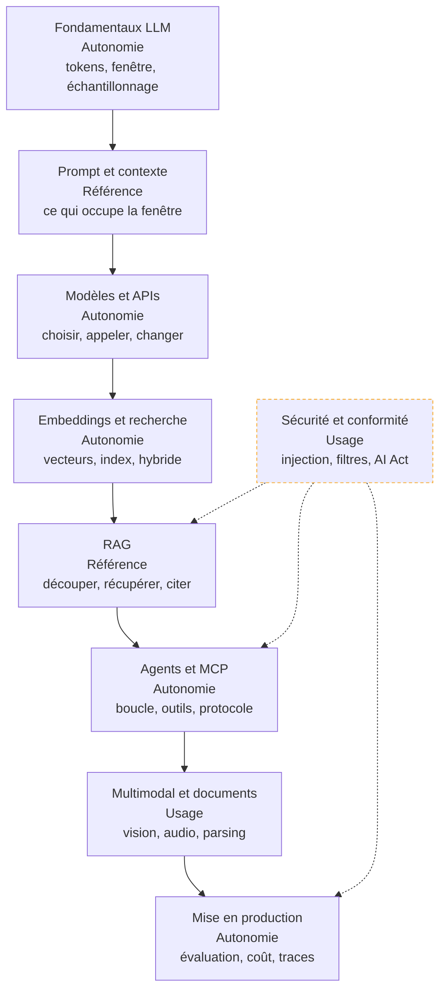

Construire un produit sur un modèle qu'on n'a pas entraîné : récupérer le bon contexte, orchestrer, poser des garde-fous, tenir le coût et la latence, et mesurer ce qu'on livre.

## La roadmap

Chaque case mène à sa page, et porte en deuxième ligne le niveau attendu chez un profil confirmé — **notion** (reconnaître le sujet, savoir qui appeler), **usage** (s'en servir sur un chemin balisé), **autonomie** (concevoir, déboguer sous pression, arbitrer et défendre), **référence** (faire autorité dans la salle). Cochez les étapes acquises en bas de page pour suivre votre progression.

## Ma progression

- [ ] [[parcours/ai-engineer/fondamentaux-llm|Fondamentaux LLM]] — pourquoi un appel coûte ce qu'il coûte et répond ce qu'il répond
- [ ] [[parcours/ai-engineer/prompt-et-contexte|Prompt et context engineering]] — écrire l'instruction, puis décider de ce qui entre dans la fenêtre
- [ ] [[parcours/ai-engineer/modeles-et-apis|Modèles, plateformes et APIs]] — l'arbitrage à cinq axes, et le client qu'on écrit pour en changer
- [ ] [[parcours/ai-engineer/embeddings-et-recherche|Embeddings et recherche]] — vectoriser, indexer, mesurer le rappel, passer à l'hybride
- [ ] [[parcours/ai-engineer/rag|RAG]] — le pipeline complet, et l'étage qui fait réellement échouer les réponses
- [ ] [[parcours/ai-engineer/agents-et-mcp|Agents, outils et MCP]] — la boucle, la qualité des outils, l'exposition standardisée
- [ ] [[parcours/ai-engineer/securite-et-conformite|Sécurité et conformité]] — injection de prompt, filtrage, classification AI Act
- [ ] [[parcours/ai-engineer/multimodal-et-documents|Multimodal et documents]] — vision, audio, parsing de PDF, outils de codage assisté
- [ ] [[parcours/ai-engineer/mise-en-production|Mise en production]] — jeu d'évaluation, traces, budget par requête
