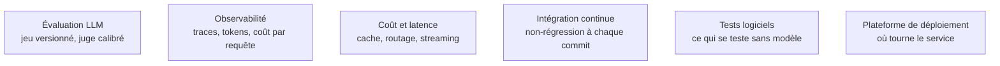

La roadmap amont s'arrête à la construction ; le travail réel commence à la mise en service, parce qu'un système LLM n'a pas de « ça marche » binaire — il a une distribution de qualité qui dérive à chaque changement de prompt, de modèle ou de corpus.

## Sans mesure automatisée, chaque évolution est un pari

Un jeu de cinquante à deux cents cas avec réponse attendue, dans le dépôt, rejoué en intégration continue : c'est le seul artefact qui permette de décider si un changement améliore ou dégrade le système. Il transforme aussi « je trouve que ça marche mal » en un chiffre discutable — autant un outil technique qu'un instrument de négociation.

Le juge à base de modèle vient après, pas avant : un modèle qui note selon une grille explicite, calibré sur des annotations humaines avant qu'on lui fasse confiance. Sur les dimensions vérifiables par programme — le chiffre est exact, le fichier est produit, le schéma est valide — on ne l'utilise pas du tout.

## Ce qu'il faut savoir faire

- **Instrumenter les tokens dès le premier jour.** Les surprises viennent toujours d'une boucle d'agent ou d'un contexte qui grossit, jamais d'un prompt trop long écrit exprès.
- **Tracer chaque requête de bout en bout** : prompt exact, contexte récupéré, appels d'outils avec leurs arguments et leurs résultats, sortie, latence, coût. Sans trace, aucun incident n'est reproductible, donc aucun n'est corrigeable.
- **Fixer le budget de tokens par requête et par session dans le code**, pas dans le tableau de bord de facturation. Un agent en boucle découvert le lendemain matin coûte plus cher que tout le reste du projet.
- **Prendre les deux leviers de coût qui ne dégradent pas la qualité** — le cache de préfixe et le routage d'un petit vers un grand modèle — avant de toucher aux prompts.
- **Optimiser le temps jusqu'au premier token** plutôt que le temps total : c'est ce que l'utilisateur perçoit. Streaming, et appels d'outils parallélisés quand ils sont indépendants.
- **Filtrer les traces à l'émission.** Elles contiennent des données clients, des secrets collés par un utilisateur, parfois des jetons d'API : rédaction à l'émission, rétention courte, accès restreint.
- **Rejouer les sessions échouées de production** comme cas de test : c'est la meilleure source de jeu d'évaluation, et la seule qui ressemble aux utilisateurs réels.

> [!warning] Piège
> N'évaluer que la réponse finale d'un système RAG, et juger sur une moyenne. Si la récupération échoue, la génération est parfaite sur le mauvais contexte et la note globale ne dit pas où corriger ; et ce qui coûte, ce sont les quelques pour cent de sessions qui partent en vrille, pas la médiane.

## Les notions mobilisées

- [[notions/evaluation-llm]] — angle AI Engineer : le jeu d'évaluation est le premier livrable, pas le dernier ; sans lui le système devient intouchable à la première montée de version du modèle.
- [[notions/observabilite]] — une trace par requête avec la relation parent-enfant préservée : c'est ce qui distingue un incident analysable d'un incident classé sans suite.
- [[notions/cout-et-latence-inference]] — budget par requête et par session câblé dans le code, pas surveillé après coup.
- [[notions/integration-continue]] — le jeu d'évaluation n'a de valeur que rejoué automatiquement ; lancé à la main, il n'est jamais lancé.
- [[notions/tests-logiciels]] — les outils, les extracteurs et les filtres se testent comme du code normal, sans modèle : c'est la moitié des pannes.
- [[notions/plateforme-de-deploiement]] — un tour d'agent dure parfois plusieurs minutes et ne tient pas dans une requête HTTP synchrone : le choix d'hébergement en découle.

## Pour apprendre

- [Langfuse](https://langfuse.com/docs) — traces, coûts et jeux d'évaluation ; le plus complet des outils libres, et auto-hébergeable.
- [DeepEval](https://www.deepeval.com/) — l'évaluation écrite comme des tests, donc exécutable en intégration continue.
- [Ragas](https://docs.ragas.io/en/stable/) — des métriques de RAG définies et calculables : fidélité, pertinence du contexte.
- [deepeval](https://github.com/confident-ai/deepeval) — le dépôt, pour lire comment les métriques sont réellement calculées.
- [Instructor](https://github.com/567-labs/instructor) — sortie structurée validée et réessayée : supprime une classe entière d'erreurs avant qu'elles atteignent la production.
