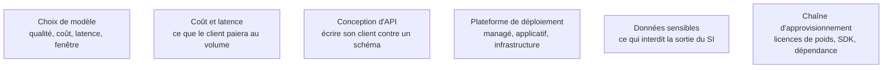

Niveau attendu : **autonomie**. L'attendu est de conduire l'arbitrage à cinq axes sur ses propres cas mesurés et de le tenir devant un achat, une DSI ou un fournisseur ; pas plus haut, parce que servir soi-même des poids sur GPU — vLLM, quantification, traitement par lots — reste un appui de la plateforme.

Un modèle pré-entraîné est un composant qu'on remplace, pas un choix d'architecture définitif — et la couche par laquelle passe tout votre trafic mérite plus de soin que le modèle lui-même.

## L'arbitrage à cinq axes

Qualité **sur vos propres cas**, coût, latence, taille de fenêtre, confidentialité. Le débat ouvert contre fermé se tranche le plus souvent sur la dernière ligne : si les données ne peuvent pas sortir, l'auto-hébergement n'est plus une préférence mais une contrainte. Partout ailleurs, il n'a de sens qu'avec un volume soutenu, sinon le coût GPU à vide dépasse la facture d'API.

Les familles ouvertes ont comblé une grande partie de l'écart sur l'extraction, la classification et la récupération — les tâches où le contexte fait le travail. L'écart persiste sur le raisonnement long et l'usage d'outils en chaîne. La stratégie qui tient : petit modèle ouvert pour le volume, gros modèle fermé pour les cas durs, routage explicite entre les deux.

## Ce qu'il faut savoir faire

- **Construire vingt à cinquante cas représentatifs avec réponse attendue avant de comparer quoi que ce soit.** Sans ce jeu, on choisit sur des classements publics qui ne ressemblent pas au problème.
- **Lire réellement la licence des poids ouverts** avant tout usage commercial : « open weights » ne veut pas dire « libre d'usage ».
- **Écrire son client contre le schéma OpenAI-compatible**, que vLLM, Ollama, OpenRouter et la plupart des serveurs exposent : on change alors de backend en changeant une URL de base.
- **Connaître ce que chaque API apporte en propre** — état conversationnel et outils côté serveur pour l'API Responses d'OpenAI, blocs de contenu typés et cache de prompt explicite côté Claude, fenêtre très large et multimodalité native côté Gemini.
- **Câbler retry avec backoff, timeout et plafond de dépense dès le premier appel.** Les 429 arrivent le jour de la démonstration.
- **Comparer vite avant de s'engager** : un agrégateur derrière une clé unique est le moyen le plus rapide d'essayer dix modèles sur les mêmes cas ; Ollama et LM Studio couvrent le poste local.

> [!warning] Piège
> Câbler un fournisseur en dur dans le code applicatif. Les gains de coût se prennent en changeant de modèle, pas en polissant les prompts — et un fournisseur qui déprécie une version sans préavis fige un produit entier.

## Les notions mobilisées

- [[notions/choix-de-modele]] — angle AI Engineer : la décision se réévalue à chaque trimestre, elle ne se prend pas une fois pour toutes.
- [[notions/cout-et-latence-inference]] — le coût unitaire à volume cible, calculé avant d'écrire la première ligne, décide souvent seul de l'ouvert contre le fermé.
- [[notions/conception-d-api]] — la couche d'abstraction minimale devant les fournisseurs est le seul endroit où elle est rentable.
- [[notions/plateforme-de-deploiement]] — API managée, plateforme applicative ou GPU en propre : trois modèles d'exploitation, trois compétences différentes à avoir en interne.
- [[notions/donnees-sensibles]] — la classification des données décide de l'auto-hébergement bien avant toute considération de qualité.
- [[notions/chaine-d-approvisionnement-logicielle]] — poids téléchargés, SDK, serveurs tiers : la dépendance se documente au même titre que les bibliothèques.

## Pour apprendre

- [OpenAI — API Reference](https://developers.openai.com/api/reference/overview) — la référence de l'API la plus répandue, paramètre par paramètre.
- [Claude — Messages API](https://platform.claude.com/docs/en/api/messages) — le format de conversation, les blocs de contenu, l'usage d'outils.
- [Gemini API](https://ai.google.dev/gemini-api/docs) — la troisième famille à connaître, notamment sur le multimodal.
- [Hugging Face — Hub](https://huggingface.co/docs/hub/en/index) — comment sont distribués modèles, jeux de données et démonstrations.
- [Ollama](https://ollama.com/) — faire tourner un modèle ouvert en local : la façon la moins chère de tester une idée, et la seule quand les données ne sortent pas.
- [OpenAI Cookbook](https://github.com/openai/openai-cookbook) — des exemples qui tournent, maintenus par l'éditeur.
