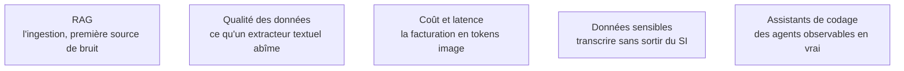

Niveau attendu : **usage**. Le parsing par vision s'emploie sur un chemin balisé — une API, une résolution à borner, un coût en tokens image à surveiller — et cela suffit à un confirmé ; la génération d'images et de vidéo, elle, reste au niveau de la notion, parce qu'elle sort du périmètre réel du métier en entreprise.

La multimodalité élargit le périmètre — lire des documents scannés, décrire des captures, transcrire des réunions — mais l'usage le plus rentable pour un ingénieur RAG n'est pas la génération d'images : c'est la compréhension de documents.

## Pourquoi le parsing par vision a gagné

Un extracteur textuel classique lit un PDF colonne par colonne et rend une bouillie où les tableaux ont disparu. Un modèle de vision lit la page rendue en image et produit du Markdown structuré, tableaux préservés. C'est plus cher qu'un extracteur classique, et cela supprime la première source de bruit d'un RAG — le bon fragment existe enfin. Sur un corpus de documents complexes, aucun réglage de découpage ne rattrape une extraction ratée en amont.

Les outils de codage assisté, eux, sont le meilleur terrain d'observation des agents : boucle, outils, contexte, condition d'arrêt, tout y est visible en direct sur un problème qu'on connaît.

## Ce qu'il faut savoir faire

- **Choisir la résolution envoyée en connaissance de cause.** La qualité de compréhension en dépend directement, la facturation en tokens image aussi — envoyer en pleine résolution par réflexe fait exploser le coût.
- **Cadrer serré le traitement vidéo.** Une vidéo, c'est de l'échantillonnage d'images plus une transcription audio : coûteux en tokens, à borner par durée et par fréquence d'échantillonnage.
- **Savoir ce que la transcription ne fait pas.** Les modèles courants transcrivent correctement le français, mais la diarisation — qui parle quand — reste à ajouter, et les équivalents ouverts s'imposent dès que les données ne peuvent pas sortir.
- **Réserver la génération d'images à ce qui la justifie.** Hors marketing, elle reste marginale en contexte entreprise ; la compréhension, elle, se rentabilise immédiatement.
- **Tenir un fichier d'instructions à la racine du dépôt** — conventions, commandes de test, architecture. C'est du context engineering appliqué à son propre code, et ça se versionne.
- **Donner un retour d'exécution à tout agent de code.** Sans tests, typage ou analyseur statique, il produit du code plausible et faux.

> [!warning] Piège
> Accepter des dépendances ou des schémas de données générés sans les lire. Les erreurs coûteuses ne sont pas des fautes de syntaxe — elles sont des choix d'architecture plausibles, découverts trois mois plus tard.

## Les notions mobilisées

- [[notions/rag]] — angle AI Engineer : le parsing documentaire est l'étage zéro du pipeline, celui dont personne ne mesure la qualité et qui plafonne tous les autres.
- [[notions/qualite-des-donnees]] — un tableau écrasé en colonnes illisibles est un défaut de qualité, pas un défaut de modèle.
- [[notions/cout-et-latence-inference]] — la tarification des images n'obéit pas à la même logique que le texte et surprend systématiquement au passage à l'échelle.
- [[notions/donnees-sensibles]] — enregistrements de réunions et pièces scannées sont souvent la catégorie la plus sensible du corpus.
- [[notions/assistants-de-codage]] — angle AI Engineer : s'en servir comme banc d'observation d'une boucle agentique réelle, autant que comme outil de production.

## Pour apprendre

- [OpenAI — Vision](https://developers.openai.com/api/docs/guides/images-vision) — ce qu'un modèle de vision accepte en entrée et ce que la fidélité d'image change.
- [Hugging Face — Un monde multimodal](https://huggingface.co/learn/computer-vision-course/en/unit4/multimodal-models/a_multimodal_world) — le cours gratuit sur les modèles multimodaux, sans cadre propriétaire.
- [Whisper](https://github.com/openai/whisper) — le dépôt du modèle de transcription de référence, exécutable en local.
- [LlamaIndex — Multimodal](https://docs.llamaindex.ai/en/stable/use_cases/multimodal/) — les chargeurs de documents et le stockage d'images associées aux fragments.
- [Claude Code in Action](https://anthropic.skilljar.com/claude-code-in-action) — un cours gratuit sur un agent de code, utile autant pour l'outil que pour le motif.
