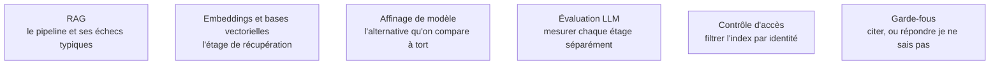

Niveau attendu : **référence**. Second domaine d'autorité du métier : c'est le système que l'AI Engineer livre le plus souvent, et celui où une erreur — découpage sur un nombre de caractères fixe, filtre d'identité absent — ne se voit qu'après coup et n'est rattrapée par personne d'autre.

Faire parler le modèle de données qu'il n'a jamais vues, sans toucher aux poids — et savoir que la quasi-totalité des mauvaises réponses vient de la récupération, pas de la génération.

## Le pipeline, et l'étage qui décide de tout

Le chemin canonique est linéaire : découper le document, vectoriser les fragments, indexer, récupérer à la requête, générer la réponse. Chaque étage peut faire échouer l'ensemble, mais ils ne se valent pas. Si le bon passage n'est pas dans le contexte, aucun modèle ne le devinera — et une génération parfaite sur un mauvais contexte produit une réponse fausse, fluide et citée. C'est pourquoi on mesure le rappel de la récupération d'abord, la qualité de la génération ensuite.

Le débat « RAG ou affinage » est mal posé : le RAG apporte des faits à jour et traçables, l'affinage un style et un vocabulaire métier. Ils se combinent, ils ne se remplacent pas. Le RAG s'impose dès que le corpus bouge et que la réponse doit être citée — support client, recherche interne, assistance réglementaire, analyse de contrats.

## Ce qu'il faut savoir faire

- **Découper sur la structure du document** — titres, sections — et non sur un nombre de caractères fixe, garder un recouvrement, et conserver le titre de section dans chaque fragment.
- **Enrichir la récupération plutôt que la génération** : réécriture de requête, recherche hybride, filtres de métadonnées, reclassement, puis top k final. C'est là que se gagnent les points.
- **Imposer la citation des fragments utilisés** et autoriser explicitement la réponse « je ne sais pas » quand le contexte ne contient pas l'information. Sans ces deux règles, le système est inaudible en entreprise.
- **Filtrer l'index par identité à la requête**, jamais après coup : la remontée d'un document auquel l'utilisateur courant n'a pas droit est l'incident le plus fréquent en déploiement interne.
- **Commencer sans framework.** Cent lignes de Python suffisent pour un RAG simple et se déboguent ; LangChain, LlamaIndex, Haystack et RAGFlow s'adoptent quand on sait précisément ce qu'on leur délègue.
- **Savoir quand passer au RAG agentique** : le modèle décide de chercher, reformule, relance une seconde requête, s'arrête quand il a de quoi répondre. Gain net sur les questions à sauts multiples, coût et latence en hausse.

> [!warning] Piège
> Livrer un RAG sans jeu d'évaluation. Sans une centaine de paires question/passage attendu, on ne sait pas si un changement de découpage a amélioré ou dégradé le système, et chaque itération devient une affaire d'opinion.

## Les notions mobilisées

- [[notions/rag]] — angle AI Engineer : le corpus réel est toujours plus sale que prévu, et l'essentiel du travail est dans l'ingestion, pas dans la génération.
- [[notions/embeddings-et-bases-vectorielles]] — l'étage de récupération, traité en propre : dimension, métrique, index, recherche hybride.
- [[notions/affinage-de-modele]] — ce qu'il apporte vraiment face au RAG, et la dette de ré-entraînement qu'il crée à chaque version de modèle.
- [[notions/evaluation-llm]] — mesurer le rappel de la récupération et la qualité de la génération séparément, sinon la note globale ne dit pas où corriger.
- [[notions/controle-d-acces]] — le filtrage de l'index par identité : le point de contrôle qui manque presque toujours dans une première version.
- [[notions/garde-fous]] — citation obligatoire, refus autorisé, ancrage : les trois règles qui rendent une réponse vérifiable.

## Pour apprendre

- [Retrieval-Augmented Generation for Knowledge-Intensive NLP Tasks](https://arxiv.org/abs/2005.11401) — l'article fondateur (Lewis et al., 2020). Le lire évite de croire que le RAG est une idée de 2024.
- [LlamaIndex](https://developers.llamaindex.ai/python/framework/) — la bibliothèque la plus explicite sur le découpage, l'indexation et la récupération.
- [LangChain](https://docs.langchain.com/oss/python/langchain/overview) — l'écosystème le plus répandu ; utile comme catalogue de motifs même si on n'adopte pas le cadre.
- [Ragas](https://docs.ragas.io/en/stable/) — des métriques de RAG définies et calculables : fidélité, pertinence du contexte.
- [Claude — Réduire les hallucinations](https://platform.claude.com/docs/en/test-and-evaluate/strengthen-guardrails/reduce-hallucinations) — ce qui marche vraiment : ancrage, citation, autorisation de répondre « je ne sais pas ».
