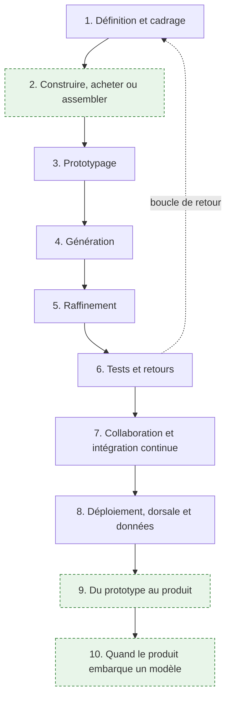
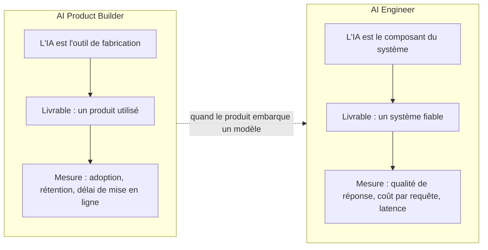
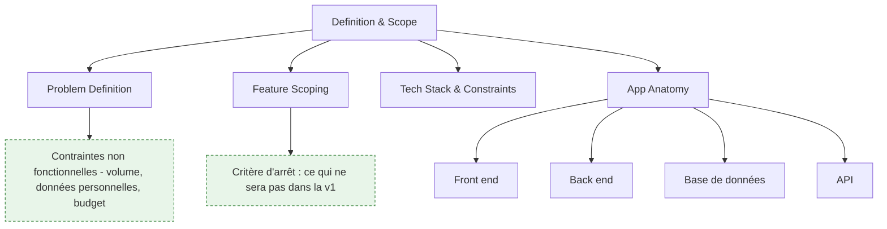
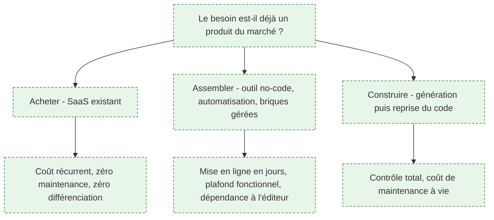
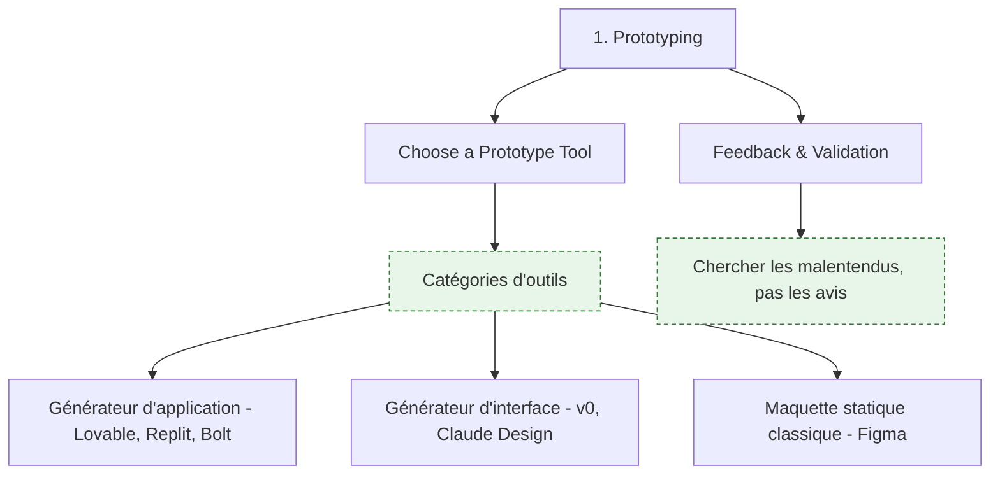
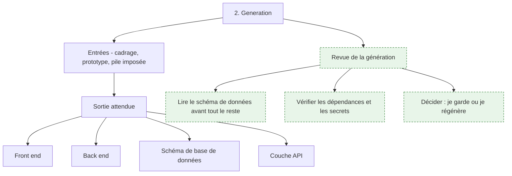

# Parcours — AI Product Builder

> [!abstract] Livrer un produit logiciel en s'appuyant sur des outils de génération de code : cadrer, prototyper, générer, reprendre le code généré, tester avec de vrais utilisateurs, déployer. Pour qui veut mettre un produit en ligne vite sans découvrir six mois plus tard qu'il a construit une maquette non maintenable — pas pour qui veut concevoir un système IA, c'est l'autre métier.

**Source** : roadmap.sh/ai-product-builder, dernière modification amont le 25 juin 2026, capturée le 16 septembre 2026 · **Rédigée** le 16 septembre 2026
Les éléments en vert dans les schémas et les encadrés « Ajout 2026 » ne figurent pas dans la roadmap d'origine.

---

## En un coup d'œil

Aucun pré-requis déclaré en amont, et c'est une des rares roadmaps du catalogue dans ce cas. En pratique il en faut deux : savoir lire du code sans l'avoir écrit, et savoir ce qu'est une requête HTTP. Le reste s'apprend dans l'ordre du parcours.

---

## Ce métier et celui d'AI Engineer

La confusion est permanente et elle coûte cher au recrutement comme à l'orientation. Les deux titres contiennent « AI », les deux livrent du logiciel, et ils ne font pas le même travail.

**À quoi ça sert.** Poser la frontière évite de recruter un profil pour le travail de l'autre. L'AI Product Builder utilise l'IA **pour fabriquer** : il décrit un produit, une chaîne d'outils en génère le code, il le reprend et le met en ligne. Son risque est le produit que personne n'utilise, ou le prototype qui devient le système de production par inertie. L'AI Engineer met l'IA **dans** le produit : récupération de contexte, orchestration, garde-fous, coût d'inférence. Son risque est le système qui répond n'importe quoi en production. Voir [[05 - Roadmap — AI Engineer]] pour ce second versant, qui n'est pas traité ici.

**Ce qu'il faut savoir**

- Un AI Product Builder qui livre un formulaire de réservation, une boutique ou un outil interne ne touche aucun LLM en production. Le mot « AI » de son titre désigne son atelier, pas son produit.
- Dès que le produit contient un appel de modèle — un résumé, une recherche sémantique, un assistant — il devient aussi un problème d'AI Engineer, et la section 10 dit ce que cela implique.
- Les deux parcours convergent sur la mise en production : tests, intégration continue, observabilité, coût. C'est le tronc commun du logiciel, pas une spécificité IA.
- Le glissement de carrière le plus fréquent va du produit vers le système, parce que le premier produit livré finit toujours par demander une fonction intelligente. L'inverse est plus rare.

> [!tip] Ajout 2026
> La question qui tranche en entretien : « quelle est votre métrique de succès ? » Si la réponse parle d'utilisateurs actifs et de délai de mise en ligne, c'est un product builder. Si elle parle de taux de réponse correcte et de coût par appel, c'est un AI engineer. Les deux réponses sont bonnes, elles ne décrivent pas le même poste.

> [!warning] Piège
> Publier une fiche de poste « AI Engineer » pour un besoin de product builder. On reçoit des candidats qui savent évaluer un pipeline RAG et à qui on demande de livrer une application de gestion en trois semaines — et réciproquement. La déception est symétrique et le turnover immédiat.

---

## 1. Définition et cadrage

**À quoi ça sert.** L'amont a raison sur un point qu'il faut prendre au sérieux : la définition du problème en une ou deux phrases est l'entrée la plus déterminante de toute la chaîne. Un générateur ne comble pas un flou, il l'amplifie — il produira une application cohérente qui résout un problème légèrement différent du vôtre, et l'écart ne se verra qu'au premier utilisateur réel. Le cadrage remplace ici la phase de conception qu'on a supprimée : puisqu'on ne dessine plus d'architecture avant de coder, la précision de l'énoncé porte toute la charge. Voir [[notions/cadrage-besoin]] — pour ce métier, le livrable de cadrage n'est pas un cahier des charges mais un paragraphe et une liste de dix fonctions maximum, dont la moitié est barrée.

**Ce qu'il faut savoir**

- Problem definition — une phrase sur le problème, une sur la personne à qui il arrive. Si elle contient « et aussi », il y a deux produits et il faut en choisir un.
- Feature scoping — la seule discipline qui compte en v1 est la soustraction. Chaque fonction ajoutée allonge le code généré, donc le code à relire, donc le temps de test. Écris explicitement ce qui n'y sera pas : c'est la liste que le générateur ne lira jamais mais que toi tu reliras.
- App anatomy — front end, back end, base de données, API : quatre briques et les contrats entre elles. Ce n'est pas de la culture générale, c'est ce qui te permet de localiser une panne dans du code que tu n'as pas écrit. Le contrat d'API est la couture la plus fragile d'une application générée, voir [[notions/conception-d-api]] — ici le besoin est modeste : des routes stables, des codes d'erreur justes, une version dans l'URL dès qu'un tiers consomme.
- Tech stack & constraints — contrainte à poser avant de générer, jamais après. Et le conseil amont est contre-intuitif mais exact : choisir une pile très répandue, pas la meilleure. Le générateur reproduit ce qu'il a vu massivement ; sur une pile de niche il invente des APIs qui n'existent pas.
- Contraintes non fonctionnelles — volume attendu, données personnelles manipulées, budget mensuel d'hébergement. Trois lignes, à écrire au cadrage, qui déterminent la section 8 et qu'on découvre sinon le jour de la mise en ligne.

> [!tip] Ajout 2026
> Écris le cadrage dans un fichier versionné à la racine du dépôt, et donne-le en contexte à chaque outil de la chaîne — prototypage, génération, assistant de codage. C'est le même geste que le fichier d'instructions de dépôt : une source d'intention unique, relue par tous les outils, modifiée au même endroit. Sans cela, chaque outil travaille sur la version du problème qu'il a reçue la dernière fois.

> [!warning] Piège
> Confondre le conseil « pile populaire » avec « pile que je connais ». Ce sont deux critères différents et le premier prime quand on délègue la génération : mieux vaut une pile très documentée qu'on apprendra en relisant, qu'une pile maîtrisée mais rare dont le code généré sera faux. Le coût de la relecture est plus faible que le coût du débogage d'un code plausible et inexistant.

---

## 2. Construire, acheter ou assembler (hors roadmap)

**À quoi ça sert.** La roadmap amont commence à « vous allez construire » et ne pose jamais la question précédente. C'est son angle mort le plus coûteux : la génération de code a tellement baissé le prix du premier jour qu'on construit désormais des choses qu'on aurait achetées, et dont on paiera la maintenance pendant cinq ans. L'arbitrage se fait sur le coût complet, pas sur le coût de fabrication — un produit généré en un week-end coûte ensuite des mises à jour de dépendances, des correctifs de sécurité, une astreinte et un successeur quand son auteur part. Voir [[notions/roi-des-projets-ia]] — pour ce métier, le calcul se fait sur trois ans et inclut le temps de reprise du code généré, qui est la ligne systématiquement oubliée.

**Ce qu'il faut savoir**

- Acheter — le bon choix quand le besoin est standard et non différenciant : facturation, support, paie, prise de rendez-vous. Le coût d'abonnement est visible et déprime, la maintenance évitée est invisible et bien plus chère.
- Assembler — briques gérées et outils d'automatisation pour tout ce qui est interne, à faible volume, et dont l'échec n'a pas de conséquence client. Le plafond arrive vite, mais on l'atteint en ayant appris ce que le produit devait faire.
- Construire — se justifie quand la fonction est le cœur de l'offre, quand les données ne peuvent pas sortir, ou quand le prix du SaaS croît plus vite que l'usage. Trois raisons, pas quatre.
- Le critère de bascule le plus fiable : est-ce que ce composant figurera dans l'argumentaire commercial ? Si oui, il se construit. Sinon il s'achète.
- L'arbitrage entre un traitement déterministe et un appel de modèle relève de la même famille de décision et se pose dès qu'une fonction « intelligente » apparaît au cadrage — voir [[notions/arbitrage-deterministe-probabiliste]]. Ici l'erreur typique est inversée par rapport au conseil : on ne met pas trop d'IA, on met un LLM dans une fonction qui était une règle métier de quinze lignes, parce que le générateur l'a proposé.

> [!tip] Ajout 2026
> Le prototype généré est un excellent outil d'arbitrage avant l'arbitrage : deux jours de génération donnent une maquette cliquable qui permet de négocier un SaaS en connaissance de cause, ou de constater que le besoin réel était trois champs de formulaire. Utiliser la génération pour décider de ne pas construire est son usage le plus rentable, et le moins pratiqué.

> [!warning] Piège
> « On le fait en interne, ça nous coûtera moins cher. » La comparaison est presque toujours faite entre un abonnement annuel et zéro, parce que le temps de l'équipe n'est pas facturé au projet. Refais le calcul avec le coût chargé des personnes et un taux de maintenance annuel de 15 à 20 % du coût de construction : la moitié des décisions « construire » s'inversent.

---

## 3. Prototypage

**À quoi ça sert.** Le prototype n'est pas une étape de design, c'est un instrument de réduction d'incertitude. Son utilité tient à une seule propriété : il rend une incompréhension visible pendant qu'elle coûte encore une demi-journée. Le déplacement réel de 2026 est là — un prototype n'est plus une image cliquable, c'est une application qui répond, et une partie des malentendus ne se révélait qu'à ce niveau de réalisme. Cela ne remplace pas la maquette statique : dessiner reste plus rapide pour explorer dix dispositions d'écran, générer est plus rapide pour valider un enchaînement.

**Ce qu'il faut savoir**

- Deux catégories, à ne pas confondre. Le **générateur d'application** part d'une description et produit une application complète et hébergée, front et dorsale, prête à cliquer — Lovable, Bolt et Replit occupent cette case. Le **générateur d'interface** produit un composant ou un écran à intégrer dans un projet existant — v0 et Claude Design occupent celle-là. Le premier sert à valider un parcours, le second à accélérer une intégration.
- Le critère de choix utile n'est pas la qualité du code produit mais la destination : le prototype est-il jetable ou est-il le début du produit ? Si jetable, prends le plus rapide. S'il doit survivre, prends celui dont tu peux exporter le code dans ton dépôt et le lire.
- Feedback & validation — l'amont dit « cherchez les incompréhensions », ce qui est la bonne consigne. Regarde où les gens s'arrêtent, pas ce qu'ils déclarent aimer. Une session de quinze minutes avec cinq personnes suffit à sortir les trois malentendus structurants.
- Un prototype qui n'a pas produit de décision — abandonner, réduire, changer de direction — n'a servi à rien, quelle que soit sa beauté.
- Ne connecte pas de données réelles à un prototype. C'est la source la plus banale d'incident sur données personnelles : une maquette hébergée publiquement, sans authentification, avec un export de la base client dedans.

> [!tip] Ajout 2026
> Prototype la fonction la plus incertaine, pas la page d'accueil. Les générateurs produisent une page d'accueil convaincante en trente secondes et c'est précisément la partie qui ne portait aucun risque. Le week-end perdu se reconnaît à ceci : la maquette est superbe et on ne sait toujours pas si le cœur du produit fonctionne.

> [!warning] Piège
> Montrer le prototype à la direction sans dire que c'est un prototype. Le réalisme qui en fait un bon outil de validation en fait un très mauvais outil de communication : ce qui répond en démonstration est considéré comme livré, et le délai restant est vu comme de la finition. Annonce la nature du livrable avant de partager le lien, par écrit.

---

## 4. Génération

**À quoi ça sert.** La génération transforme un énoncé en base de code fonctionnelle. Ce qu'elle change réellement, ce n'est pas la vitesse d'écriture — c'est le déplacement de l'effort, qui passe de l'écriture vers la relecture et la décision. Le travail ne disparaît pas, il devient un travail de revue sur du code qu'on n'a pas écrit, discipline que peu de gens ont exercée. C'est aussi le moment où se fixent les choix les plus durables : le schéma de base de données généré en huit secondes structurera le produit pendant toute sa vie, bien après que le code qui l'entoure aura été réécrit.

**Ce qu'il faut savoir**

- La qualité de sortie est dominée par la clarté des entrées, mais pas seulement : elle dépend surtout de la banalité du problème. Une application de gestion standard sort correcte, une mécanique métier singulière sort plausible et fausse.
- Lis le schéma de données en premier, avant toute ligne d'interface. C'est la partie la plus chère à corriger plus tard et la plus facile à corriger maintenant — clés, unicité, suppressions en cascade, dates avec fuseau, champs qui devraient être des tables.
- Vérifie les dépendances ajoutées, une par une. Les générateurs importent volontiers des bibliothèques abandonnées ou surdimensionnées, et parfois des noms qui n'existent pas sur le registre.
- Vérifie où sont les secrets. Une clé d'API dans le code du front end est l'accident le plus fréquent d'une application générée, et il est public dès la première mise en ligne.
- Règle de décision à appliquer tout de suite : si plus d'un tiers de ce qui est généré est à réécrire, régénère avec un énoncé corrigé au lieu de rafistoler. Les corrections successives sur une base mal orientée coûtent plus cher qu'une seconde génération.
- Journalise l'énoncé qui a produit la base de code, dans le dépôt. Sans lui, personne ne saura dans six mois pourquoi l'application est structurée ainsi.

> [!tip] Ajout 2026
> Commite la sortie brute de la génération dans un premier commit isolé, avant toute retouche. Cela donne une ligne de démarcation nette entre « ce que la machine a produit » et « ce que nous avons décidé », qui est exactement la frontière qu'on cherche en revue de sécurité ou en reprise de projet. C'est gratuit et presque personne ne le fait.

> [!warning] Piège
> Accepter les tests générés comme preuve que le code fonctionne. Ils sont écrits à partir du même énoncé et par le même modèle : ils vérifient que le code fait ce que le code fait. Un test qui n'a jamais échoué n'a jamais rien prouvé — casse-en un volontairement pour vérifier qu'il le détecte.

---
