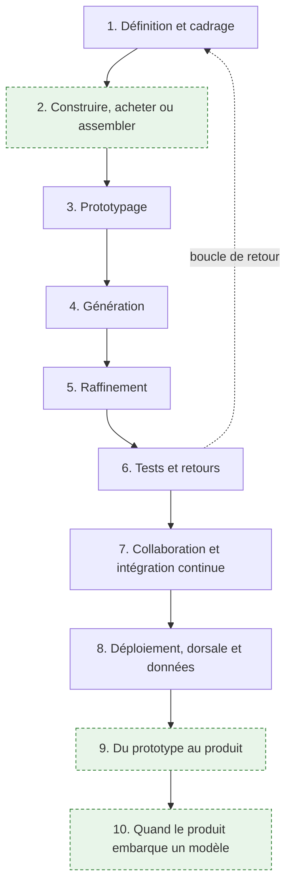
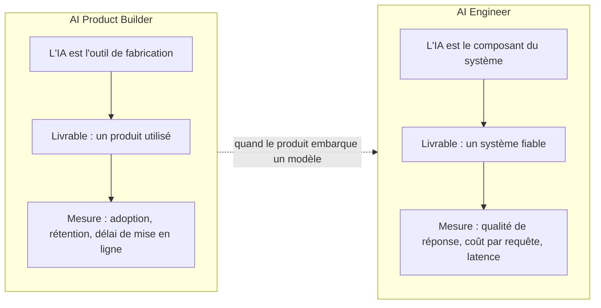
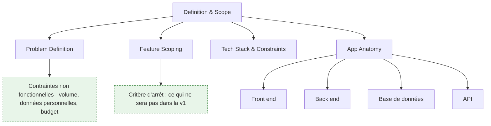

# Parcours — AI Product Builder

> [!abstract] Livrer un produit logiciel en s'appuyant sur des outils de génération de code : cadrer, prototyper, générer, reprendre le code généré, tester avec de vrais utilisateurs, déployer. Pour qui veut mettre un produit en ligne vite sans découvrir six mois plus tard qu'il a construit une maquette non maintenable — pas pour qui veut concevoir un système IA, c'est l'autre métier.

**Source** : roadmap.sh/ai-product-builder, dernière modification amont le 25 juin 2026, capturée le 16 septembre 2026 · **Rédigée** le 16 septembre 2026
Les éléments en vert dans les schémas et les encadrés « Ajout 2026 » ne figurent pas dans la roadmap d'origine.

---

## En un coup d'œil

Aucun pré-requis déclaré en amont, et c'est une des rares roadmaps du catalogue dans ce cas. En pratique il en faut deux : savoir lire du code sans l'avoir écrit, et savoir ce qu'est une requête HTTP. Le reste s'apprend dans l'ordre du parcours.

---

## Ce métier et celui d'AI Engineer

La confusion est permanente et elle coûte cher au recrutement comme à l'orientation. Les deux titres contiennent « AI », les deux livrent du logiciel, et ils ne font pas le même travail.

**À quoi ça sert.** Poser la frontière évite de recruter un profil pour le travail de l'autre. L'AI Product Builder utilise l'IA **pour fabriquer** : il décrit un produit, une chaîne d'outils en génère le code, il le reprend et le met en ligne. Son risque est le produit que personne n'utilise, ou le prototype qui devient le système de production par inertie. L'AI Engineer met l'IA **dans** le produit : récupération de contexte, orchestration, garde-fous, coût d'inférence. Son risque est le système qui répond n'importe quoi en production. Voir [[05 - Roadmap — AI Engineer]] pour ce second versant, qui n'est pas traité ici.

**Ce qu'il faut savoir**

- Un AI Product Builder qui livre un formulaire de réservation, une boutique ou un outil interne ne touche aucun LLM en production. Le mot « AI » de son titre désigne son atelier, pas son produit.
- Dès que le produit contient un appel de modèle — un résumé, une recherche sémantique, un assistant — il devient aussi un problème d'AI Engineer, et la section 10 dit ce que cela implique.
- Les deux parcours convergent sur la mise en production : tests, intégration continue, observabilité, coût. C'est le tronc commun du logiciel, pas une spécificité IA.
- Le glissement de carrière le plus fréquent va du produit vers le système, parce que le premier produit livré finit toujours par demander une fonction intelligente. L'inverse est plus rare.

> [!tip] Ajout 2026
> La question qui tranche en entretien : « quelle est votre métrique de succès ? » Si la réponse parle d'utilisateurs actifs et de délai de mise en ligne, c'est un product builder. Si elle parle de taux de réponse correcte et de coût par appel, c'est un AI engineer. Les deux réponses sont bonnes, elles ne décrivent pas le même poste.

> [!warning] Piège
> Publier une fiche de poste « AI Engineer » pour un besoin de product builder. On reçoit des candidats qui savent évaluer un pipeline RAG et à qui on demande de livrer une application de gestion en trois semaines — et réciproquement. La déception est symétrique et le turnover immédiat.

---

## 1. Définition et cadrage

**À quoi ça sert.** L'amont a raison sur un point qu'il faut prendre au sérieux : la définition du problème en une ou deux phrases est l'entrée la plus déterminante de toute la chaîne. Un générateur ne comble pas un flou, il l'amplifie — il produira une application cohérente qui résout un problème légèrement différent du vôtre, et l'écart ne se verra qu'au premier utilisateur réel. Le cadrage remplace ici la phase de conception qu'on a supprimée : puisqu'on ne dessine plus d'architecture avant de coder, la précision de l'énoncé porte toute la charge. Voir [[notions/cadrage-besoin]] — pour ce métier, le livrable de cadrage n'est pas un cahier des charges mais un paragraphe et une liste de dix fonctions maximum, dont la moitié est barrée.

**Ce qu'il faut savoir**

- Problem definition — une phrase sur le problème, une sur la personne à qui il arrive. Si elle contient « et aussi », il y a deux produits et il faut en choisir un.
- Feature scoping — la seule discipline qui compte en v1 est la soustraction. Chaque fonction ajoutée allonge le code généré, donc le code à relire, donc le temps de test. Écris explicitement ce qui n'y sera pas : c'est la liste que le générateur ne lira jamais mais que toi tu reliras.
- App anatomy — front end, back end, base de données, API : quatre briques et les contrats entre elles. Ce n'est pas de la culture générale, c'est ce qui te permet de localiser une panne dans du code que tu n'as pas écrit. Le contrat d'API est la couture la plus fragile d'une application générée, voir [[notions/conception-d-api]] — ici le besoin est modeste : des routes stables, des codes d'erreur justes, une version dans l'URL dès qu'un tiers consomme.
- Tech stack & constraints — contrainte à poser avant de générer, jamais après. Et le conseil amont est contre-intuitif mais exact : choisir une pile très répandue, pas la meilleure. Le générateur reproduit ce qu'il a vu massivement ; sur une pile de niche il invente des APIs qui n'existent pas.
- Contraintes non fonctionnelles — volume attendu, données personnelles manipulées, budget mensuel d'hébergement. Trois lignes, à écrire au cadrage, qui déterminent la section 8 et qu'on découvre sinon le jour de la mise en ligne.

> [!tip] Ajout 2026
> Écris le cadrage dans un fichier versionné à la racine du dépôt, et donne-le en contexte à chaque outil de la chaîne — prototypage, génération, assistant de codage. C'est le même geste que le fichier d'instructions de dépôt : une source d'intention unique, relue par tous les outils, modifiée au même endroit. Sans cela, chaque outil travaille sur la version du problème qu'il a reçue la dernière fois.

> [!warning] Piège
> Confondre le conseil « pile populaire » avec « pile que je connais ». Ce sont deux critères différents et le premier prime quand on délègue la génération : mieux vaut une pile très documentée qu'on apprendra en relisant, qu'une pile maîtrisée mais rare dont le code généré sera faux. Le coût de la relecture est plus faible que le coût du débogage d'un code plausible et inexistant.

---
