> [!abstract] Livrer un produit logiciel en s'appuyant sur des outils de génération de code : cadrer, prototyper, générer, reprendre le code généré, tester avec de vrais utilisateurs, déployer. Pour qui veut mettre un produit en ligne vite sans découvrir six mois plus tard qu'il a construit une maquette non maintenable — pas pour qui veut concevoir un système IA, c'est l'autre métier.

## En un coup d'œil

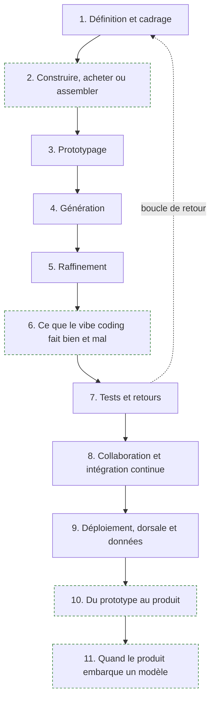

Aucun pré-requis déclaré en amont, et c'est une des rares roadmaps du catalogue dans ce cas. En pratique il en faut deux : savoir lire du code sans l'avoir écrit, et savoir ce qu'est une requête HTTP. Le reste s'apprend dans l'ordre du parcours.

---

## Ce métier et celui d'AI Engineer

La confusion est permanente et elle coûte cher au recrutement comme à l'orientation. Les deux titres contiennent « AI », les deux livrent du logiciel, et ils ne font pas le même travail.

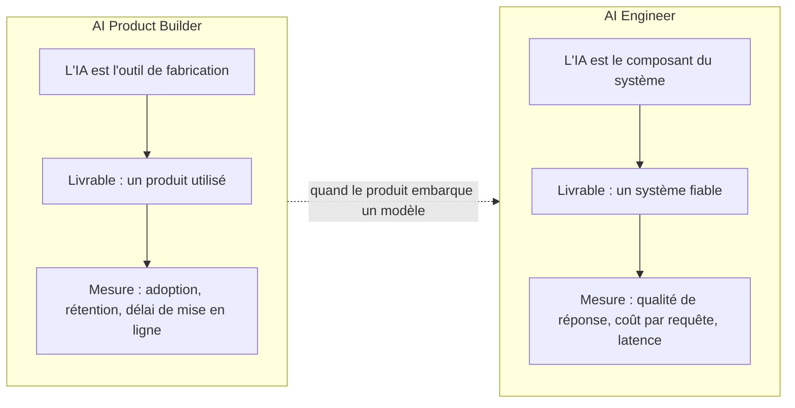

**À quoi ça sert.** Poser la frontière évite de recruter un profil pour le travail de l'autre. L'AI Product Builder utilise l'IA **pour fabriquer** : il décrit un produit, une chaîne d'outils en génère le code, il le reprend et le met en ligne. Son risque est le produit que personne n'utilise, ou le prototype qui devient le système de production par inertie. L'AI Engineer met l'IA **dans** le produit : récupération de contexte, orchestration, garde-fous, coût d'inférence. Son risque est le système qui répond n'importe quoi en production. Voir [[parcours/ai-engineer/index|AI Engineer]] pour ce second versant, qui n'est pas traité ici.

**Ce qu'il faut savoir**

- Un AI Product Builder qui livre un formulaire de réservation, une boutique ou un outil interne ne touche aucun LLM en production. Le mot « AI » de son titre désigne son atelier, pas son produit.
- Dès que le produit contient un appel de modèle — un résumé, une recherche sémantique, un assistant — il devient aussi un problème d'AI Engineer, et la section 10 dit ce que cela implique.
- Les deux parcours convergent sur la mise en production : tests, intégration continue, observabilité, coût. C'est le tronc commun du logiciel, pas une spécificité IA.
- Le glissement de carrière le plus fréquent va du produit vers le système, parce que le premier produit livré finit toujours par demander une fonction intelligente. L'inverse est plus rare.

> [!tip] Ajout 2026
> La question qui tranche en entretien : « quelle est votre métrique de succès ? » Si la réponse parle d'utilisateurs actifs et de délai de mise en ligne, c'est un product builder. Si elle parle de taux de réponse correcte et de coût par appel, c'est un AI engineer. Les deux réponses sont bonnes, elles ne décrivent pas le même poste.

> [!warning] Piège
> Publier une fiche de poste « AI Engineer » pour un besoin de product builder. On reçoit des candidats qui savent évaluer un pipeline RAG et à qui on demande de livrer une application de gestion en trois semaines — et réciproquement. La déception est symétrique et le turnover immédiat.

---

## 1. Définition et cadrage

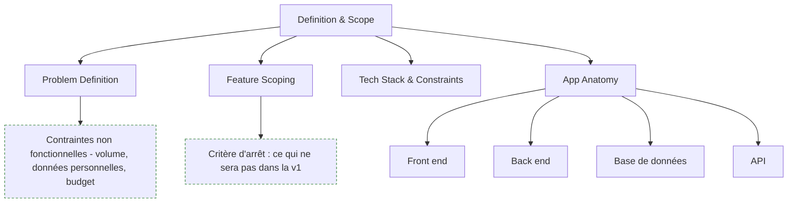

**À quoi ça sert.** L'amont a raison sur un point qu'il faut prendre au sérieux : la définition du problème en une ou deux phrases est l'entrée la plus déterminante de toute la chaîne. Un générateur ne comble pas un flou, il l'amplifie — il produira une application cohérente qui résout un problème légèrement différent du vôtre, et l'écart ne se verra qu'au premier utilisateur réel. Le cadrage remplace ici la phase de conception qu'on a supprimée : puisqu'on ne dessine plus d'architecture avant de coder, la précision de l'énoncé porte toute la charge. Voir [[notions/cadrage-besoin]] — pour ce métier, le livrable de cadrage n'est pas un cahier des charges mais un paragraphe et une liste de dix fonctions maximum, dont la moitié est barrée.

**Ce qu'il faut savoir**

- Problem definition — une phrase sur le problème, une sur la personne à qui il arrive. Si elle contient « et aussi », il y a deux produits et il faut en choisir un.
- Feature scoping — la seule discipline qui compte en v1 est la soustraction. Chaque fonction ajoutée allonge le code généré, donc le code à relire, donc le temps de test. Écris explicitement ce qui n'y sera pas : c'est la liste que le générateur ne lira jamais mais que toi tu reliras.
- App anatomy — front end, back end, base de données, API : quatre briques et les contrats entre elles. Ce n'est pas de la culture générale, c'est ce qui te permet de localiser une panne dans du code que tu n'as pas écrit. Le contrat d'API est la couture la plus fragile d'une application générée, voir [[notions/conception-d-api]] — ici le besoin est modeste : des routes stables, des codes d'erreur justes, une version dans l'URL dès qu'un tiers consomme.
- Tech stack & constraints — contrainte à poser avant de générer, jamais après. Et le conseil amont est contre-intuitif mais exact : choisir une pile très répandue, pas la meilleure. Le générateur reproduit ce qu'il a vu massivement ; sur une pile de niche il invente des APIs qui n'existent pas.
- Contraintes non fonctionnelles — volume attendu, données personnelles manipulées, budget mensuel d'hébergement. Trois lignes, à écrire au cadrage, qui déterminent la section 8 et qu'on découvre sinon le jour de la mise en ligne.

> [!tip] Ajout 2026
> Écris le cadrage dans un fichier versionné à la racine du dépôt, et donne-le en contexte à chaque outil de la chaîne — prototypage, génération, assistant de codage. C'est le même geste que le fichier d'instructions de dépôt : une source d'intention unique, relue par tous les outils, modifiée au même endroit. Sans cela, chaque outil travaille sur la version du problème qu'il a reçue la dernière fois.

> [!warning] Piège
> Confondre le conseil « pile populaire » avec « pile que je connais ». Ce sont deux critères différents et le premier prime quand on délègue la génération : mieux vaut une pile très documentée qu'on apprendra en relisant, qu'une pile maîtrisée mais rare dont le code généré sera faux. Le coût de la relecture est plus faible que le coût du débogage d'un code plausible et inexistant.

---

## 2. Construire, acheter ou assembler (hors roadmap)

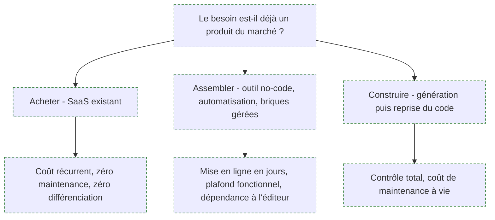

**À quoi ça sert.** La roadmap amont commence à « vous allez construire » et ne pose jamais la question précédente. C'est son angle mort le plus coûteux : la génération de code a tellement baissé le prix du premier jour qu'on construit désormais des choses qu'on aurait achetées, et dont on paiera la maintenance pendant cinq ans. L'arbitrage se fait sur le coût complet, pas sur le coût de fabrication — un produit généré en un week-end coûte ensuite des mises à jour de dépendances, des correctifs de sécurité, une astreinte et un successeur quand son auteur part. Voir [[notions/roi-des-projets-ia]] — pour ce métier, le calcul se fait sur trois ans et inclut le temps de reprise du code généré, qui est la ligne systématiquement oubliée.

**Ce qu'il faut savoir**

- Acheter — le bon choix quand le besoin est standard et non différenciant : facturation, support, paie, prise de rendez-vous. Le coût d'abonnement est visible et déprime, la maintenance évitée est invisible et bien plus chère.
- Assembler — briques gérées et outils d'automatisation pour tout ce qui est interne, à faible volume, et dont l'échec n'a pas de conséquence client. Le plafond arrive vite, mais on l'atteint en ayant appris ce que le produit devait faire.
- Construire — se justifie quand la fonction est le cœur de l'offre, quand les données ne peuvent pas sortir, ou quand le prix du SaaS croît plus vite que l'usage. Trois raisons, pas quatre.
- Le critère de bascule le plus fiable : est-ce que ce composant figurera dans l'argumentaire commercial ? Si oui, il se construit. Sinon il s'achète.
- L'arbitrage entre un traitement déterministe et un appel de modèle relève de la même famille de décision et se pose dès qu'une fonction « intelligente » apparaît au cadrage — voir [[notions/arbitrage-deterministe-probabiliste]]. Ici l'erreur typique est inversée par rapport au conseil : on ne met pas trop d'IA, on met un LLM dans une fonction qui était une règle métier de quinze lignes, parce que le générateur l'a proposé.

> [!tip] Ajout 2026
> Le prototype généré est un excellent outil d'arbitrage avant l'arbitrage : deux jours de génération donnent une maquette cliquable qui permet de négocier un SaaS en connaissance de cause, ou de constater que le besoin réel était trois champs de formulaire. Utiliser la génération pour décider de ne pas construire est son usage le plus rentable, et le moins pratiqué.

> [!warning] Piège
> « On le fait en interne, ça nous coûtera moins cher. » La comparaison est presque toujours faite entre un abonnement annuel et zéro, parce que le temps de l'équipe n'est pas facturé au projet. Refais le calcul avec le coût chargé des personnes et un taux de maintenance annuel de 15 à 20 % du coût de construction : la moitié des décisions « construire » s'inversent.

---

## 3. Prototypage

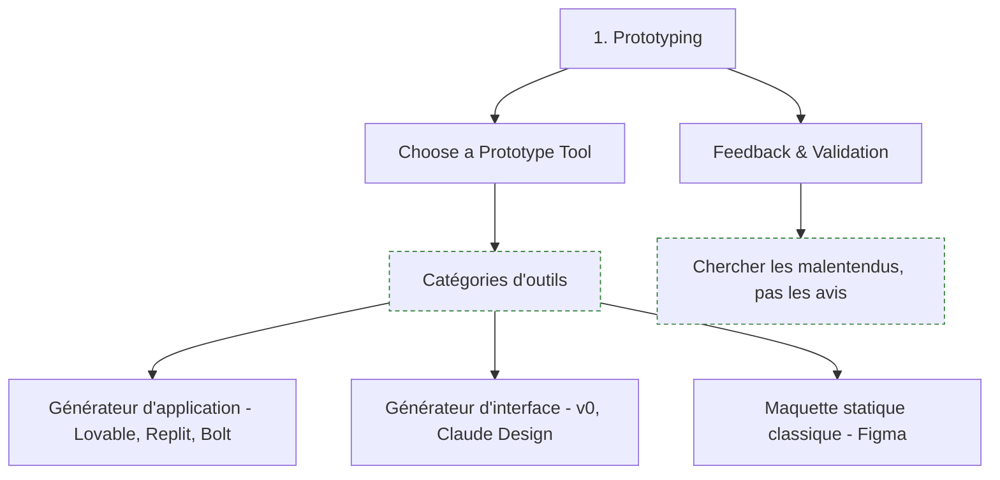

**À quoi ça sert.** Le prototype n'est pas une étape de design, c'est un instrument de réduction d'incertitude. Son utilité tient à une seule propriété : il rend une incompréhension visible pendant qu'elle coûte encore une demi-journée. Le déplacement réel de 2026 est là — un prototype n'est plus une image cliquable, c'est une application qui répond, et une partie des malentendus ne se révélait qu'à ce niveau de réalisme. Cela ne remplace pas la maquette statique : dessiner reste plus rapide pour explorer dix dispositions d'écran, générer est plus rapide pour valider un enchaînement.

**Ce qu'il faut savoir**

- Deux catégories, à ne pas confondre. Le **générateur d'application** part d'une description et produit une application complète et hébergée, front et dorsale, prête à cliquer — Lovable, Bolt et Replit occupent cette case. Le **générateur d'interface** produit un composant ou un écran à intégrer dans un projet existant — v0 et Claude Design occupent celle-là. Le premier sert à valider un parcours, le second à accélérer une intégration.
- Le critère de choix utile n'est pas la qualité du code produit mais la destination : le prototype est-il jetable ou est-il le début du produit ? Si jetable, prends le plus rapide. S'il doit survivre, prends celui dont tu peux exporter le code dans ton dépôt et le lire.
- Feedback & validation — l'amont dit « cherchez les incompréhensions », ce qui est la bonne consigne. Regarde où les gens s'arrêtent, pas ce qu'ils déclarent aimer. Une session de quinze minutes avec cinq personnes suffit à sortir les trois malentendus structurants.
- Un prototype qui n'a pas produit de décision — abandonner, réduire, changer de direction — n'a servi à rien, quelle que soit sa beauté.
- Ne connecte pas de données réelles à un prototype. C'est la source la plus banale d'incident sur données personnelles : une maquette hébergée publiquement, sans authentification, avec un export de la base client dedans.

> [!tip] Ajout 2026
> Prototype la fonction la plus incertaine, pas la page d'accueil. Les générateurs produisent une page d'accueil convaincante en trente secondes et c'est précisément la partie qui ne portait aucun risque. Le week-end perdu se reconnaît à ceci : la maquette est superbe et on ne sait toujours pas si le cœur du produit fonctionne.

> [!warning] Piège
> Montrer le prototype à la direction sans dire que c'est un prototype. Le réalisme qui en fait un bon outil de validation en fait un très mauvais outil de communication : ce qui répond en démonstration est considéré comme livré, et le délai restant est vu comme de la finition. Annonce la nature du livrable avant de partager le lien, par écrit.

---

## 4. Génération

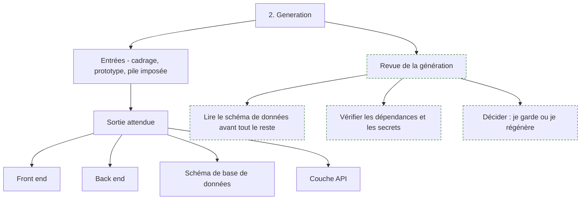

**À quoi ça sert.** La génération transforme un énoncé en base de code fonctionnelle. Ce qu'elle change réellement, ce n'est pas la vitesse d'écriture — c'est le déplacement de l'effort, qui passe de l'écriture vers la relecture et la décision. Le travail ne disparaît pas, il devient un travail de revue sur du code qu'on n'a pas écrit, discipline que peu de gens ont exercée. C'est aussi le moment où se fixent les choix les plus durables : le schéma de base de données généré en huit secondes structurera le produit pendant toute sa vie, bien après que le code qui l'entoure aura été réécrit.

**Ce qu'il faut savoir**

- La qualité de sortie est dominée par la clarté des entrées, mais pas seulement : elle dépend surtout de la banalité du problème. Une application de gestion standard sort correcte, une mécanique métier singulière sort plausible et fausse.
- Lis le schéma de données en premier, avant toute ligne d'interface. C'est la partie la plus chère à corriger plus tard et la plus facile à corriger maintenant — clés, unicité, suppressions en cascade, dates avec fuseau, champs qui devraient être des tables.
- Vérifie les dépendances ajoutées, une par une. Les générateurs importent volontiers des bibliothèques abandonnées ou surdimensionnées, et parfois des noms qui n'existent pas sur le registre.
- Vérifie où sont les secrets. Une clé d'API dans le code du front end est l'accident le plus fréquent d'une application générée, et il est public dès la première mise en ligne.
- Règle de décision à appliquer tout de suite : si plus d'un tiers de ce qui est généré est à réécrire, régénère avec un énoncé corrigé au lieu de rafistoler. Les corrections successives sur une base mal orientée coûtent plus cher qu'une seconde génération.
- Journalise l'énoncé qui a produit la base de code, dans le dépôt. Sans lui, personne ne saura dans six mois pourquoi l'application est structurée ainsi.

> [!tip] Ajout 2026
> Commite la sortie brute de la génération dans un premier commit isolé, avant toute retouche. Cela donne une ligne de démarcation nette entre « ce que la machine a produit » et « ce que nous avons décidé », qui est exactement la frontière qu'on cherche en revue de sécurité ou en reprise de projet. C'est gratuit et presque personne ne le fait.

> [!warning] Piège
> Accepter les tests générés comme preuve que le code fonctionne. Ils sont écrits à partir du même énoncé et par le même modèle : ils vérifient que le code fait ce que le code fait. Un test qui n'a jamais échoué n'a jamais rien prouvé — casse-en un volontairement pour vérifier qu'il le détecte.

---

## 5. Raffinement : reprendre le code généré

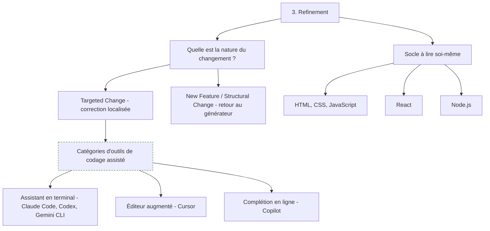

**À quoi ça sert.** C'est l'étape où le métier se joue vraiment, et la seule que la roadmap traite avec précision. La question préalable — changement localisé ou changement structurel — vaut plus que le choix d'outil : rapiécer manuellement une modification qui touche le modèle de données produit une base de code où la moitié suit la logique du générateur et l'autre celle du correcteur, état dont on ne ressort plus. L'amont donne ici la bonne règle : correction locale dans le code, changement d'architecture par régénération. Voir [[notions/assistants-de-codage]] — pour ce métier, l'usage dominant n'est pas d'écrire du code neuf mais de **comprendre et modifier du code qu'on n'a pas écrit**, ce qui inverse complètement les critères de choix d'outil.

**Ce qu'il faut savoir**

- **Assistant en terminal** — un agent qui lit le dépôt, modifie plusieurs fichiers, exécute les tests et boucle sur le résultat. C'est la catégorie adaptée aux tâches qui traversent l'application : tracer un bug, renommer un concept partout, ajouter une couche de validation. Claude Code, Codex et Gemini CLI en sont les représentants actuels, et le prochain nom qui les remplacera occupera la même case.
- **Éditeur augmenté** — un IDE qui indexe le dépôt et répond sur la sélection courante. C'est la catégorie du travail d'exploration : ouvrir un fichier inconnu, demander ce qu'il fait, modifier avec la structure sous les yeux. Cursor en est l'exemple le plus répandu.
- **Complétion en ligne** — la prédiction du bloc suivant pendant la frappe. Utile quand tu sais déjà ce que tu écris, inutile quand tu cherches à comprendre. Copilot occupe cette case.
- Le critère de choix tient en une question : **je sais ce que je veux écrire, ou je cherche à savoir ce qui existe ?** Première réponse, complétion. Deuxième réponse, éditeur augmenté. Tâche qui traverse plusieurs fichiers et dont le succès est vérifiable par un test, assistant en terminal.
- Aucun de ces outils n'est fiable sans **retour d'exécution**. Un agent branché sur des tests, un typage et un linter se corrige ; le même agent sans rien produit du code plausible et faux avec une confiance identique. C'est le seul facteur de qualité qui ne dépend pas du modèle.
- Socle à connaître pour soi — HTML, CSS et JavaScript pour lire le front end, React parce que c'est ce que les générateurs produisent par défaut, Node.js parce que c'est ce qu'ils produisent côté serveur. Pas pour écrire : pour relire et pour savoir dans quelle couche est la panne.
- Les outils de navigation du navigateur — inspecteur, onglet réseau, console — sont le premier réflexe de diagnostic d'un front end généré, avant de demander quoi que ce soit à un assistant.

> [!tip] Ajout 2026
> Un fichier d'instructions à la racine du dépôt — conventions, commande de test, ce qu'on ne touche pas — améliore plus la qualité de sortie que le changement d'outil, et il sert à toute la catégorie d'un coup. C'est du cadrage appliqué à son propre code : versionné, relu, mis à jour quand une erreur se répète. Quand un assistant refait deux fois la même bêtise, la correction va dans ce fichier, pas dans la conversation.

> [!warning] Piège
> Enchaîner les demandes de correction sans jamais lire le diff. Au bout de dix tours on obtient une application qui passe la démonstration et dont plus personne, humain ou machine, ne peut dire pourquoi elle fonctionne. Le symptôme se reconnaît tôt : une correction en casse une autre, deux fois de suite. À ce moment-là, arrête et relis.

---

## 6. Ce que le vibe coding fait bien, et ce qu'il fait mal (hors roadmap)

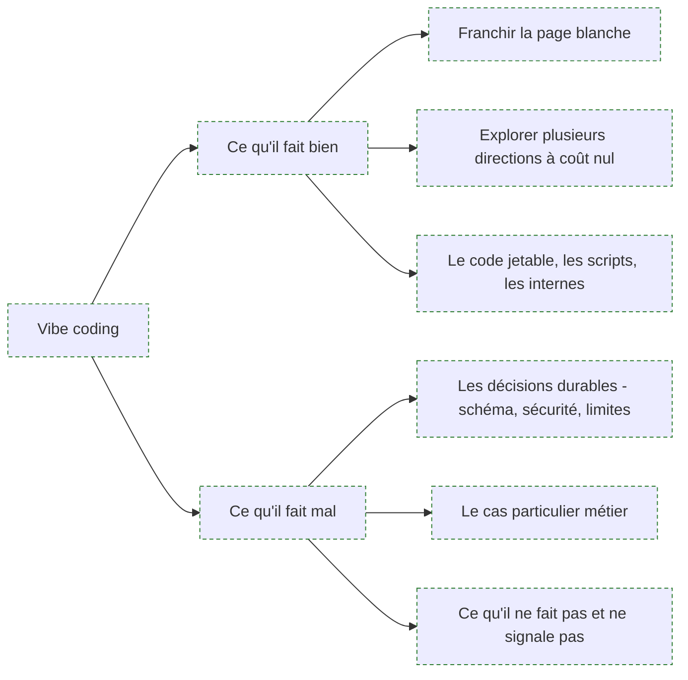

**À quoi ça sert.** La roadmap amont renvoie vers une roadmap dédiée et ne prend jamais position. Il en faut une, parce que c'est le cœur du métier et que le débat public oscille entre deux positions également fausses : « ça remplace les développeurs » et « ça ne produit que de la dette ». La position tenable est plus ennuyeuse : le vibe coding déplace le goulot d'étranglement de l'écriture vers le jugement, et il est excellent là où se tromper ne coûte rien, mauvais là où l'erreur est silencieuse et durable.

**Ce qu'il faut savoir**

- Ce qu'il fait bien, sans discussion : passer la page blanche, produire un squelette conventionnel, explorer trois directions en une heure au lieu de trois jours, écrire les parties fastidieuses et vérifiables — formulaires, migrations, adaptateurs, scripts internes, tests d'interface. Sur du code jetable ou à faible enjeu, la question de la dette ne se pose pas : le code sera supprimé avant de coûter.
- Ce qu'il fait mal, et c'est structurel : tout ce qui relève d'un choix durable pris une fois. Modèle de données, frontières de modules, gestion des droits, comportement en cas d'erreur, limites de charge. Le générateur propose la solution la plus fréquente, qui est souvent la bonne — et quand elle ne l'est pas, rien dans la sortie ne le signale.
- Le défaut le plus coûteux n'est pas le bug : c'est **l'absence silencieuse**. Pas de limitation de débit, pas de vérification d'autorisation sur une route, pas de journalisation, pas de gestion du cas où le service externe est indisponible. Le code livré fonctionne ; ce qui manque ne produit aucune erreur jusqu'au jour où.
- La compétence qui prend de la valeur est la revue : savoir lire du code écrit par un autre, repérer ce qui manque plutôt que ce qui est faux, décider quoi garder. C'est une compétence de relecture, et elle s'entraîne mal en écrivant.
- Le facteur de réussite le plus discriminant n'est pas le talent de formulation, c'est le niveau du lecteur. Le même outil produit un résultat solide entre les mains de quelqu'un qui sait ce qu'il aurait écrit, et un château de cartes entre celles de quelqu'un qui ne peut pas juger. Ce n'est pas un jugement moral, c'est ce qui décide du résultat.

> [!tip] Ajout 2026
> Le partage qui tient à l'usage : **génère ce que tu saurais écrire, écris ce que tu ne saurais pas juger**. Inverser cette règle est la définition courte du problème. Elle a l'avantage d'être applicable sans débat philosophique et de se vérifier fichier par fichier en revue.

> [!warning] Piège
> Traiter la vitesse de production comme la mesure du progrès. Le débit de code n'a jamais été le facteur limitant d'un produit — la compréhension du besoin et la capacité à faire évoluer l'existant le sont. Multiplier par dix la production de code d'une équipe qui n'a pas augmenté sa capacité de relecture ne va pas dix fois plus vite : elle accumule un stock qu'elle ne peut plus vérifier.

---

## 7. Tests et retours

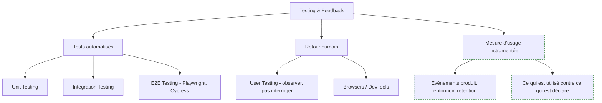

**À quoi ça sert.** Deux boucles différentes qu'on confond souvent. La boucle technique répond à « est-ce que ça marche encore » et se ferme en secondes ; la boucle produit répond à « est-ce que ça sert » et se ferme en semaines. Sur une base de code générée, la première est vitale pour une raison spécifique : les tests sont le seul retour d'exécution qui empêche un assistant de casser en silence ce qu'il ne comprend pas. Voir [[notions/tests-logiciels]] — pour ce métier, les tests ne servent pas d'abord à prouver la justesse, ils servent de garde-corps aux modifications automatisées, ce qui change ce qu'il faut couvrir en priorité : les parcours, pas les fonctions.

**Ce qu'il faut savoir**

- Unitaire, intégration, bout en bout — la pyramide classique s'inverse partiellement ici. Sur une application générée, trois tests de bout en bout sur les parcours qui rapportent de l'argent protègent plus que cinquante tests unitaires sur des fonctions utilitaires que le générateur réécrira de toute façon.
- Écris les tests de bout en bout des parcours critiques toi-même, ou au moins relis-les ligne à ligne. Ce sont eux qui définissent ce que « le produit fonctionne » veut dire, et c'est une décision, pas une tâche.
- User testing — l'amont le dit bien : on ne cherche pas des avis, on cherche les moments d'hésitation. Cinq personnes, quinze minutes, une tâche précise à accomplir sans aide, et on se tait pendant qu'elles la font.
- Outils du navigateur — inspecteur, console, onglet réseau, mesure de performance. C'est le premier endroit où regarder quand le front end se comporte mal, et le moyen le plus rapide de savoir si la panne est côté client ou côté serveur.
- **Mesurer l'usage, pas la satisfaction déclarée.** Les gens répondent qu'une fonction leur est utile et ne l'ouvrent jamais. Instrumente les événements dès la première mise en ligne — entrée dans le parcours, abandon, complétion, retour — parce que c'est la seule donnée qui arbitre les priorités de la v2. La satisfaction déclarée sert à comprendre un comportement déjà observé, jamais à le prédire.
- Quatre chiffres suffisent au début : combien de personnes commencent le parcours principal, combien le finissent, combien reviennent la semaine suivante, où exactement se situe l'abandon. Tout le reste est du raffinement.

> [!tip] Ajout 2026
> Branche l'instrumentation avant la première mise en ligne, pas après le premier désaccord sur les priorités. Rétablir des données d'usage a posteriori demande de re-livrer et d'attendre un mois, pendant lequel les arbitrages se prennent à l'opinion. Une dizaine d'événements nommés proprement, dans un fichier unique, suffisent — et ce fichier est de ceux qu'on écrit soi-même.

> [!warning] Piège
> Confondre absence de bug et absence de problème. Une application générée sans erreur en production peut n'avoir aucun utilisateur qui atteint la fin du parcours : la boucle technique est verte et le produit est mort. Les deux boucles se surveillent séparément, et c'est la seconde qui décide s'il faut continuer.

---

## 8. Collaboration et intégration continue

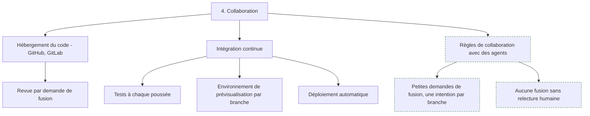

**À quoi ça sert.** Le versionnement est la première chose à mettre en place après une génération, et l'amont a raison de le dire aussi tôt. La raison est propre à ce métier : quand une part du code est produite par une machine, l'historique devient le seul endroit où l'on peut répondre à « qui a décidé ça, et pourquoi ». Le dépôt n'est plus une sauvegarde, c'est la mémoire des décisions. L'intégration continue apporte le reste — voir [[notions/integration-continue]] — et son usage ici est moins la qualité que la **vitesse de retour** : un environnement de prévisualisation par branche transforme chaque idée en lien cliquable à envoyer à trois utilisateurs.

**Ce qu'il faut savoir**

- GitHub et GitLab rendent le même service pour ce métier — hébergement, revue, chaîne d'intégration. Le second intègre la chaîne nativement, le premier a l'écosystème le plus large. Choisis celui que ton organisation utilise déjà et passe à la suite.
- Une branche, une intention. Quand un assistant modifie quinze fichiers pour deux raisons différentes, la revue devient impossible et personne ne la fait sérieusement. Demande explicitement de séparer.
- Ce qui tourne à chaque poussée, au minimum : les tests, le typage, le linter. C'est exactement le retour d'exécution dont la section 5 dit qu'il conditionne la qualité des assistants — l'intégration continue le rend systématique au lieu de dépendre de la mémoire de chacun.
- Environnements de prévisualisation par branche — la fonction la plus sous-estimée des plateformes modernes. Elle raccourcit la boucle produit de la section 7 bien plus que n'importe quelle amélioration d'outil.
- Verrouille la branche principale, même seul sur le projet. C'est la barrière qui empêche un agent en boucle de livrer directement en production, et elle coûte deux minutes de configuration.
- Journalise les décisions structurantes dans le dépôt — un fichier court par décision, ce qu'on a choisi et ce qu'on a écarté. Sur un code dont personne ne se souvient de l'écriture, c'est ce qui remplace la mémoire de l'auteur.

> [!tip] Ajout 2026
> Fais relire les demandes de fusion générées par un second outil avant la relecture humaine : il attrape les oublis mécaniques — secret en clair, route sans contrôle d'accès, dépendance inutile — et laisse à l'humain le jugement d'architecture, qui est le seul qu'il soit irremplaçable à porter. L'ordre compte : machine d'abord pour le mécanique, humain ensuite pour l'intention.

> [!warning] Piège
> Livrer en production depuis le poste local, « le temps de démarrer ». Cette habitude ne se défait plus une fois prise, et elle supprime la seule trace qui permettra de savoir ce qui tourne réellement. Le premier déploiement automatisé coûte une demi-journée au démarrage et une semaine six mois plus tard.

---

## 9. Déploiement, dorsale et données

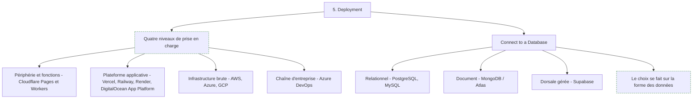

**À quoi ça sert.** L'amont liste onze produits sans donner de critère, ce qui est le défaut central de cette section. La grille utile n'est pas la marque mais le **niveau de prise en charge** qu'on achète : plus la plateforme en fait, moins on configure et moins on contrôle. Le bon choix est le niveau le plus élevé qui satisfait la contrainte la plus dure du cadrage — et pour un premier produit, cette contrainte est presque toujours le budget ou le délai, jamais l'extensibilité qu'on imagine.

**Ce qu'il faut savoir**

- **Périphérie et fonctions** — code déployé sur un réseau mondial, facturé à l'invocation, sans serveur à maintenir. Adapté au front end et aux traitements courts et sans état. Cloudflare occupe cette case. Limite structurelle : durée d'exécution bornée et pas de processus long.
- **Plateforme applicative** — on pousse un dépôt, la plateforme construit, héberge et gère les certificats et les mises à l'échelle. C'est la case par défaut d'un produit qui démarre : Vercel côté front end, Railway et Render pour une application complète avec base, DigitalOcean App Platform comme intermédiaire. Limite : le coût cesse d'être compétitif à volume soutenu.
- **Infrastructure brute** — AWS, Azure, GCP. Contrôle total, tout est possible, tout est à faire. N'y va pas pour un premier produit sauf contrainte imposée : l'écart de temps de mise en ligne se compte en semaines et l'écart de facture en surprises.
- **Chaîne d'entreprise** — Azure DevOps et équivalents. On ne les choisit pas, on les subit parce que l'organisation les impose. Ce n'est pas une critique, c'est une réalité à intégrer au cadrage.
- Base de données : le choix se fait sur la forme des données, pas sur la mode. Structure stable avec des relations qui comptent, relationnel — PostgreSQL par défaut, MySQL si l'hébergement l'impose. Documents hétérogènes dont le schéma bouge à chaque itération, document — MongoDB et son service géré Atlas. En cas d'hésitation, relationnel : on migre plus facilement vers le souple que l'inverse.
- **Dorsale gérée** — la catégorie qui change le plus la vitesse d'un product builder : base relationnelle, authentification, droits d'accès par ligne, API générée et temps réel dans un seul service. Supabase en est l'exemple ici. Ce qu'on achète, c'est de ne pas écrire l'authentification soi-même, et c'est de loin le meilleur rapport valeur sur risque du parcours.
- L'authentification et les droits d'accès sont le point où une application générée est le plus souvent fausse. Une route qui vérifie l'identité mais pas l'autorisation laisse n'importe quel utilisateur connecté lire les données des autres. Vérifie-le à la main, sur chaque route qui renvoie des données d'utilisateur.
- Voir [[notions/sql]] pour les requêtes — ici le besoin est modeste mais non nul : savoir lire le schéma généré, comprendre une jointure, et repérer la requête qui lit toute la table à chaque affichage de page.

> [!tip] Ajout 2026
> Regarde le plafond du palier gratuit avant de choisir, pas la vitrine. Les plateformes applicatives sont généreuses jusqu'à un seuil précis — bande passante, minutes de construction, heures de base de données — et la facture qui suit est brutale et sans préavis. Note le seuil dans le cadrage et pose une alerte de dépense dessus le jour de la mise en ligne.
>
> Deuxième point à traiter au moment du déploiement et pas après : si l'application manipule des données personnelles, l'hébergement, les sous-traitants et la durée de conservation sont des décisions de cette section. Voir [[notions/rgpd]] — pour ce métier le piège concret est la dorsale gérée dont les données résident hors Union européenne, choisie en trois clics et impossible à déplacer ensuite.

> [!warning] Piège
> Choisir l'infrastructure sur la charge imaginée. Le dimensionnement « au cas où ça décolle » fait perdre des semaines à un produit qui aura douze utilisateurs le premier mois, et la migration d'une plateforme applicative vers une infrastructure brute — quand elle devient nécessaire — se fait en connaissant enfin le profil de charge réel. C'est plus rapide dans cet ordre.

---

## 10. Du prototype au produit : ce que la roadmap ne chiffre pas (hors roadmap)

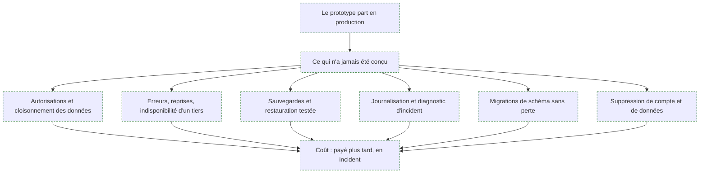

**À quoi ça sert.** La roadmap s'arrête à « déployer » comme si la mise en ligne finissait le travail. Le scénario le plus fréquent de ce métier est pourtant celui-ci : un prototype validé en démonstration reçoit des utilisateurs réels, personne ne prend la décision de le reconstruire, et il devient le produit par simple absence de décision. Le prototype n'est pas mauvais — il n'a simplement jamais été conçu pour durer, et la différence entre les deux tient à une liste courte et parfaitement connue. Nommer la liste permet de la traiter en une à deux semaines, ou de décider explicitement de ne pas la traiter, ce qui est un choix acceptable tant qu'il est conscient.

**Ce qu'il faut savoir**

- Autorisations — le contrôle par ligne et par utilisateur sur chaque route qui renvoie des données. C'est le premier poste, le plus souvent absent, et le seul dont la défaillance est publique.
- Comportement en erreur — que se passe-t-il quand le service de paiement, le fournisseur d'e-mail ou la base ne répondent pas ? Un prototype n'a pas de réponse ; un produit a des reprises, des délais d'attente et un message honnête à l'utilisateur.
- Sauvegardes — et surtout une restauration réellement essayée une fois. Une sauvegarde jamais restaurée est une hypothèse, pas une garantie.
- Journalisation — de quoi reconstituer ce qui s'est passé pour un utilisateur donné à une heure donnée. Sans cela, le premier incident sérieux se termine en « on ne sait pas ».
- Migrations — le schéma va changer. Un mécanisme de migration versionné, appliqué de la même façon en test et en production, s'installe en deux heures au démarrage et devient très coûteux à rétablir plus tard.
- Suppression de compte et de données — obligation légale et fonction que les générateurs n'écrivent jamais spontanément, parce que personne ne la demande dans l'énoncé initial.
- Le coût de cette liste est à peu près constant : une à deux semaines pour une application modeste. Le coût de son report n'est pas constant, il croît avec le nombre d'utilisateurs et le volume de données déjà accumulé.

> [!tip] Ajout 2026
> Prends la décision explicitement, par écrit, le jour de la première mise en ligne : « ceci est un prototype en production, avec telles limites, jusqu'à telle date ou tel nombre d'utilisateurs ». Un seuil déclaré transforme une dérive en décision — et il donne l'argument budgétaire au moment où il servira. Sans seuil écrit, la conversation de renforcement n'a jamais lieu avant l'incident.

> [!warning] Piège
> Réécrire entièrement au lieu de renforcer. Quand la liste ci-dessus est enfin regardée, la réaction courante est « ce code est mauvais, reprenons de zéro » — alors que le code fonctionne et que ce qui manque est identifié, borné et additif. La réécriture complète reproduit les mêmes absences avec six mois de retard et sans les utilisateurs.

---

## 11. Quand le produit embarque réellement un modèle (hors roadmap)

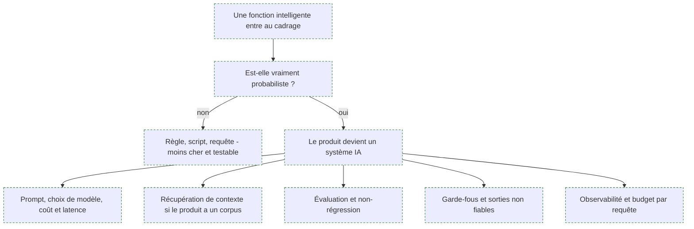

**À quoi ça sert.** La roadmap amont porte le nom « AI Product Builder » et ne traite que d'une chose : construire un produit **avec** des outils d'IA. Elle ne dit rien du produit qui **contient** un modèle, alors que c'est l'autre moitié de ce que le titre laisse attendre et le cas de la majorité des produits construits aujourd'hui. Cette section pose la frontière et renvoie : rien de ce qui suit n'est expliqué ici, parce que c'est le domaine de l'AI Engineer et que le corpus l'explique déjà une fois — voir [[parcours/ai-engineer/index|AI Engineer]].

**Ce qu'il faut savoir**

- La première question reste l'arbitrage — voir [[notions/arbitrage-deterministe-probabiliste]]. Une classification à sept catégories stables, un calcul, un routage : ce sont des règles. On n'y met un modèle que si l'entrée est du langage libre ou si les cas sont ouverts.
- [[notions/choix-de-modele]] — pour ce métier, le critère dominant n'est pas la qualité de tête de gamme mais le coût par utilisateur actif : un produit grand public ne survit pas à un gros modèle appelé à chaque interaction.
- [[notions/ingenierie-de-prompt]] — ici le prompt est un actif produit, versionné et testé comme du code, pas une chaîne dans un fichier de configuration modifiée en production.
- [[notions/rag]] et [[notions/embeddings-et-bases-vectorielles]] — nécessaires seulement si le produit a un corpus propre à interroger. Beaucoup de produits n'en ont pas et s'en passent très bien ; les monter par réflexe est un des surcoûts les plus fréquents.
- [[notions/agents-llm]] et [[notions/mcp]] — pour ce métier, l'usage courant de MCP n'est pas dans le produit livré mais dans l'atelier : brancher les assistants de codage sur le dépôt, la base et le suivi de tickets.
- [[notions/evaluation-llm]] — le point où un product builder échoue le plus souvent, parce qu'il est habitué au binaire « ça marche / ça ne marche pas ». Une fonction à base de modèle n'a pas d'état binaire : sans un jeu de cas attendus rejoué à chaque changement, chaque amélioration est un pari.
- [[notions/cout-et-latence-inference]] — pour ce métier, le budget par utilisateur et par mois est une contrainte de modèle économique, pas une ligne d'infrastructure. Il se calcule avant de livrer, pas sur la première facture.
- [[notions/observabilite]] — traces par requête et coût par requête, sans quoi aucun incident sur une fonction à base de modèle n'est reproductible.
- [[notions/garde-fous]] et [[notions/injection-de-prompt]] — dès que le produit affiche une sortie de modèle à un utilisateur ou lui laisse déclencher une action. Le cas typique et sous-estimé du product builder : l'assistant qui lit un document envoyé par un utilisateur et dispose d'un outil d'envoi d'e-mail.

> [!tip] Ajout 2026
> Le découpage qui fonctionne en équipe réduite : la fonction à base de modèle est un service séparé, avec son propre contrat d'API, ses propres tests et son propre budget. Le reste du produit ne sait pas qu'il y a un modèle derrière. Cela permet de changer de fournisseur, de mettre la fonction en mode dégradé, et de mesurer son coût isolément — trois choses impossibles quand les appels sont dispersés dans le code applicatif.

> [!warning] Piège
> Ajouter un assistant conversationnel au produit parce qu'il en faut un. C'est la fonction la plus demandée, la plus chère à évaluer, la moins utilisée après le premier mois et la plus exposée en cas de dérapage. Dans la plupart des produits, une recherche qui comprend les formulations approximatives et deux ou trois champs pré-remplis intelligemment apportent plus de valeur d'usage pour un dixième du risque.

---

## Parcours conseillé

| Ordre | Étape | Effort | À viser |
|---|---|---|---|
| 1 | Cadrage et anatomie d'une application | ~2 jours | Un paragraphe de problème, dix fonctions dont cinq barrées, une pile imposée |
| 2 | Arbitrage construire / acheter / assembler | ~1 jour | Un calcul sur trois ans, écrit, avec l'option « ne pas construire » évaluée |
| 3 | Prototype de la fonction la plus incertaine | ~2 jours | Une maquette cliquable et trois malentendus identifiés en session utilisateur |
| 4 | Première génération complète | ~3 jours | Une base de code lisible, un schéma de données relu, un commit de sortie brute |
| 5 | Socle de relecture — HTML, CSS, JS, React, Node | ~2 semaines | Savoir localiser une panne dans une couche sans demander à un outil |
| 6 | Reprise du code avec un assistant | ~1 semaine | Dix corrections ciblées, diff relu à chaque fois, fichier d'instructions de dépôt |
| 7 | Tests et instrumentation d'usage | ~1 semaine | Trois tests de bout en bout sur les parcours critiques, dix événements nommés |
| 8 | Dépôt, intégration continue, prévisualisation | ~3 jours | Branche principale verrouillée, tests à chaque poussée, un lien par branche |
| 9 | Déploiement et dorsale gérée | ~1 semaine | En ligne, authentification et droits vérifiés à la main, alerte de dépense posée |
| 10 | Liste prototype vers produit | ~2 semaines | Sauvegarde restaurée une fois, migrations versionnées, suppression de compte |
| 11 | Fonction à base de modèle, si le produit en a une | continu | Service isolé, jeu d'évaluation, budget par requête |

---

## Ressources

Toutes reprises de la roadmap amont, où elles sont référencées à ces adresses.

**Cadrage et cycle produit**

- [Will AI make us all product builders?](https://www.fundament.design/p/will-ai-make-us-all-product-builders?hide_intro_popup=true) — la meilleure des deux sur le déplacement du métier.
- [How to scope your AI product](https://uxdesign.cc/how-to-scope-your-ai-product-5b9885ef3851) et [How to effectively scope your software projects](https://www.freecodecamp.org/news/how-to-effectively-scope-your-software-projects-from-planning-to-execution-e96cbcac54b9/) — cadrage et réduction de périmètre.
- [The Best Tech Stack in the Age of AI](https://thebootstrappedfounder.com/the-best-tech-stack-in-the-age-of-ai/) — l'argument du choix d'une pile très répandue.
- [Web Application Architecture: Front-end, Middleware and Back-end](https://dev.to/techelopment/web-application-architecture-front-end-middleware-and-back-end-2ld7) — l'anatomie en quatre briques.

**Socle technique à relire soi-même**

- [React Docs](https://react.dev/reference/react) et la [roadmap React](https://roadmap.sh/react) — ce que les générateurs produisent par défaut côté interface.
- [Introduction to Node.js](https://nodejs.org/en/learn/getting-started/introduction-to-nodejs) et la [roadmap Node.js](https://roadmap.sh/nodejs) — côté serveur.
- [What are browser developer tools?](https://developer.mozilla.org/en-US/docs/Learn_web_development/Howto/Tools_and_setup/What_are_browser_developer_tools) — le premier outil de diagnostic, et le seul document vraiment indispensable de cette liste.
- Roadmaps de socle citées en amont : [frontend](https://roadmap.sh/frontend), [backend](https://roadmap.sh/backend), [api-design](https://roadmap.sh/api-design), [git-github](https://roadmap.sh/git-github).

**Outils, par catégorie**

- Générateurs d'application — [Lovable](https://docs.lovable.dev/introduction/welcome), [Bolt](https://support.bolt.new/), [Replit](https://docs.replit.com/getting-started/intro-replit).
- Générateur d'interface — [v0](https://v0.app/docs).
- Assistants en terminal — [Claude Code](https://code.claude.com/docs/en/overview) et sa [roadmap dédiée](https://roadmap.sh/claude-code), [Codex](https://developers.openai.com/codex), [Gemini CLI](https://geminicli.com/docs/).
- Éditeur augmenté et complétion — [Cursor](https://cursor.com/docs), [GitHub Copilot](https://docs.github.com/en/copilot).
- Roadmap [vibe-coding](https://roadmap.sh/vibe-coding), citée deux fois en amont, pour le versant pratique de la section 6.

**Tests**

- [What is User Testing?](https://trymata.com/blog/what-is-user-testing/), [What is Unit Testing?](https://www.guru99.com/unit-testing-guide.html), [Integration Testing](https://www.guru99.com/integration-testing.html), [End to End Testing](https://microsoft.github.io/code-with-engineering-playbook/automated-testing/e2e-testing/).

**Déploiement et données**

- Plateformes applicatives — [Vercel](https://vercel.com/docs), [Railway](https://docs.railway.com/quick-start), [Render](https://render.com/docs), [DigitalOcean](https://www.digitalocean.com/community/tutorials).
- Périphérie — [Cloudflare Pages](https://developers.cloudflare.com/pages/get-started/) et sa [roadmap](https://roadmap.sh/cloudflare).
- Infrastructure — [AWS Cloud Essentials](https://aws.amazon.com/getting-started/cloud-essentials/), [Azure](https://azure.microsoft.com/en-us/), [Google Cloud](https://cloud.google.com), [Azure DevOps](https://azure.microsoft.com/en-us/products/devops).
- Bases — [PostgreSQL](https://www.postgresql.org/docs/) et sa [roadmap DBA](https://roadmap.sh/postgresql-dba), [MySQL](https://dev.mysql.com/doc/), [MongoDB](https://www.mongodb.com/) et sa [roadmap](https://roadmap.sh/mongodb), [Supabase](https://supabase.com/docs).
- Hébergement du code — [GitHub](https://docs.github.com/en/get-started/quickstart), [GitLab](https://docs.gitlab.com/).

> [!warning] Sur deux ressources amont
> La roadmap référence **Hope** et **Bit Cloud**, deux produits du même éditeur, sous des libellés commerciaux et avec des liens portant un paramètre de suivi propre à roadmap.sh. Le descriptif amont de Hope est un texte promotionnel, pas une description technique. Ils sont mentionnés ici pour la complétude de la source, sans être recommandés ni rangés dans une catégorie : rien dans la capture ne permet d'évaluer leur usage réel.
