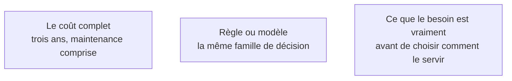

Niveau attendu : **autonomie**. C'est l'arbitrage qu'il faut savoir défendre chiffres en main devant quelqu'un qui a déjà décidé de construire, et l'option de ne pas construire n'a pas d'autre avocat.

La génération de code a tellement baissé le prix du premier jour qu'on construit désormais des choses qu'on aurait achetées, et dont on paiera la maintenance pendant cinq ans. L'arbitrage se fait sur le coût complet, pas sur le coût de fabrication.

## Ce qu'il faut savoir faire

- **Acheter** quand le besoin est standard et non différenciant : facturation, support, paie, prise de rendez-vous. Le coût d'abonnement est visible et déprime ; la maintenance évitée est invisible et bien plus chère.
- **Assembler** — briques gérées et outils d'automatisation — pour ce qui est interne, à faible volume, et dont l'échec n'a pas de conséquence client. Le plafond fonctionnel arrive vite, mais on l'atteint en ayant appris ce que le produit devait faire.
- **Construire** pour trois raisons et pas quatre : la fonction est le cœur de l'offre, les données ne peuvent pas sortir, ou le prix du service croît plus vite que l'usage.
- Appliquer le critère de bascule le plus fiable : ce composant figurera-t-il dans l'argumentaire commercial ? Si oui, il se construit. Sinon il s'achète.
- Refaire le calcul avec le coût chargé des personnes et un taux de maintenance annuel de 15 à 20 % du coût de construction. La moitié des décisions « construire » s'inversent.
- Utiliser la génération pour décider de **ne pas** construire : deux jours de prototype donnent de quoi négocier un abonnement en connaissance de cause, ou de constater que le besoin réel était trois champs de formulaire.

## Les notions mobilisées

- [[notions/roi-des-projets-ia]] — le calcul se fait sur trois ans et inclut le temps de reprise du code généré, qui est la ligne systématiquement oubliée.
- [[notions/arbitrage-deterministe-probabiliste]] — l'erreur typique de ce métier est inversée par rapport au conseil courant : on ne met pas trop d'IA, on met un modèle dans une fonction qui était une règle de quinze lignes, parce que le générateur l'a proposé.
- [[notions/cadrage-besoin]] — l'arbitrage n'est possible que si le besoin est formulé indépendamment de la solution imaginée.

> [!warning] Piège
> « On le fait en interne, ça nous coûtera moins cher. » La comparaison est presque toujours faite entre un abonnement annuel et zéro, parce que le temps de l'équipe n'est pas facturé au projet. C'est l'arbitrage le plus faussé du métier, et le plus facile à redresser : il suffit d'écrire les deux colonnes.
