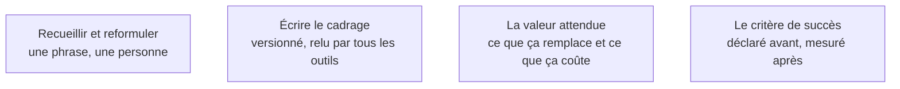

Niveau attendu : **autonomie**. L'énoncé remplace l'architecture qu'on ne dessine plus : personne d'autre ne le rédigera, et sa précision plafonne tout ce qui suit.

L'entrée la plus déterminante de toute la chaîne. Puisqu'on ne dessine plus d'architecture avant de coder, la précision de l'énoncé porte toute la charge : ce qui n'est pas écrit sera inventé, et inventé de façon plausible.

## Ce qu'il faut savoir faire

- Écrire le problème en une phrase, et la personne à qui il arrive en une autre. Si la première contient « et aussi », il y a deux produits et il faut en choisir un.
- Pratiquer la soustraction comme seule discipline de périmètre en v1. Chaque fonction ajoutée allonge le code généré, donc le code à relire, donc le temps de test.
- Écrire explicitement ce qui **ne sera pas** dans la v1. C'est la liste que le générateur ne lira jamais et que soi-même on relira à chaque arbitrage.
- Viser dix fonctions maximum, dont la moitié barrée. Le livrable de cadrage de ce métier n'est pas un cahier des charges, c'est un paragraphe et une liste courte.
- Déclarer le critère de succès avant de construire — un nombre d'utilisateurs qui atteignent la fin du parcours, un délai, un taux de retour. Sans lui, le débat de la v2 se tiendra à l'opinion.
- Ranger le cadrage dans un fichier versionné à la racine du dépôt et le donner en contexte à chaque outil de la chaîne : prototypage, génération, assistant de codage.

## Les notions mobilisées

- [[notions/cadrage-besoin]] — l'angle de ce métier est que le cadrage n'est pas un document mais une contrainte d'entrée pour une machine, donc il doit être court, littéral et sans implicite.
- [[notions/redaction-technique]] — un fichier unique, versionné, modifié à un seul endroit : c'est ce qui empêche chaque outil de travailler sur une version différente du problème.
- [[notions/roi-des-projets-ia]] — la valeur attendue s'écrit au cadrage, parce qu'elle décide de la section suivante : construire, acheter ou assembler.
- [[notions/mesure-d-usage-produit]] — le critère de succès écrit ici est exactement ce qu'on instrumentera avant la première mise en ligne.

> [!warning] Piège
> Considérer qu'un énoncé flou sera précisé par le générateur au premier essai. Il ne le sera pas : la sortie sera cohérente, complète et légèrement à côté, et l'écart ne se verra qu'au premier utilisateur réel. C'est le mode d'échec le moins visible du métier parce qu'il ne produit aucune erreur technique.

## Pour apprendre

- [How to scope your AI product](https://uxdesign.cc/how-to-scope-your-ai-product-5b9885ef3851) — la réduction de périmètre appliquée à un produit dont une partie est incertaine.
- [How to effectively scope your software projects](https://www.freecodecamp.org/news/how-to-effectively-scope-your-software-projects-from-planning-to-execution-e96cbcac54b9/) — la version générale, utile pour la mécanique de découpage.
- [Will AI make us all product builders?](https://www.fundament.design/p/will-ai-make-us-all-product-builders?hide_intro_popup=true) — le déplacement du métier vers le jugement, et ce que cela demande au cadrage.
