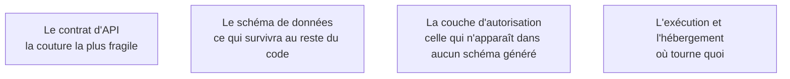

Niveau attendu : **usage**. Il s'agit de localiser une panne dans les quatre briques, pas de concevoir leur découpage : la carte se lit, elle ne se redessine pas.

Front end, back end, base de données, API : quatre briques et les contrats entre elles. Ce n'est pas de la culture générale — c'est ce qui permet de localiser une panne dans du code qu'on n'a pas écrit.

## Ce qu'il faut savoir faire

- Situer une panne dans une couche avant de demander quoi que ce soit à un outil : côté client, côté serveur, base ou réseau. L'onglet réseau du navigateur répond à cette question en dix secondes.
- Lire un contrat d'API et repérer ce qui le rend instable — une route qui change de forme selon les cas, un code d'erreur unique pour dix causes, aucune version dans l'URL alors qu'un tiers la consomme.
- Reconnaître dans un schéma généré ce qui est une table et ce qui aurait dû en être une : un champ texte qui contient une liste, une colonne « statut » qui encode trois concepts.
- Savoir que l'autorisation n'est une brique dans aucun schéma d'anatomie standard, et qu'elle traverse pourtant les quatre. C'est précisément pour cela qu'elle est absente des générations.
- Décrire son application en quatre boîtes et trois flèches, à main levée, sans ouvrir le code. Si on n'y arrive pas, on ne saura pas juger ce qu'un assistant propose d'y changer.

## Les notions mobilisées

- [[notions/conception-d-api]] — ici le besoin est modeste : des routes stables, des codes d'erreur justes, une version dans l'URL dès qu'un tiers consomme. Mais c'est la couture que la génération traite le plus légèrement.
- [[notions/sql]] — savoir lire le schéma généré, comprendre une jointure, repérer la requête qui lit toute la table à chaque affichage de page.
- [[notions/controle-d-acces]] — la brique manquante par construction : elle ne figure pas dans l'énoncé, donc elle ne figure pas dans la sortie.
- [[notions/plateforme-de-deploiement]] — l'anatomie détermine ce qui peut tourner en périphérie et ce qui exige un processus long.

> [!tip] La lecture qui rapporte le plus
> Ouvrir l'onglet réseau et cliquer sur le parcours principal de bout en bout. On obtient en trois minutes la liste réelle des routes, leur ordre, ce qu'elles renvoient et lesquelles sont appelées dix fois pour rien — une information que ni le code ni la documentation générée ne donnent aussi vite.

## Pour apprendre

- [Web Application Architecture: Front-end, Middleware and Back-end](https://dev.to/techelopment/web-application-architecture-front-end-middleware-and-back-end-2ld7) — l'anatomie en quatre briques, avec les responsabilités de chacune.
- [Roadmap API design](https://roadmap.sh/api-design) — la carte du sujet quand le contrat devient un vrai point dur.
- [Roadmap backend](https://roadmap.sh/backend) et [roadmap frontend](https://roadmap.sh/frontend) — les deux versants, à consulter pour situer un terme rencontré, pas à parcourir en entier.
