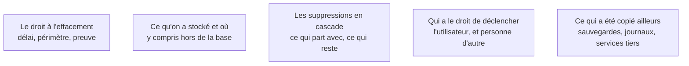

Obligation légale, et fonction que les générateurs n'écrivent jamais spontanément parce que personne ne la demande dans l'énoncé initial. Elle est aussi le meilleur révélateur de ce qu'on sait réellement de son propre schéma.

## Ce qu'il faut savoir faire

- Écrire la liste de tout ce que le produit stocke sur une personne, y compris hors de la base : fichiers déposés, événements d'analyse, journaux, courriels chez un tiers, entrées dans un outil de support.
- Implémenter la suppression de compte comme une fonction du produit, testée, et pas comme une requête manuelle lancée à la demande. La version manuelle ne tient pas au-delà de quelques cas.
- Décider pour chaque table si la donnée est supprimée, anonymisée ou conservée pour une obligation distincte — une facture se conserve, un historique de navigation non.
- Vérifier ce que font les suppressions en cascade du schéma généré. Elles font souvent trop, ou pas assez, et on ne le découvre qu'en les exécutant sur un jeu réaliste.
- Traiter le cas des sauvegardes et des journaux, où la donnée survit à la suppression. La réponse acceptable est une durée de rétention bornée et documentée, pas l'oubli du sujet.
- Restreindre le déclenchement à l'utilisateur lui-même et aux administrateurs identifiés, et journaliser chaque exécution. Une suppression est irréversible : c'est l'opération la plus sensible du produit.

## Les notions mobilisées

- [[notions/rgpd]] — le droit à l'effacement a un délai, un périmètre et une obligation de réponse ; pour ce métier le point dur n'est pas la règle, c'est de savoir où sont les données.
- [[notions/donnees-sensibles]] — la classification faite au cadrage sert exactement ici : elle dit ce qui doit partir et ce qui doit rester.
- [[notions/sql]] — les cascades, les clés étrangères et les contraintes décident de ce qui est supprimable sans casser le reste.
- [[notions/controle-d-acces]] — une route de suppression sans contrôle d'autorisation est la pire des routes mal protégées.
- [[notions/lignage-des-donnees]] — savoir où une donnée a été recopiée est ce qui rend l'effacement complet possible ; sans cette carte, il est partiel et on ne sait pas de combien.

> [!tip] Le test qui révèle tout
> Créer un compte, s'en servir normalement pendant dix minutes, puis le supprimer et chercher ce qui reste — en base, dans les fichiers, dans l'outil d'analyse, dans les journaux. Ce qu'on trouve est la vraie liste de ce que le produit stocke, et elle est toujours plus longue que celle qu'on avait écrite.
