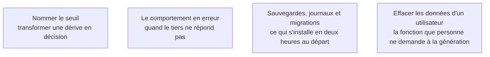

Le scénario le plus fréquent de ce métier : un prototype validé en démonstration reçoit des utilisateurs réels, personne ne prend la décision de le reconstruire, et il devient le produit par absence de décision. Ce qui lui manque est une liste courte et parfaitement connue.

## Les quatre sujets

## Ma progression

- [ ] [[parcours/ai-product-builder/du-prototype-au-produit/nommer-le-seuil|Nommer le seuil]] — la phrase écrite le jour de la mise en ligne
- [ ] [[parcours/ai-product-builder/du-prototype-au-produit/le-comportement-en-erreur|Le comportement en erreur]] — reprises, délais d'attente, message honnête
- [ ] [[parcours/ai-product-builder/du-prototype-au-produit/sauvegardes-journaux-et-migrations|Sauvegardes, journaux et migrations]] — une restauration réellement essayée
- [ ] [[parcours/ai-product-builder/du-prototype-au-produit/effacer-les-donnees-d-un-utilisateur|Effacer les données d'un utilisateur]] — obligation légale, et ce qu'elle oblige à savoir du schéma
