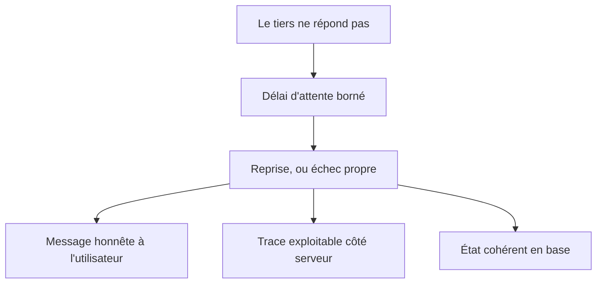

Niveau attendu : **usage**. Reprises, délais d'attente et message honnête sont des motifs connus, à appliquer aux quelques tiers du produit — pas une conception de résilience distribuée.

Que se passe-t-il quand le service de paiement, le fournisseur d'e-mail ou la base ne répondent pas ? Un prototype n'a pas de réponse ; un produit a des reprises, des délais d'attente et un message honnête à l'utilisateur.

## Ce qu'il faut savoir faire

- Lister les dépendances externes du produit et, pour chacune, écrire ce qui se passe si elle ne répond pas. La liste tient sur une page et n'existe jamais spontanément.
- Borner tous les appels sortants par un délai d'attente. Sans lui, une lenteur chez un tiers devient une indisponibilité complète du produit, et c'est le mode de panne le plus fréquent.
- Distinguer ce qui se rejoue de ce qui ne se rejoue pas. Réessayer un envoi d'e-mail est anodin ; réessayer un débit ne l'est pas, et demande une clé d'idempotence.
- Garantir qu'un échec laisse la base dans un état cohérent. Une commande enregistrée sans paiement, ou l'inverse, est plus coûteuse à réparer que l'indisponibilité elle-même.
- Écrire un message d'erreur honnête et actionnable : ce qui s'est passé, ce que l'utilisateur peut faire, et une référence à citer. Les messages génériques transforment chaque incident en ticket.
- Prévoir le mode dégradé des fonctions non essentielles plutôt que leur échec. Une recommandation qui ne s'affiche pas vaut mieux qu'une page qui ne se charge pas.

## Les notions mobilisées

- [[notions/observabilite]] — un échec sans trace est un échec qu'on ne saura pas reproduire, et la panne d'un tiers est précisément celle qui ne se reproduit pas à la demande.
- [[notions/conception-d-api]] — des codes d'erreur justes et distincts sont ce qui permet à l'appelant de décider s'il rejoue ou s'il abandonne.
- [[notions/tests-logiciels]] — le chemin d'erreur se teste en simulant l'indisponibilité du tiers ; sinon il n'est jamais exécuté avant la production.
- [[notions/garde-fous]] — la dégradation contrôlée d'une fonction non essentielle est la même idée, appliquée au produit entier.

> [!tip] L'exercice de trente minutes
> Couper volontairement une dépendance externe en environnement de test et parcourir le produit. On découvre en une demi-heure quelles pages blanchissent, quelles opérations laissent la base à moitié écrite, et quels messages sont incompréhensibles. C'est la façon la plus rapide de construire la liste.
