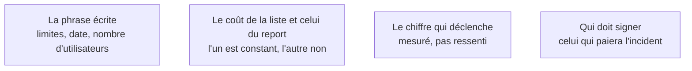

Le prototype n'est pas mauvais : il n'a simplement jamais été conçu pour durer. Un seuil déclaré par écrit transforme une dérive en décision — et il donne l'argument budgétaire au moment où il servira.

## Ce qu'il faut savoir faire

- Écrire la phrase le jour de la première mise en ligne, pas après : « ceci est un prototype en production, avec telles limites, jusqu'à telle date ou tel nombre d'utilisateurs ». Sans seuil écrit, la conversation de renforcement n'a jamais lieu avant l'incident.
- Choisir un seuil **mesurable** avec ce qui est déjà instrumenté : nombre d'utilisateurs actifs, volume de données stockées, date. Un seuil qui demande une mesure qu'on n'a pas est un seuil qui ne se déclenchera pas.
- Chiffrer les deux coûts. Celui de la liste de renforcement est à peu près constant — une à deux semaines pour une application modeste. Celui de son report croît avec le nombre d'utilisateurs et le volume déjà accumulé.
- Faire valider le seuil par celui qui portera l'incident, pas seulement par celui qui a demandé le produit. Ce sont rarement les mêmes.
- Accepter comme légitime la décision de ne pas renforcer, tant qu'elle est consciente, écrite et datée. Ce qui n'est pas acceptable, c'est qu'elle n'ait jamais été prise.
- Relire le seuil à chaque jalon produit. Un seuil écrit une fois et jamais regardé est décoratif.

## Les notions mobilisées

- [[notions/redaction-technique]] — une note de décision courte, datée, versionnée dans le dépôt : c'est le format, et il tient en quinze lignes.
- [[notions/roi-des-projets-ia]] — le coût du report est la ligne que le calcul initial n'a jamais contenue, et c'est celle qui décide.
- [[notions/mesure-d-usage-produit]] — le seuil se surveille avec les mêmes événements que ceux qui arbitrent les priorités.
- [[notions/gestion-parties-prenantes]] — nommer le seuil est d'abord un acte de négociation : il déplace la charge de la preuve au bon moment.

> [!warning] Piège
> Réécrire entièrement au lieu de renforcer. Quand la liste est enfin regardée, la réaction courante est « ce code est mauvais, reprenons de zéro » — alors que le code fonctionne et que ce qui manque est identifié, borné et additif. La réécriture complète reproduit les mêmes absences avec six mois de retard et sans les utilisateurs.
