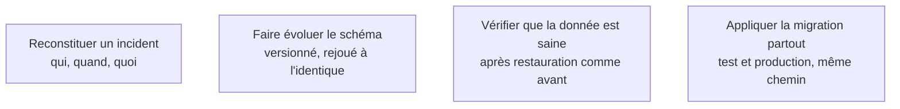

Niveau attendu : **usage**. Les trois mécanismes s'installent depuis la documentation de la plateforme en quelques heures ; la restauration se répète, elle ne s'invente pas.

Trois mécanismes qui s'installent en quelques heures au démarrage et qui deviennent très coûteux à rétablir plus tard. Aucun n'est écrit spontanément par un générateur, parce qu'aucun ne figure dans l'énoncé initial.

## Ce qu'il faut savoir faire

- Mettre en place une sauvegarde automatique et **essayer une restauration au moins une fois**. Une sauvegarde jamais restaurée est une hypothèse, pas une garantie — et c'est l'étape que tout le monde saute.
- Mesurer ce que coûte une restauration : combien de temps, combien de données perdues au pire. Ces deux chiffres se déclarent, ils ne se découvrent pas pendant l'incident.
- Journaliser de quoi reconstituer ce qui s'est passé pour un utilisateur donné à une heure donnée. Sans cela, le premier incident sérieux se termine en « on ne sait pas ».
- Journaliser sans écrire de données personnelles dans les traces. C'est l'erreur qui transforme un outil de diagnostic en fichier à déclarer et à purger.
- Installer un mécanisme de migration versionné, appliqué de la même façon en test et en production. Le schéma va changer, et une modification appliquée à la main en production est une divergence permanente.
- Rendre chaque migration réversible, ou au moins savoir laquelle ne l'est pas. La suppression de colonne est l'opération qui coûte le plus cher à découvrir irréversible.

## Les notions mobilisées

- [[notions/observabilite]] — traces, journaux et métriques ; pour ce métier, l'objectif minimal est de pouvoir raconter la séance d'un utilisateur précis.
- [[notions/sql]] — une migration est une modification de schéma, et savoir lire ce qu'elle fait est ce qui distingue une évolution d'une perte de données.
- [[notions/qualite-des-donnees]] — une restauration réussie techniquement peut rendre un jeu incohérent ; la vérification porte sur les données, pas sur le processus.
- [[notions/integration-continue]] — les migrations s'appliquent par la même chaîne que le code, sinon les deux divergent.

> [!warning] Piège
> Compter sur la sauvegarde automatique de l'hébergeur sans en connaître la portée. Elle couvre souvent la base et pas les fichiers déposés par les utilisateurs, avec une rétention de quelques jours et aucune procédure de restauration partielle. Lire ce qu'elle couvre exactement fait partie du choix d'hébergement.
