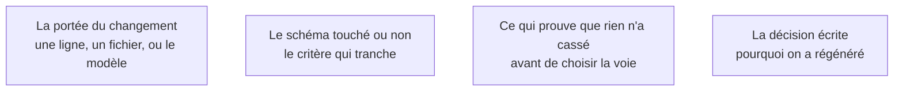

Niveau attendu : **autonomie**. La question se tranche à chaud, base de code sous les yeux, et le mauvais choix laisse une base à deux logiques dont on ne ressort pas.

La question préalable vaut plus que le choix d'outil. Rapiécer manuellement une modification qui touche le modèle de données produit une base où la moitié suit la logique du générateur et l'autre celle du correcteur — état dont on ne ressort plus.

## Ce qu'il faut savoir faire

- Poser la question avant d'ouvrir un outil : ce changement est-il **localisé** — un libellé, une validation, un calcul — ou **structurel** — une entité nouvelle, une relation qui change, un droit d'accès qui se déplace ?
- Appliquer la règle : correction locale dans le code, changement d'architecture par régénération avec un énoncé corrigé.
- Prendre le schéma de données comme critère de tranchage. Si la modification y touche, elle est structurelle, quelle que soit la taille du diff qu'un assistant propose.
- Reconnaître le symptôme de la mauvaise voie : une correction en casse une autre, deux fois de suite. À ce moment-là, arrêter et relire au lieu de demander une correction de plus.
- Régénérer sans perdre ce qui a été gagné : les tests écrits à la main, les décisions journalisées et le cadrage corrigé survivent à une régénération. Le reste est rejetable.
- Écrire pourquoi on a régénéré. C'est une décision d'architecture, et la seule trace qu'elle laissera.

## Les notions mobilisées

- [[notions/assistants-de-codage]] — l'usage dominant de ce métier n'est pas d'écrire du code neuf mais de comprendre et modifier du code qu'on n'a pas écrit, ce qui inverse les critères de choix d'outil.
- [[notions/sql]] — le schéma est le critère opérationnel : s'il bouge, on est dans le structurel.
- [[notions/tests-logiciels]] — sans jeu de tests, on ne peut ni corriger localement en confiance, ni vérifier qu'une régénération n'a rien perdu.
- [[notions/redaction-technique]] — un fichier court par décision structurante, ce qu'on a choisi et ce qu'on a écarté.

> [!warning] Piège
> Enchaîner les demandes de correction sans jamais lire le diff. Au bout de dix tours on obtient une application qui passe la démonstration et dont plus personne, humain ou machine, ne peut dire pourquoi elle fonctionne.
