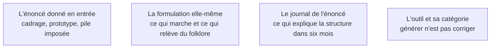

Niveau attendu : **référence**. C'est le geste propre au métier : le schéma produit en huit secondes survivra au code qui l'entoure, et aucun autre rôle dans l'équipe ne sait dire ce qu'il fallait mettre dans l'énoncé.

La génération transforme un énoncé en base de code fonctionnelle. C'est le moment où se fixent les choix les plus durables : le schéma de base de données produit en huit secondes structurera le produit bien après que le code qui l'entoure aura été réécrit.

## Ce qu'il faut savoir faire

- Donner les trois entrées ensemble : le cadrage, ce que le prototype a tranché, et la pile imposée. Une seule sur trois produit une application cohérente sur le mauvais problème.
- Reconnaître ce qui plafonne la qualité de sortie : la clarté de l'énoncé compte, mais **la banalité du problème compte davantage**. Une application de gestion standard sort correcte ; une mécanique métier singulière sort plausible et fausse.
- Commiter la sortie brute de la génération dans un premier commit isolé, avant toute retouche. Cela pose une ligne de démarcation nette entre « ce que la machine a produit » et « ce que nous avons décidé » — exactement la frontière qu'on cherche en revue de sécurité ou en reprise de projet.
- Journaliser l'énoncé qui a produit la base de code, dans le dépôt. Sans lui, personne ne saura dans six mois pourquoi l'application est structurée ainsi.
- Appliquer la règle de décision tout de suite : si plus d'un tiers de ce qui est généré est à réécrire, régénérer avec un énoncé corrigé au lieu de rafistoler. Les corrections successives sur une base mal orientée coûtent plus cher qu'une seconde génération.
- Générer en une passe le socle complet — front, dorsale, schéma, couche d'API — plutôt que brique par brique. Les incohérences de contrat entre briques générées séparément sont le défaut le plus pénible à rattraper.

## Les notions mobilisées

- [[notions/cadrage-besoin]] — l'énoncé de génération est le cadrage rendu littéral ; tout implicite qu'il contient sera comblé par une hypothèse plausible.
- [[notions/ingenierie-de-prompt]] — ici le levier utile n'est pas la formule magique mais le contexte fourni : fichiers de référence, contraintes explicites, exemples de ce qu'on ne veut pas.
- [[notions/redaction-technique]] — l'énoncé versionné à côté du code est la seule documentation d'intention qu'aura ce produit.
- [[notions/assistants-de-codage]] — l'outil qui génère un socle et celui qui corrige une ligne ne se pilotent pas de la même façon, même quand c'est le même produit.

> [!tip] Le commit qui coûte zéro
> Un commit `génération brute` avant la première retouche, et l'énoncé dans le message ou dans un fichier à côté. Cela rend lisible pour toujours ce qui a été décidé par un humain, et c'est gratuit. Presque personne ne le fait, et tout le monde le regrette à la première reprise par quelqu'un d'autre.

> [!warning] Piège
> Accepter les tests générés comme preuve que le code fonctionne. Ils sont écrits à partir du même énoncé et par le même modèle : ils vérifient que le code fait ce que le code fait. Un test qui n'a jamais échoué n'a jamais rien prouvé — en casser un volontairement pour vérifier qu'il le détecte.
