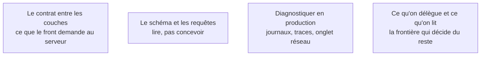

Niveau attendu : **usage**. On lit pour localiser la panne, on n'écrit pas : viser le niveau d'un développeur front sur React serait payer très cher une compétence que l'outil couvre.

HTML, CSS et JavaScript pour lire le front end ; React parce que c'est ce que les générateurs produisent par défaut ; Node.js parce que c'est ce qu'ils produisent côté serveur. Le niveau visé n'est pas d'écrire : c'est de relire, et de savoir dans quelle couche est la panne.

## Ce qu'il faut savoir faire

- Lire un composant React et dire ce qu'il affiche, d'où viennent ses données et ce qui le fait se redessiner. Pas l'écrire de mémoire — le lire.
- Lire un gestionnaire de route Node.js et dire ce qu'il reçoit, ce qu'il interroge et ce qu'il renvoie, y compris en cas d'erreur.
- Ouvrir l'**inspecteur** pour comprendre pourquoi un élément ne s'affiche pas où on l'attend, la **console** pour voir l'erreur que l'interface masque, l'**onglet réseau** pour savoir si la panne est côté client ou côté serveur. C'est le premier réflexe de diagnostic, avant de demander quoi que ce soit à un assistant.
- Lire une requête SQL générée et repérer celle qui lit toute la table à chaque affichage de page — le défaut de performance le plus fréquent et le plus facile à voir.
- Suivre un appel de bout en bout : clic, requête, route, requête SQL, réponse, rendu. Une fois, à la main, sur le parcours principal. C'est l'exercice qui rend le reste du parcours praticable.
- Assumer la frontière : ce qu'on ne saurait pas relire, on ne devrait pas le déléguer à une machine sans vérification externe.

## Les notions mobilisées

- [[notions/conception-d-api]] — le contrat entre couches est le premier endroit où une application générée se contredit elle-même.
- [[notions/sql]] — le besoin est modeste mais non nul : lire le schéma, comprendre une jointure, repérer la requête coûteuse.
- [[notions/observabilite]] — savoir lire un journal et une trace est la version production du même réflexe que l'onglet réseau.
- [[notions/assistants-de-codage]] — le socle sert précisément à juger ce qu'un assistant propose ; c'est sa seule justification ici.

## Pour apprendre

- [What are browser developer tools?](https://developer.mozilla.org/en-US/docs/Learn_web_development/Howto/Tools_and_setup/What_are_browser_developer_tools) — le premier outil de diagnostic, et le document le plus rentable de toute cette liste.
- [React Docs](https://react.dev/reference/react) et la [roadmap React](https://roadmap.sh/react) — ce que les générateurs produisent par défaut côté interface.
- [Introduction to Node.js](https://nodejs.org/en/learn/getting-started/introduction-to-nodejs) et la [roadmap Node.js](https://roadmap.sh/nodejs) — le versant serveur, même usage.
- [Roadmap frontend](https://roadmap.sh/frontend) — à consulter pour situer un terme rencontré en relecture, pas à parcourir en entier.
