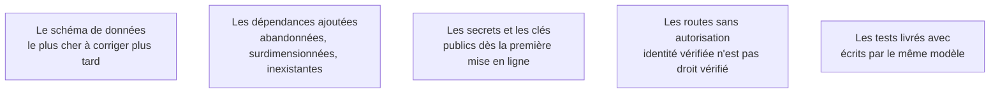

Niveau attendu : **référence**. Un développeur relit du code écrit par quelqu'un ; relire du code sans auteur, dans l'ordre schéma-dépendances-secrets, est une discipline que ce métier est seul à porter.

Une revue de génération suit un ordre fixe, et il n'est pas celui dans lequel le code s'affiche. Le schéma de données d'abord, les dépendances ensuite, les secrets juste après. L'interface vient en dernier parce qu'elle est la moins chère à corriger.

## Ce qu'il faut savoir faire

- Lire le schéma de données en premier, avant toute ligne d'interface : clés, unicité, suppressions en cascade, dates avec fuseau, champs qui auraient dû être des tables. C'est la partie la plus chère à corriger plus tard et la plus facile à corriger maintenant.
- Vérifier les dépendances ajoutées une par une. Les générateurs importent volontiers des bibliothèques abandonnées ou surdimensionnées, et parfois des noms qui n'existent pas sur le registre.
- Chercher les secrets là où ils ne devraient pas être. Une clé d'API dans le code du front end est l'accident le plus fréquent d'une application générée, et elle est publique dès la première mise en ligne.
- Parcourir la liste des routes et, pour chacune qui renvoie des données d'utilisateur, vérifier à la main qu'elle contrôle l'**autorisation** et pas seulement l'authentification.
- Lire les tests livrés en se demandant lesquels pourraient échouer. Ceux qui ne le pourraient jamais sont du décor.
- Décider explicitement : je garde, je corrige, je régénère. Sortir de la revue sans cette phrase, c'est entrer dans la boucle de rafistolage.

## Les notions mobilisées

- [[notions/sql]] — savoir lire un schéma généré et repérer ce qui va coincer : la table sans contrainte d'unicité, la relation encodée dans un champ texte, la requête qui balaie tout à chaque affichage.
- [[notions/chaine-d-approvisionnement-logicielle]] — une dépendance inventée par un modèle est aussi une cible : un nom plausible et libre sur le registre public est un vecteur connu.
- [[notions/donnees-sensibles]] — le front end est public par construction, et tout ce qu'on y place l'est aussi, y compris ce qui sert à parler à un service tiers.
- [[notions/controle-d-acces]] — la vérification manquante ne produit aucune erreur : l'application fonctionne parfaitement et laisse chaque utilisateur connecté lire les données des autres.
- [[notions/tests-logiciels]] — un test généré à partir du même énoncé que le code ne constitue pas une vérification indépendante.

> [!warning] Piège
> Relire dans l'ordre d'affichage du générateur, qui commence par l'interface parce qu'elle est démonstrative. On passe trois heures sur des composants qui seront réécrits et zéro minute sur le schéma qui ne le sera pas.
