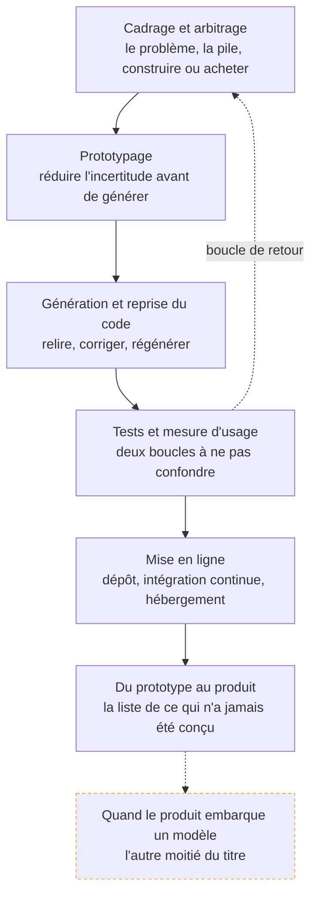

Livrer un produit logiciel en s'appuyant sur des outils de génération de code : cadrer, prototyper, générer, reprendre ce qui a été généré, tester avec de vrais utilisateurs, mettre en ligne. Le mot « AI » du titre désigne l'atelier, pas nécessairement le produit. Deux pré-requis non déclarés en amont mais réels : savoir lire du code qu'on n'a pas écrit, et savoir ce qu'est une requête HTTP.

## La roadmap

Chaque case mène à sa page. Cochez les étapes acquises en bas de page pour suivre votre progression.

## Ma progression

- [ ] [[parcours/ai-product-builder/cadrage-et-arbitrage/index|Cadrage et arbitrage]] — définir le problème, poser la pile, décider de construire ou pas
- [ ] [[parcours/ai-product-builder/prototypage/index|Prototypage]] — choisir l'outil, prototyper la bonne fonction, valider avec des gens
- [ ] [[parcours/ai-product-builder/generation-et-reprise/index|Génération et reprise du code]] — conduire une génération, la relire, la corriger sans la dénaturer
- [ ] [[parcours/ai-product-builder/tests-et-mesure-d-usage/index|Tests et mesure d'usage]] — la boucle technique et la boucle produit, et ce qu'on instrumente
- [ ] [[parcours/ai-product-builder/mise-en-ligne/index|Mise en ligne]] — dépôt, intégration continue, hébergement, base de données, droits d'accès
- [ ] [[parcours/ai-product-builder/du-prototype-au-produit/index|Du prototype au produit]] — ce qu'un prototype n'a jamais eu, et ce que coûte son report
- [ ] [[parcours/ai-product-builder/quand-le-produit-embarque-un-modele/index|Quand le produit embarque un modèle]] — la frontière avec l'AI Engineer, et ce qu'elle impose
