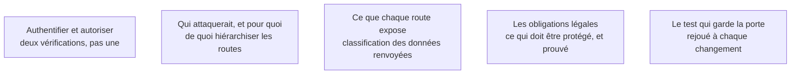

Niveau attendu : **autonomie**. C'est l'endroit où une application générée est fausse sans lever la moindre erreur : il faut savoir le vérifier soi-même, route par route, sans attendre qu'un audit le signale.

Le point où une application générée est le plus souvent fausse. Une route qui vérifie l'identité mais pas l'autorisation laisse n'importe quel utilisateur connecté lire les données des autres — et elle ne produit aucune erreur.

## Ce qu'il faut savoir faire

- Distinguer les deux questions et les vérifier séparément : **qui es-tu** — l'authentification — et **as-tu le droit d'accéder à cet objet précis** — l'autorisation. La seconde est presque toujours celle qui manque.
- Parcourir à la main chaque route qui renvoie des données d'utilisateur et vérifier qu'elle filtre sur l'identité de l'appelant, pas seulement sur sa présence. Le test concret : se connecter avec un compte A et demander l'objet d'un compte B.
- Écrire un test automatisé par famille de route qui reproduit cette tentative. C'est la seule protection contre la réintroduction de la faille par une génération ultérieure.
- Déléguer l'authentification à une dorsale gérée plutôt que la coder. C'est de loin le meilleur rapport valeur sur risque du parcours, et le code d'authentification maison généré est rarement correct.
- Vérifier ce qui arrive dans le front end : une clé d'API, un identifiant de service, un jeton à durée illimitée dans le code client est public dès la première mise en ligne.
- Hiérarchiser l'effort par ce qu'un accès indu permettrait réellement — lire, modifier, se faire passer pour quelqu'un, déclencher un paiement. Toutes les routes ne se valent pas.

## Les notions mobilisées

- [[notions/controle-d-acces]] — authentification, autorisation, moindre privilège ; pour ce métier, l'angle est que l'absence de la seconde ne se voit ni à l'exécution ni en relecture rapide.
- [[notions/modelisation-de-la-menace]] — une liste sommaire d'adversaires et de gains suffit à ordonner les routes à vérifier en premier.
- [[notions/donnees-sensibles]] — ce que la route renvoie décide de la gravité, pas la sophistication de l'attaque.
- [[notions/rgpd]] — un accès indu à des données personnelles est une violation à notifier, avec des délais qui ne se négocient pas.
- [[notions/tests-logiciels]] — un contrôle d'accès non testé est un contrôle d'accès qui disparaîtra à la prochaine régénération.

> [!warning] Piège
> Considérer que l'interface protège. Si un bouton n'est pas affiché mais que la route existe, la route est accessible. Une application générée expose presque toujours plus de routes que d'écrans, et c'est la liste des routes qu'il faut relire, pas celle des écrans.
