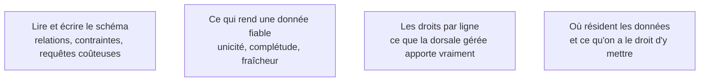

Le choix se fait sur la forme des données, pas sur la mode. En cas d'hésitation, relationnel : on migre plus facilement vers le souple que l'inverse.

## Ce qu'il faut savoir faire

- Choisir le **relationnel** quand la structure est stable et que les relations comptent — PostgreSQL par défaut, MySQL si l'hébergement l'impose. C'est le cas de la très grande majorité des produits.
- Choisir le **document** quand les objets sont hétérogènes et que le schéma bouge à chaque itération. C'est un choix qui se paie plus tard en cohérence, et qu'il faut assumer sciemment.
- Connaître la **dorsale gérée** : base relationnelle, authentification, droits d'accès par ligne, API générée et temps réel dans un seul service. C'est la catégorie qui change le plus la vitesse d'un product builder — ce qu'on achète, c'est de ne pas écrire l'authentification soi-même.
- Poser les contraintes que le générateur a omises : unicité, clés étrangères, non-nullité, comportement en cascade. Elles empêchent des classes entières de données incohérentes que personne ne détectera avant six mois.
- Mettre en place les migrations dès le premier jour. Le schéma va changer, et un mécanisme versionné appliqué de la même façon en test et en production s'installe en deux heures au démarrage.
- Vérifier la résidence des données avant de s'engager, surtout sur une dorsale gérée : c'est le choix le plus rapide à faire et le plus coûteux à défaire.

## Les notions mobilisées

- [[notions/sql]] — lire le schéma généré, comprendre une jointure, repérer la requête qui lit toute la table à chaque affichage de page.
- [[notions/qualite-des-donnees]] — les contraintes de schéma sont la forme la moins chère de contrôle qualité, et la seule qui s'applique sans travail récurrent.
- [[notions/controle-d-acces]] — les droits par ligne d'une dorsale gérée sont puissants et silencieux : mal réglés, ils ouvrent tout sans produire d'erreur.
- [[notions/donnees-sensibles]] — le choix de base décide de ce qui peut y être stocké, et de ce qui doit être chiffré ou externalisé.

## Pour apprendre

- [PostgreSQL — documentation](https://www.postgresql.org/docs/) et la [roadmap DBA](https://roadmap.sh/postgresql-dba) — le choix par défaut, et la carte du sujet quand il faut aller plus loin.
- [MySQL — documentation](https://dev.mysql.com/doc/) — l'alternative relationnelle qu'on rencontre surtout par contrainte d'hébergement.
- [MongoDB](https://www.mongodb.com/) et sa [roadmap](https://roadmap.sh/mongodb) — la voie document, à lire avant de la choisir plutôt qu'après.
- [Supabase — documentation](https://supabase.com/docs) — la dorsale gérée la plus rapide à mettre debout ; lire en priorité la partie sur les droits d'accès par ligne.
