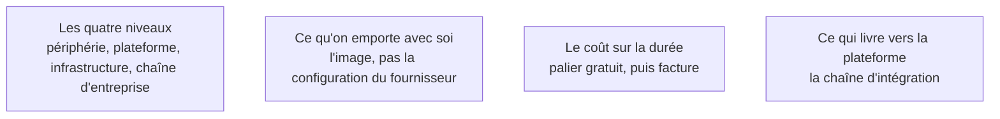

La grille utile n'est pas la marque mais le **niveau de prise en charge** qu'on achète : plus la plateforme en fait, moins on configure et moins on contrôle. Le bon choix est le niveau le plus élevé qui satisfait la contrainte la plus dure du cadrage.

## Ce qu'il faut savoir faire

- Situer le besoin sur les quatre niveaux. **Périphérie et fonctions** : code déployé sur un réseau mondial, facturé à l'invocation, sans serveur à maintenir — adapté au front end et aux traitements courts et sans état, avec une durée d'exécution bornée et pas de processus long.
- **Plateforme applicative** : on pousse un dépôt, la plateforme construit, héberge, gère les certificats et la mise à l'échelle. C'est la case par défaut d'un produit qui démarre, et sa limite est que le coût cesse d'être compétitif à volume soutenu.
- **Infrastructure brute** : contrôle total, tout est possible, tout est à faire. N'y aller pour un premier produit que sous contrainte imposée — l'écart de délai de mise en ligne se compte en semaines et l'écart de facture en surprises.
- **Chaîne d'entreprise** : on ne la choisit pas, on la subit parce que l'organisation l'impose. Ce n'est pas une critique, c'est une contrainte à inscrire au cadrage.
- Regarder le plafond du palier gratuit avant de choisir, pas la vitrine. Les plateformes applicatives sont généreuses jusqu'à un seuil précis — bande passante, minutes de construction, heures de base de données — et la facture qui suit est brutale et sans préavis.
- Poser une alerte de dépense le jour de la mise en ligne, sur le seuil noté au cadrage. C'est cinq minutes, et c'est la seule protection contre la facture découverte en fin de mois.

## Les notions mobilisées

- [[notions/plateforme-de-deploiement]] — les quatre niveaux et ce qu'on achète à chacun ; pour ce métier, monter d'un niveau se paie toujours en délai avant de se payer en facture.
- [[notions/conteneurisation]] — ce qui rend une migration entre niveaux envisageable plus tard : sans image reproductible, changer d'hébergeur est une réécriture.
- [[notions/roi-des-projets-ia]] — le coût d'hébergement sur trois ans fait partie du même calcul que le coût de construction, et il est le plus facile à projeter.
- [[notions/integration-continue]] — le niveau de prise en charge décide de ce que la chaîne doit faire elle-même.

## Pour apprendre

- [Vercel](https://vercel.com/docs), [Railway](https://docs.railway.com/quick-start), [Render](https://render.com/docs) et [DigitalOcean](https://www.digitalocean.com/community/tutorials) — la catégorie plateforme applicative, à comparer sur le palier gratuit et la prévisualisation par branche.
- [Cloudflare Pages](https://developers.cloudflare.com/pages/get-started/) et sa [roadmap](https://roadmap.sh/cloudflare) — le niveau périphérie et ses limites d'exécution.
- [AWS Cloud Essentials](https://aws.amazon.com/getting-started/cloud-essentials/), [Azure](https://azure.microsoft.com/en-us/) et [Google Cloud](https://cloud.google.com) — l'infrastructure brute, à lire pour savoir ce qu'on évite.
- [Azure DevOps](https://azure.microsoft.com/en-us/products/devops) — la chaîne d'entreprise, utile quand elle est imposée.
