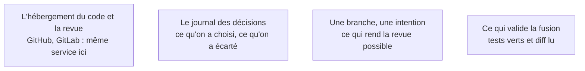

Niveau attendu : **autonomie**. Quand une machine écrit une part du code, l'historique devient la seule mémoire des décisions : il faut le tenir sans y être contraint par une équipe, parce qu'il n'y en a pas.

Le versionnement est la première chose à mettre en place après une génération. Quand une part du code est produite par une machine, l'historique devient le seul endroit où l'on peut répondre à « qui a décidé ça, et pourquoi ».

## Ce qu'il faut savoir faire

- Mettre le dépôt en place avant la première retouche, avec la sortie brute de la génération en premier commit. C'est ce qui rend lisible, plus tard, la frontière entre ce que la machine a produit et ce que l'équipe a décidé.
- Choisir la plateforme que l'organisation utilise déjà. GitHub et GitLab rendent le même service pour ce métier — hébergement, revue, chaîne d'intégration — et le temps passé à comparer est du temps perdu.
- Imposer **une branche, une intention**. Quand un assistant modifie quinze fichiers pour deux raisons différentes, la revue devient impossible et personne ne la fait sérieusement. Le demander explicitement à l'outil.
- Verrouiller la branche principale, même seul sur le projet. C'est la barrière qui empêche un agent en boucle de livrer directement en production, et elle coûte deux minutes de configuration.
- Ne jamais fusionner sans relecture humaine du diff, quel que soit l'état des tests. Les tests disent que ça marche ; ils ne disent pas que c'est ce qu'on voulait.
- Journaliser les décisions structurantes dans le dépôt — un fichier court par décision, ce qu'on a choisi et ce qu'on a écarté. Sur un code dont personne ne se souvient de l'écriture, c'est ce qui remplace la mémoire de l'auteur.

## Les notions mobilisées

- [[notions/integration-continue]] — l'hébergement du code et la chaîne qui s'y greffe forment un seul choix, et il se fait sur l'existant de l'organisation.
- [[notions/redaction-technique]] — le journal de décisions est le seul artefact qui survit au départ de celui qui a lancé les générations.
- [[notions/assistants-de-codage]] — un agent produit volontiers un changement large et multi-intentions ; c'est à l'humain de poser la contrainte de découpage.
- [[notions/tests-logiciels]] — la condition de fusion minimale, qui ne dispense jamais de la lecture du diff.

> [!tip] L'ordre qui fait gagner du temps
> Faire relire les demandes de fusion générées par un second outil **avant** la relecture humaine. Il attrape les oublis mécaniques — secret en clair, route sans contrôle d'accès, dépendance inutile — et laisse à l'humain le jugement d'architecture, le seul qu'il soit irremplaçable à porter.

## Pour apprendre

- [GitHub — prise en main](https://docs.github.com/en/get-started/quickstart) et [GitLab — documentation](https://docs.gitlab.com/) — les deux plateformes, à lire côté revue et protection de branche plus que côté commandes.
- [Roadmap git-github](https://roadmap.sh/git-github) — la carte du sujet quand le travail à plusieurs commence réellement.
