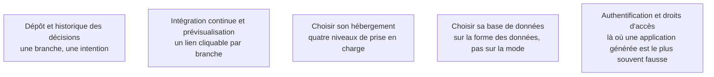

Quand une part du code est produite par une machine, le dépôt n'est plus une sauvegarde : c'est le seul endroit où l'on peut répondre à « qui a décidé ça, et pourquoi ». Le reste de cet étage met le produit en face de vrais utilisateurs.

## Les cinq sujets

## Ma progression

- [ ] [[parcours/ai-product-builder/mise-en-ligne/depot-et-historique-des-decisions|Dépôt et historique des décisions]] — ce qui remplace la mémoire de l'auteur
- [ ] [[parcours/ai-product-builder/mise-en-ligne/integration-continue-et-previsualisation|Intégration continue et prévisualisation]] — le retour d'exécution rendu systématique
- [ ] [[parcours/ai-product-builder/mise-en-ligne/choisir-son-hebergement|Choisir son hébergement]] — périphérie, plateforme applicative, infrastructure brute, chaîne d'entreprise
- [ ] [[parcours/ai-product-builder/mise-en-ligne/choisir-sa-base-de-donnees|Choisir sa base de données]] — relationnel, document, dorsale gérée
- [ ] [[parcours/ai-product-builder/mise-en-ligne/authentification-et-droits-d-acces|Authentification et droits d'accès]] — identité vérifiée ne veut pas dire autorisation vérifiée
