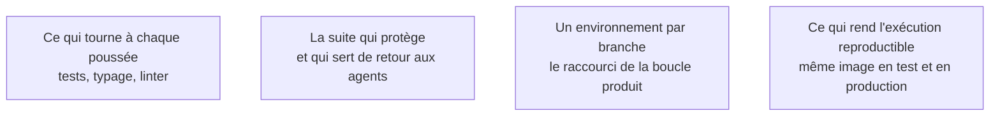

Niveau attendu : **usage**. Les plateformes livrent la prévisualisation par branche en quelques clics ; concevoir une chaîne de livraison est un autre métier, et le besoin n'apparaît pas à cette échelle.

L'intégration continue sert ici moins la qualité que la **vitesse de retour** : un environnement de prévisualisation par branche transforme chaque idée en lien cliquable à envoyer à trois utilisateurs.

## Ce qu'il faut savoir faire

- Faire tourner à chaque poussée, au minimum : les tests, le typage, le linter. C'est exactement le retour d'exécution dont dépend la qualité des assistants — l'intégration continue le rend systématique au lieu de dépendre de la mémoire de chacun.
- Activer les environnements de prévisualisation par branche. C'est la fonction la plus sous-estimée des plateformes modernes, et elle raccourcit la boucle produit bien plus que n'importe quelle amélioration d'outil.
- Bloquer la fusion sur l'échec de la chaîne. Une chaîne rouge qu'on peut contourner cesse d'être lue en une semaine.
- Garder la chaîne rapide. Au-delà de quelques minutes, les gens poussent sans attendre le résultat et le garde-corps devient décoratif.
- Déployer automatiquement depuis la branche principale dès le premier jour, même vers un hébergement modeste. Le premier déploiement automatisé coûte une demi-journée au démarrage et une semaine six mois plus tard.
- S'assurer que ce qui est testé et ce qui est déployé sont la même chose. Une construction reproductible évite la classe entière des pannes « ça marchait en local ».

## Les notions mobilisées

- [[notions/integration-continue]] — pour ce métier, la chaîne vaut d'abord par la vitesse de retour qu'elle offre, pas par la discipline qu'elle impose.
- [[notions/tests-logiciels]] — la chaîne ne vaut que ce que vaut la suite qu'elle exécute ; une chaîne verte sur des tests vides ne protège de rien.
- [[notions/plateforme-de-deploiement]] — la prévisualisation par branche est une capacité de plateforme, et un critère de choix à part entière.
- [[notions/conteneurisation]] — le moyen le plus simple de garantir que l'environnement de test et celui de production sont identiques.

> [!warning] Piège
> Livrer en production depuis le poste local, « le temps de démarrer ». Cette habitude ne se défait plus une fois prise, et elle supprime la seule trace qui permettra de savoir ce qui tourne réellement.
