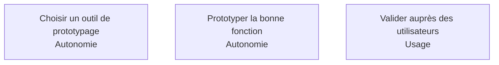

Le prototype n'est pas une étape de design, c'est un instrument de réduction d'incertitude : il rend une incompréhension visible pendant qu'elle coûte encore une demi-journée.

## Les trois sujets, et le niveau attendu d'un confirmé

## Ma progression

- [ ] [[parcours/ai-product-builder/prototypage/choisir-un-outil-de-prototypage|Choisir un outil de prototypage]] — trois catégories, et le critère jetable ou non
- [ ] [[parcours/ai-product-builder/prototypage/prototyper-la-bonne-fonction|Prototyper la bonne fonction]] — ce qu'un prototype doit trancher, et ce qu'il ne doit pas contenir
- [ ] [[parcours/ai-product-builder/prototypage/valider-aupres-des-utilisateurs|Valider auprès des utilisateurs]] — cinq personnes, quinze minutes, et le silence de l'observateur
