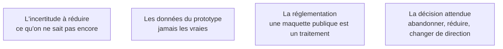

Les générateurs produisent une page d'accueil convaincante en trente secondes, et c'est précisément la partie qui ne portait aucun risque. Un prototype qui n'a pas produit de décision n'a servi à rien, quelle que soit sa beauté.

## Ce qu'il faut savoir faire

- Identifier la fonction la plus incertaine du cadrage et prototyper celle-là. Le week-end perdu se reconnaît à ceci : la maquette est superbe et on ne sait toujours pas si le cœur du produit fonctionne.
- Formuler avant de commencer la décision que le prototype doit permettre de prendre. Si aucune décision n'est en jeu, le prototype n'est pas nécessaire.
- Accepter l'issue « on n'en a pas besoin ». C'est le résultat le plus rentable du prototypage et le moins recherché.
- Ne jamais connecter de données réelles à un prototype. C'est la source la plus banale d'incident sur données personnelles : une maquette hébergée publiquement, sans authentification, avec un export de la base client dedans.
- Fabriquer un jeu de données fictives crédible dès le premier prototype — assez réaliste pour que les utilisateurs se projettent, entièrement inventé.
- Fixer une date de fin au prototype au moment où on le commence. Sans elle, il se raffine indéfiniment et devient le produit sans que personne l'ait décidé.

## Les notions mobilisées

- [[notions/cadrage-besoin]] — le prototype est l'outil qui répond aux questions que le cadrage n'a pas pu trancher sur le papier ; il ne remplace pas le cadrage.
- [[notions/donnees-sensibles]] — un prototype n'a par construction ni cloisonnement ni journalisation : tout ce qu'on y met est exposé.
- [[notions/rgpd]] — une maquette en ligne qui manipule des données réelles est un traitement au sens du règlement, même si elle est « temporaire ».
- [[notions/roi-des-projets-ia]] — deux jours de prototype qui évitent six mois de construction sont le meilleur rendement du parcours.

> [!tip] Le bon ordre
> Prototyper d'abord ce qu'on ne sait pas dessiner. Si une fonction se décrit clairement en trois phrases et que personne n'en doute, elle n'a pas besoin de prototype — elle a besoin d'être générée. Le prototypage est un budget d'incertitude, il se dépense là où l'incertitude est.

> [!warning] Piège
> Montrer le prototype à la direction sans dire que c'est un prototype. Le réalisme qui en fait un bon outil de validation en fait un très mauvais outil de communication : ce qui répond en démonstration est considéré comme livré, et le délai restant est vu comme de la finition. Annoncer la nature du livrable avant de partager le lien, par écrit.
