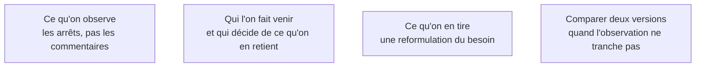

On ne cherche pas des avis, on cherche les moments d'hésitation. Cinq personnes, quinze minutes, une tâche précise à accomplir sans aide — et on se tait pendant qu'elles la font.

## Ce qu'il faut savoir faire

- Donner une tâche à accomplir, pas une interface à commenter. « Réservez une salle pour jeudi » produit une information ; « qu'est-ce que vous en pensez ? » produit de la politesse.
- Se taire. Toute aide donnée pendant la session détruit la donnée qu'on était venu chercher, et l'envie d'aider est très forte.
- Regarder **où les gens s'arrêtent**, pas ce qu'ils déclarent aimer. Une hésitation de quatre secondes sur un libellé vaut dix minutes d'entretien.
- Se contenter de cinq personnes. Une session de quinze minutes avec cinq personnes suffit à sortir les trois malentendus structurants ; la sixième confirme surtout les cinq premières.
- Rapporter les malentendus dans le fichier de cadrage, pas dans un compte rendu séparé. Le cadrage est ce que relisent les outils ; un compte rendu ne sera relu par personne.
- Distinguer ce qui relève du malentendu — corrigible par un mot, un ordre d'écran — de ce qui relève du besoin mal posé, qui impose de revenir au cadrage.

## Les notions mobilisées

- [[notions/mesure-d-usage-produit]] — l'observation qualitative sert à comprendre un comportement ; l'instrumentation sert à savoir s'il est fréquent. Les deux ne se remplacent pas.
- [[notions/gestion-parties-prenantes]] — la personne qui commande le produit n'est presque jamais celle qui l'utilisera, et c'est la seconde qu'il faut faire venir.
- [[notions/cadrage-besoin]] — une session de validation est une reformulation du besoin par le terrain, à réintégrer là où le générateur la lira.
- [[notions/ab-testing]] — quand deux dispositions se valent en observation, la comparaison mesurée après mise en ligne tranche ; avant, elle n'a pas assez de monde pour dire quoi que ce soit.

## Pour apprendre

- [What is User Testing?](https://trymata.com/blog/what-is-user-testing/) — le protocole de base, suffisant pour tenir une première session correcte dès cette semaine.
