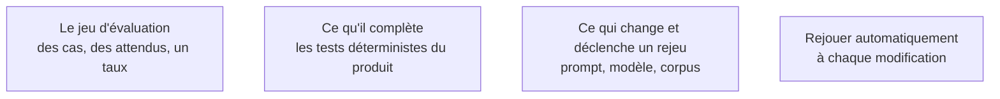

Le point où un product builder échoue le plus souvent, parce qu'il est habitué au binaire « ça marche / ça ne marche pas ». Une fonction à base de modèle n'a pas d'état binaire : sans un jeu de cas attendus rejoué à chaque changement, chaque amélioration est un pari.

## Ce qu'il faut savoir faire

- Constituer un jeu de cas avec des attendus dès la première version de la fonction, même petit. Vingt cas réels valent mieux que deux cents cas inventés, et ils existent déjà dans ce que les utilisateurs ont essayé.
- Formuler un attendu vérifiable pour chaque cas : une valeur exacte quand c'est possible, une propriété observable sinon — contient telle référence, ne mentionne aucun autre client, tient en moins de tant de caractères.
- Produire un **taux**, pas une impression. C'est ce qui transforme « je trouve que c'est moins bon » en une décision discutable.
- Rejouer le jeu à chaque changement de prompt, de modèle, de version de fournisseur ou de corpus. Ces quatre changements sont invisibles dans le diff et modifient pourtant le comportement.
- Brancher le rejeu sur la chaîne d'intégration, avec un seuil de régression qui bloque. Une évaluation qu'on lance à la main n'est lancée que quand on doute déjà.
- Ajouter au jeu chaque cas d'échec rapporté par un utilisateur. C'est la seule source de cas réellement représentatifs, et elle est gratuite.

## Les notions mobilisées

- [[notions/evaluation-llm]] — jeux d'évaluation, évaluations déterministes et par modèle, non-régression ; pour ce métier c'est l'artefact qui rend la fonction modifiable.
- [[notions/tests-logiciels]] — l'évaluation ne remplace pas les tests du produit, elle couvre la seule partie que les tests ne savent pas juger.
- [[notions/ingenierie-de-prompt]] — une modification de prompt est un changement de comportement ; sans évaluation, elle se valide à l'anecdote.
- [[notions/integration-continue]] — le rejeu automatique est ce qui distingue un jeu d'évaluation vivant d'un fichier écrit une fois.

> [!warning] Piège
> Reporter le jeu d'évaluation parce que la fonction « marche bien pour l'instant ». C'est l'inverse : plus la fonction est jeune, moins l'évaluation coûte, parce que le corpus de cas est encore petit et que personne ne dépend encore du comportement actuel. Sans elle, la fonction devient intouchable et meurt à la première montée de version du modèle.
