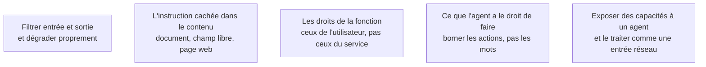

Niveau attendu : **usage**. Les garde-fous d'exposition sont une liste à appliquer — jamais d'action irréversible sans confirmation, jamais de privilège prêté au texte lu ; l'épreuve adverse relève du [[parcours/ai-red-teaming/index|red teaming]].

Dès que le produit affiche une sortie de modèle à un utilisateur ou lui laisse déclencher une action, la surface d'attaque change de nature. Le cas typique et sous-estimé : l'assistant qui lit un document envoyé par un utilisateur et dispose d'un outil d'envoi d'e-mail.

## Ce qu'il faut savoir faire

- Traiter tout contenu qui entre dans le contexte comme non fiable, quelle que soit sa provenance : document déposé, champ libre, page récupérée, e-mail entrant. L'injection réaliste n'arrive pas par la barre de saisie.
- Borner les **actions** de la fonction et pas seulement ses mots : périmètre de données limité, écriture réversible, confirmation humaine sur les opérations irréversibles ou sortantes.
- Faire porter à la fonction les droits de l'utilisateur qui l'appelle, jamais ceux du service. Une fonction qui accède à tout pour le compte de quelqu'un qui n'a droit qu'à une partie est une fuite en attente.
- Séparer strictement le contenu récupéré des instructions du système, et ne jamais laisser du contenu utilisateur définir ce que la fonction a le droit de faire.
- Définir le comportement en cas de doute. Un système qui répond quand même quand le filtre est incertain est un système sans garde-fou.
- Se méfier de la combinaison lecture de contenu externe + capacité d'action sortante. Prise séparément chacune est banale ; ensemble elles forment le chemin d'exfiltration le plus courant.

## Les notions mobilisées

- [[notions/garde-fous]] — filtrage d'entrée et de sortie, politiques, dégradation contrôlée ; pour ce métier le garde-fou qui compte est celui qui borne ce que la fonction peut faire.
- [[notions/injection-de-prompt]] — la forme indirecte est le cas réaliste d'un produit : le contenu hostile arrive par un document que l'utilisateur a lui-même déposé.
- [[notions/controle-d-acces]] — l'identité de l'appelant doit se propager jusqu'aux outils et jusqu'à l'index, sinon aucun cloisonnement n'est possible.
- [[notions/agents-llm]] — commencer par la plus petite unité d'autonomie qui apporte de la valeur, et n'ajouter une capacité qu'une fois la précédente prouvée.
- [[notions/mcp]] — exposer des capacités à un agent est un point d'entrée de sécurité, à traiter comme une interface réseau et non comme une facilité interne.

> [!warning] Piège
> Compter sur une consigne dans le prompt système pour empêcher un comportement. « Ne divulgue jamais ces informations » n'est pas une mise en œuvre : c'est une préférence exprimée à un système qui n'a aucun moyen de la garantir. Ce qui protège, c'est ce que la fonction n'a pas le droit d'atteindre.
