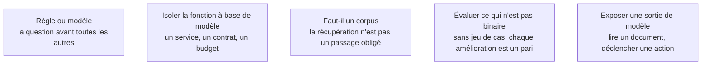

Jusqu'ici l'IA était l'atelier. À partir du moment où une fonction du produit appelle un modèle, le produit devient aussi un système d'IA — et rien de ce qui suit ne s'explique ici : [[05 - Roadmap — AI Engineer]] le traite une fois pour tout le corpus.

## Les cinq sujets

## Ma progression

- [ ] [[parcours/ai-product-builder/quand-le-produit-embarque-un-modele/regle-ou-modele|Règle ou modèle]] — ce qui justifie vraiment un appel probabiliste
- [ ] [[parcours/ai-product-builder/quand-le-produit-embarque-un-modele/isoler-la-fonction-a-base-de-modele|Isoler la fonction à base de modèle]] — changer de fournisseur, dégrader, mesurer
- [ ] [[parcours/ai-product-builder/quand-le-produit-embarque-un-modele/faut-il-un-corpus|Faut-il un corpus]] — le surcoût le plus fréquent est de monter une récupération par réflexe
- [ ] [[parcours/ai-product-builder/quand-le-produit-embarque-un-modele/evaluer-ce-qui-n-est-pas-binaire|Évaluer ce qui n'est pas binaire]] — le point où un product builder échoue le plus souvent
- [ ] [[parcours/ai-product-builder/quand-le-produit-embarque-un-modele/exposer-une-sortie-de-modele|Exposer une sortie de modèle]] — garde-fous, injection indirecte, actions permises
